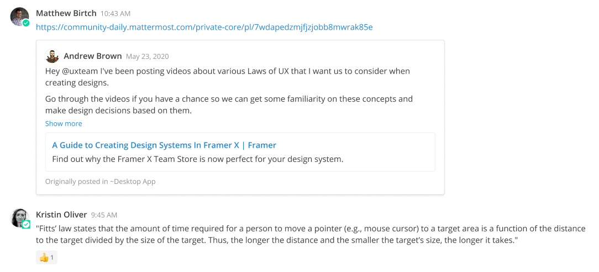

Sharing Messages
================

You can share links to messages in Mattermost. Select the **More Actions** option next to a message, then select **Copy Link**. Paste the link into a message to share the link with others.

If the link is to a message in a Public Channel, any member of the team can see the message. If the link is to a message in a Private Channel, only members in that channel can see the message.

.. tip::

    The timestamp next to the username of any message also functionas as a permanent link to that conversation.

Permalink Previews
------------------

From Mattermost v6.0 and in Mattermost Cloud, sharing links to messages generates a preview of the message. Previews help minimize context switching, and previews respect channel membership permissions, so they’re only visible to users who have access to the original message.  

