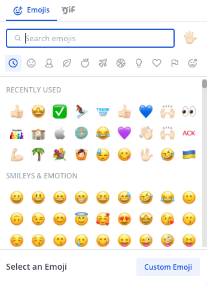
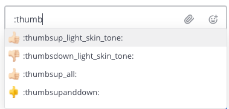
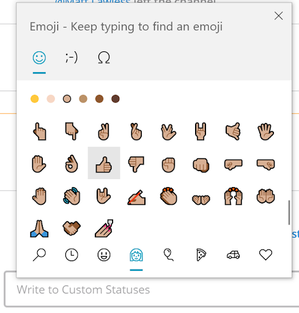
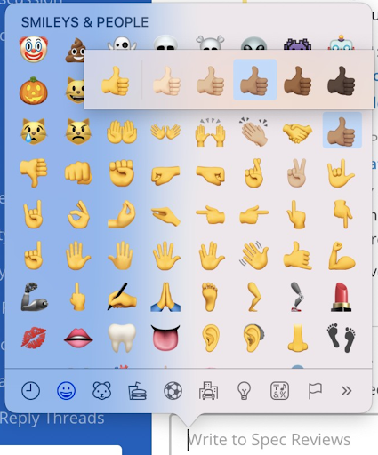
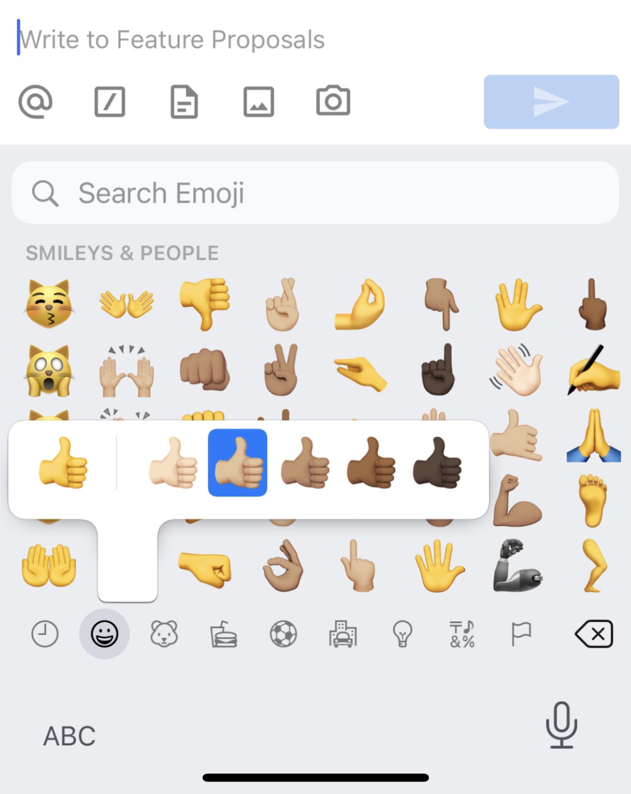
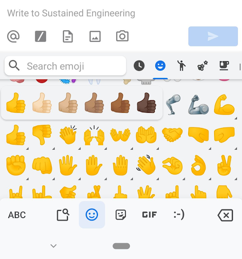

Using Emojis
============

Emojis are small, digital images or icons used to communicate or express concepts such as emotions and physical gestures in your messages.

Adding Emojis to messages
-------------------------

**Selecting Emojis**

Select the smile icon inside the Mattermost message input box to open the Emoji Picker.

**Typing Emojis**

Alternatively, open the emoji autocomplete by typing ``:`` followed by at least two characters of the word describing the emoji. 

   
It's also possible to create your own `Custom Emoji <https://docs.mattermost.com/help/settings/custom-emoji.html>`__ if the emoji you want to use doesn't exist.

Accessing Alternate Skin Tones
------------------------------

The Mattermost Emoji Picker and Emoji autocomplete use generic skin tones. To access alternate skin tones, you can use the native emoji pickers provided on your platform or device.

**Windows 10**

1. Use the keyboard shortcut: Windows Key + **.** (period) to open the native emoji picker for Windows 10.
2. Select an alternate skin tone and then select an emoji.

**macOS**

1. Use the keyboard shortcut: CMD+CTRL+Space Bar to open the native emoji picker for macOS.
2. Select and hold an emoji to choose an alternate skin tone.

**iPhone and iPad**

1. Open the emoji keyboard.
2. Touch and hold an emoji to choose an alternate skin tone.

.. tip::
  If you don't see the emoji keyboard for your Apple device, you can enable it. See `Use emoji on your iPhone, iPad, and iPod touch <https://support.apple.com/en-us/HT202332>`__ for details.

**Android**

1. Open the Android emoji keyboard.
2. Touch and hold an emoji to choose an alternate skin tone.

  Custom Emoji
  -------------
  
  You can create Custom Emojis which are available to everyone on your Mattermost server. 
  
  To create and find Custom Emojis, open the **Main Menu** at the top right of the channels sidebar and select **Custom Emoji**.
  
    .. note::

      If you can't see the **Custom Emoji** option in the menu, then your Mattermost System Admin may have restricted access to certain users. Contact your Mattermost System Admin for help.
      
      For further assistance, review the `Troubleshooting forum <https://forum.mattermost.org/c/trouble-shoot>`__ for previously reported errors, or `join the Mattermost user community for troubleshooting help <https://mattermost.com/pl/default-ask-mattermost-community/>`_.
  
  Creating Custom Emojis
  ^^^^^^^^^^^^^^^^^^^^^^
  
  Small, square pictures work best when selecting an image. The file can be any JPG, GIF, or PNG and up to 1 MB in size.
  
  1. Open the **Main Menu** at the top-right of the channels sidebar.
  2. Select **Custom Emoji**.
  3. Choose **Add Custom Emoji**.
  4. Enter a name for your Custom Emoji. This is the name that will show up in the emoji autocomplete.
  5. Choose **Select**, and choose what image to use for the emoji. 
  6. Choose **Save**.
  
  .. image:: ../images/add_custom_emoji.png
  
  Once saved, your emoji will be added to the list of Custom Emoji. 
  
  To use your Custom Emoji in a message, simply type ":" followed by your emoji name to bring it up in the emoji autocomplete. Other users on the site will also be able to see your emoji in the autocomplete, and will be able to use it in their own messages.
  
  Deleting Custom Emojis
  ^^^^^^^^^^^^^^^^^^^^^^^
  
  You can delete Custom Emojis that you created. 
  
  1. Open the **Main Menu** at the top-right of the channels sidebar.
  2. Select **Custom Emoji**.
  3. If required, use the Search Bar to find your Custom Emoji in the list.
  4. Under **Actions** select **Delete**. 
  5. Choose **Delete** to confirm. 
  
  .. image:: ../images/delete_custom_emoji.png
  