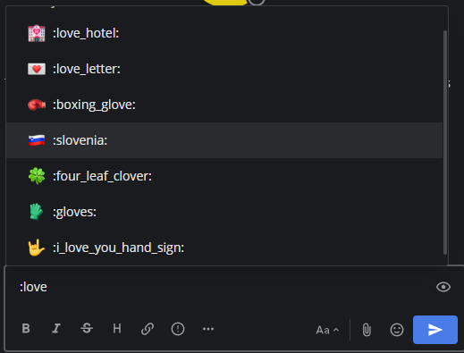

Using Emojis
============

Emojis are small, digital images or icons used to communicate or express concepts such as emotions and physical gestures in your messages.

Adding Emojis to messages
-------------------------

Selecting an Emoji
~~~~~~~~~~~~~~~~~~

Select the **Smile** icon inside the Mattermost message input box to open the Emoji Picker.

.. image:: ../images/selectemoji.png
  :alt: Open the Mattermost Emoji Picker.

Selecting a Default Skin Tone
~~~~~~~~~~~~~~~~~~~~~~~~~~~~~

Select the **Skin Tone** icon in the top right corner of the Emoji Picker to specify a preferred skin tone for people-based emojis. 

.. image:: ../images/emoji-skin-tone.png
  :alt: Select a default skin tone for people-based emojis.

Typing an Emoji
---------------

Alternatively, open the emoji autocomplete by typing ``:`` followed by at least two characters of the word describing the emoji. Descriptions include skin tone details for people-based emojis, where supported.

   
It's also possible to `create your own custom emoji <#custom-emoji>`_ if the emoji you want to use doesn't exist.

Creating Custom Emojis
-----------------------
  
You can create Custom Emojis which are available to everyone on your Mattermost server. From the Emoji Picker, select **Custom Emoji**. Small, square pictures work best when selecting an image to upload. The file can be any JPG, GIF, or PNG and up to 1 MB in size.
  
1. Enter a name for your Custom Emoji. This is the name that will show up in the emoji autocomplete.
2. Choose **Select**, then select the image to use for the emoji. 
3. Select **Save**.
  
.. image:: ../images/add_custom_emoji.png
  
Once saved, your emoji is added to the list of Custom Emoji. 

.. note::

  If you can't see the **Custom Emoji** option, then your Mattermost System Admin may have restricted access to certain users. Contact your Mattermost System Admin for help.
      
  For further assistance, review the `Troubleshooting forum <https://forum.mattermost.org/c/trouble-shoot>`__ for previously reported errors, or `join the Mattermost user community for troubleshooting help <https://mattermost.com/pl/default-ask-mattermost-community/>`_.
  
Using Custom Emojis
~~~~~~~~~~~~~~~~~~~

To use your Custom Emoji in a message, simply type ``:`` followed by your emoji name to bring it up in the emoji autocomplete. Other users on the site will also be able to see your emoji in the autocomplete, and will be able to use it in their own messages.
  
Deleting Custom Emojis
~~~~~~~~~~~~~~~~~~~~~~
  
You can delete Custom Emojis that you created. 
  
1. If required, use the Search Bar to find your Custom Emoji in the list.
2. Under **Actions** select **Delete**. 
3. Select **Delete** to confirm. 
  
.. image:: ../images/delete_custom_emoji.png
  
