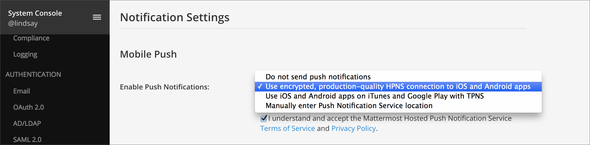
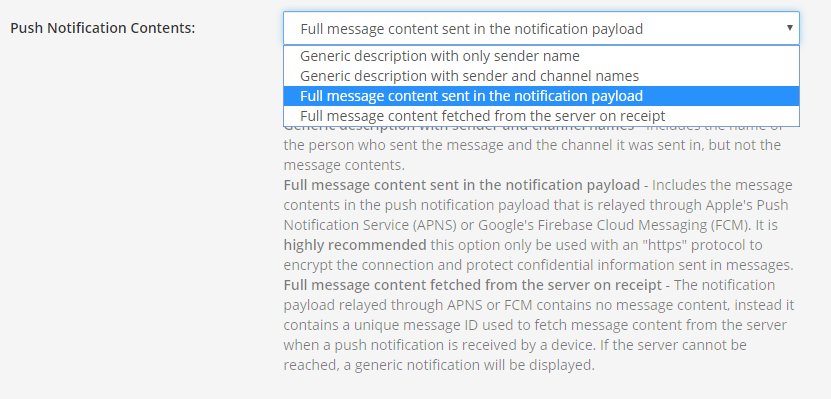

Install from Apple App Store and Google Play
============================================

To deploy the apps hosted in the Apple App Store and Google Play, we recommend you take the following steps to secure your deployment:

1. Set up a way to connect to your private network Mattermost instance, using:
  - An external proxy with encrypted transport through HTTPS and WSS network connections
  - (Recommended) Depending on your security policies, consider deploying a mobile VPN client with multi-factor authentication (MFA), GitLab SSO with MFA, or run Mattermost Enterprise Edition with MFA
  
2. Enable mobile push notifications
  - Go to **System Console > Notifications > Mobile Push** in prior versions or **System Console > Environment > Push Notification Server** in versions after 5.12
  - If testing the apps, or using Team Edition: Select "Use TPNS connection to send notifications to iOS and Android apps"
  - If using the apps in production with Enterprise Edition: Select "Use HPNS connection with uptime SLA to send notifications to iOS and Android apps"

3. (Optional) Customize mobile push notification contents
  - Go to **System Console** > **Notifications** > **Mobile Push** in prior versions or **System Console > Site Configuration > Notifications** in versions after 5.12
  - Select an option for **Push Notification Contents** to specify what type of information to include in push notifications
  - Most deployments choose to include the **full message content sent in the notification payload**. If your organization has policies or compliance requirements regarding data security, you may opt for sending **full message content fetched from the server on receipt** (Enterprise Edition E20) so messages are not sent to Apple's Push Notification Service or Google's Firebase Cloud Messaging notification service.

4. Download the mobile applications to your mobile device:

  - `iOS App <https://about.mattermost.com/mattermost-ios-app/>`__
  - `Android App <https://about.mattermost.com/mattermost-android-app/>`__

5. Open the mobile application and enter the address of your Mattermost server to connect

6. Confirm you're subscribed to `Mattermost Security Bulletins <https://about.mattermost.com/security-bulletin/>`__. In future, when notified of security updates, apply them promptly. 
