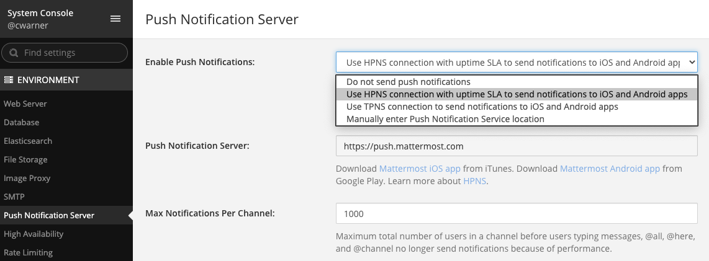

Install from Apple App Store and Google Play
============================================

To deploy the apps hosted in the Apple App Store and Google Play, we recommend you take the following steps to secure your deployment:

1. Set up a way to connect to your private network Mattermost instance, using:
  - An external proxy with encrypted transport through HTTPS and WSS network connections
  - (Recommended) Depending on your security policies, consider deploying a mobile VPN client with multi-factor authentication ("MFA"), GitLab SSO with MFA, run Mattermost Enterprise Edition with MFA
  
2. Enable mobile push notifications
  - Go to **System Console > Notifications > Mobile Push**
  - If testing the apps, or using Team Edition: Select "Use iOS and Android apps on iTunes and Google Play with TPNS"
  - If using the apps in production with Enterprise Edition: Select "Use encrypted, production-quality HPNS connection to iOS and Android apps"

3. (Optional) Customize mobile push notification contents
  - Go to **System Console** > **Notifications** > **Mobile Push**
  - Select what type of information to include in push notifications
  - Most deployments choose to include the full message snippet in push notifications unless they have policies against it to protect confidential information

.. image:: ../images/mobile_push_contents.png

4. Download the mobile applications to your mobile device:

  - `iOS App <https://about.mattermost.com/mattermost-ios-app/>`_
  - `Android App <https://about.mattermost.com/mattermost-android-app/>`_

5. Open the mobile application and enter the address of your Mattermost server to connect

6. Confirm you're subscribed to `Mattermost Security Bulletins <https://about.mattermost.com/security-bulletin/>`_. In future, when notified of security updates, apply them promptly. 
