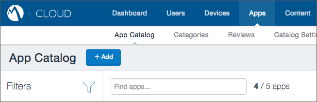
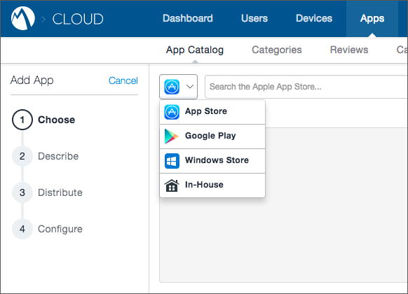
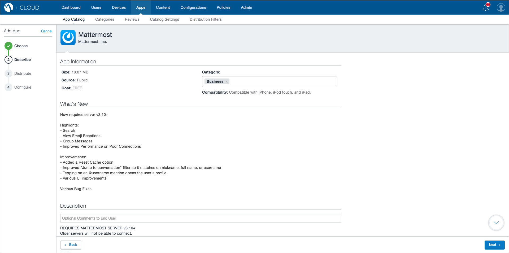
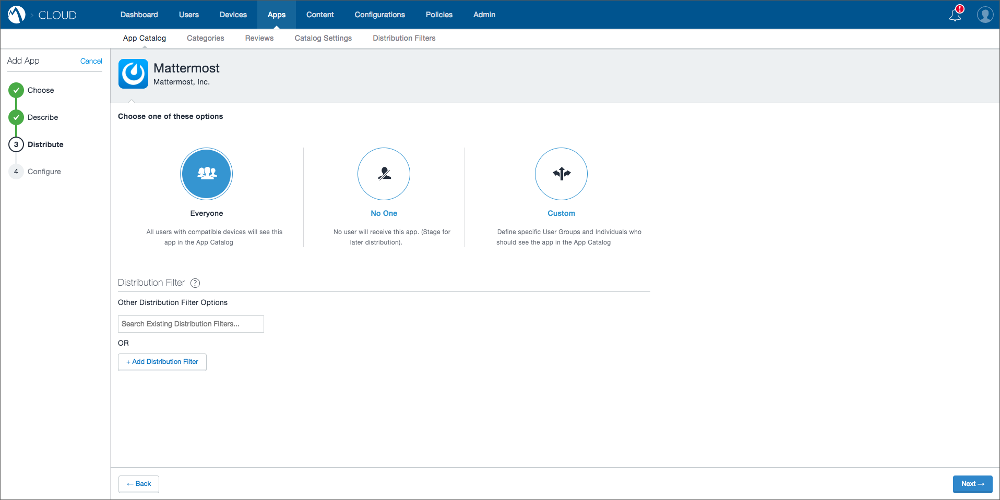
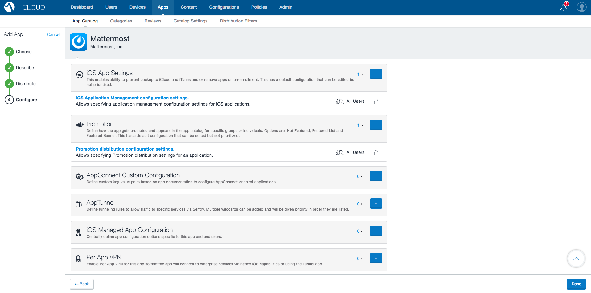
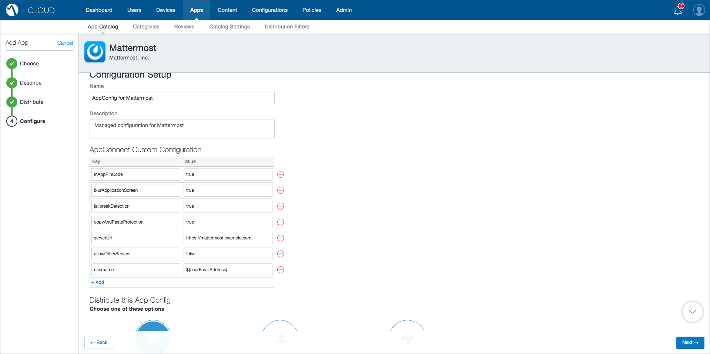

Set Up Mattermost with MobileIron EMM
=====================================

1. Log in to your MobileIron Cloud tenant.

2. Click on **Apps** and then **App Catalog**.

3. Click the **Add** button.

4. Select **App Store** or **Google Play** to use the published apps by Mattermost. If you are building the apps yourself, use the option for **In-House** and then browse to select the .apk or .ipa file.

5. After uploading the .ipa or .apk file or selecting **Mattermost** from the published app search results, click **Next**. In our example will be using the app in the Apple App Store.

6. Review or fill in the information for the app, and click **Next**.

7. Choose an option for distributing the Mattermost app to users and click **Next**.

8. Here you'll be presented different options to configure the app. Fill in the ones you need, and then go to **iOS Managed App Configuration** and click on the "**+**" sign.

9. Fill in a name for the configuration and optional description. Then enter the key-value pairs using the values from the :ref:`appconfig-table`.

10. Select a distribution option for this configuration and click **Next**.

.. image:: ../../source/images/mobileiron_step10.png

11. Review all you config settings one more time and click **Done**.
