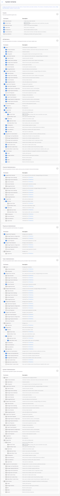
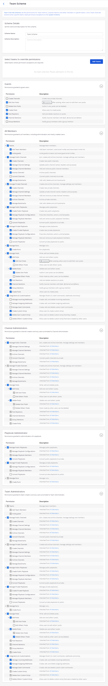

Advanced Permissions (E10/E20)
==============================

Mattermost System Admins using Mattermost Cloud or Mattermost Server from v5.0 can use Advanced Permissions to customize which users can perform specific actions, such as creating teams, managing channels, and configuring webhooks. The Mattermost permission system is based on a modified RBAC (role-based access control) architecture, using roles to determine which users have the ability to perform various actions.

Two permission schemes are provided in Mattermost: 

* System Scheme: Applies permissions universally across all teams and channels.
* Team Override Schemes: Allow admins to customize permissions for each team.

This document describes the types of permissions that can be given to users of Mattermost using schemes as well as channel settings and roles. The `permissions backend documentation <https://docs.mattermost.com/onboard/advanced-permissions-backend-infrastructure.html>`__ provides additional technical details around permissions.

.. contents::
  :backlinks: top
  :local:
  
Permissions Structure
----------------------

The Mattermost System Console provides a number of elements for Admins to control the permissions in their system. 

System Scheme (E10)
~~~~~~~~~~~~~~~~~~~~~

*Available in Enterprise Edition E10 and higher*

You can set the default permissions granted to System Admins, Team Admins, Channel Admins, Guests (if enabled), and All Members. The permissions granted in the System Scheme apply system-wide, meaning:

- **Guests:** If Guest Accounts are enabled, permissions apply to guest users in all channels, in all teams.
- **All Members:** Permissions apply to all members, including Admins, in all channels, in all teams.
- **Channel Administrators:** Permissions apply to all Channel Admins in all channels, in all teams.
- **Team Administrators:** Permissions apply to all Team Admins, in all teams.

To override the System Scheme default permissions in a specific team, you must set up a Team Override Scheme.

You can access the System Scheme interface by going to **System Console > User Management > Permissions > System Scheme**.

Team Override Schemes (E20)
~~~~~~~~~~~~~~~~~~~~~~~~~~~~

*Available in Enterprise Edition E20*

On systems with multiple `Mattermost teams <https://docs.mattermost.com/help/getting-started/creating-teams.html>`_, each team may operate and collaborate in a unique way. Team Override Schemes give Admins the flexibility to tailor permissions to the needs of each team.

When you use this permission scheme:

- The permissions granted in a Team Override Scheme apply only in the teams which are assigned to the scheme.
- The System Scheme does not apply to teams that are added to a Team Override Scheme.
- Teams can only belong to one Team Override Scheme.

You can access the Team Override Scheme interface by going to **System Console > User Management > Permissions > Team Override Schemes**.

Channel Permissions 
--------------------

The channel permissions interface is accessed in **System Console > User Management > Channels**.

Channel Moderation (E20)
~~~~~~~~~~~~~~~~~~~~~~~~~~~~~~~~~~~~~~

This content has moved to `Team and Channel Management <https://docs.mattermost.com/deployment/team-channel-management.html>`_.

Supplementary Roles (E20)
~~~~~~~~~~~~~~~~~~~~~~~~~

*Available in a future release of Enterprise Edition E20*

Allows Admins to grant additional permissions to specific users or to a group of users based on AD/LDAP group membership. Permissions can be granted within the scope of channels, teams, or system level.

Recipes
--------

This section provides some examples of common permissions use cases for team management, channel management, and overall permissions. 

Team Management
~~~~~~~~~~~~~~~~

**Only allow Admins, in specific team, to add members**

Example: In Team A, only allow Team and System Admins to add new team members. As the default for all other teams, allow all users to add and invite new members.

1. Go to **System Console > User Management > Permissions**.
2. Select **Edit Scheme**.
3. In the **All Members > Teams** panel, check the box for **Add Team Members**. This sets the system default for all teams.
4. Select **Save**.
5. Select the back arrow to return to the **Permission Schemes** menu.
6. Select **New Team Override Scheme**.

  i. Name and describe the scheme. For example, ``Authorized Personnel Only`` with description ``Restrict adding team members to Team and System Admins.``
  ii. Select **Add Teams** to add Team B to the **Select teams to override permissions** list, locate Team B, then select **Add**.
  iii. In the **All Members** panel, uncheck the box for **Add Team Members**.
  iv. In the **Team Administrators** panel, check the box for **Add Team Members**.

7. Select **Save**. 
8. Select the back arrow to return to the **Permission Schemes** menu. 

Public and Private Channel Management
~~~~~~~~~~~~~~~~~~~~~~~~~~~~~~~~~~~~~~

**Restrict who can rename channels and edit channel header and purposes**

Example: As the default for the entire system, restrict renaming channels and editing headers and purposes to Admins only.

1. Go to **System Console > User Management > Permissions**.
2. Select **Edit Scheme**.
3. In the **All Members** panel, uncheck the box for **Manage Public Channels > Manage Channel Settings**.

The **Manage Channel Settings** option is now only available to **Channel Administrators**, **Team Administrators**, and **System Administrators**.

.. note::

  Permissions for channel renaming, editing channel header, and editing channel purpose are currently grouped in a single permission. These will be split into separate permissions in a future release.

**Restrict who can create channels, in specific teams**

Example: In Team C, restrict public channel creation to Admins. As the default for all other teams, allow everyone to create public channels.

1. Go to **System Console > User Management > Permissions**.
2. Select **Edit Scheme**.
3. In the **All Members** panel, in the **Manage Public Channels** menu, check the box for **Create Channels**. This sets the system default to allow creation of public channels on all teams.
4. Select **Save**.
5. Select the arrow to return to the **Permission Schemes** interface.
6. Select **New Team Override Scheme**.

  i. Name and describe the scheme. For example, ``Contractor Scheme`` with description ``Restrict public channel creation to Admins only``.
  ii. Select **Add Teams** to add Team B to the **Select teams to override permissions** list, locate Team B, then select **Add**.
  iii. In the **All Members** panel, in the **Manage Public Channels** section, uncheck the box for **Create Channels**.
  iv. In the **Team Administrators** panel, in the **Manage Public Channels** section, check the box for **Create Channels**.
  
Convert Public channels to Private channels
~~~~~~~~~~~~~~~~~~~~~~~~~~~~~~~~~~~~~~~~~~~

**Allow all members to convert Public channels to Private channels**

Example: Set the default setting to allow all members, Team Admins, and Channel Admins to convert Public channels to Private.

1. Go to **System Console > User Management > Permissions**.
2. Select **Edit Scheme**.
3. In the **All Members** panel, uncheck the box for **Manage Public Channels > Convert Channels**.

This permission is applied to all other roles (excluding the Guest role). When this permission is not enabled for All Members, it must be manually applied to Team Admins and Channel Admins if required.

Read only channels (E20)
~~~~~~~~~~~~~~~~~~~~~~~~

**Configure a channel so that members can post/reply/react but guests can only read and react.**

1. Go to **System Console > User Management > Channels**.
2. Select **Edit** next to the name of the channel you want to configure.
3. In the **Create Posts** panel, uncheck **Guests**.
4. In the **Post Reactions** panel, uncheck **Guests** if required.
5. Select **Save**.

The channel is available for all members and guests to access, but guests can only read messages and react to them.

**Create an Announcement Channel where only channel admins are able to post.**

1. Create a new channel (either Public or Private).
2. Navigate to **System Console > User Management > Channels**.
3. Select **Edit** next to the name of the channel you just created (you may need to search for it).
4. In the **Create Posts** panel, uncheck **Guests** and **Members**.
5. In the **Post Reactions** panel, uncheck **Guests** and **Members**.
6. Select **Save**.

The channel is available for all members and guests to access but only admins can post.

Post Management
~~~~~~~~~~~~~~~~

**Restrict who can delete posts**

Example: As the default for the entire system, restrict deleting posts to only Team and System Admins.

1. Go to **System Console > User Management > Permissions**.
2. Select **Edit Scheme**.
3. In the **All Members** and **Channel Admininistrators** panels, in the **Delete Posts** section, uncheck the boxes for **Delete Own Posts** and **Delete Others' Posts**.
4. In the **Channel Administrators** and **Team Administrators** panels, in the **Delete Posts** section, check the boxes for **Delete Own Posts** and **Delete Others' Posts**.

**Restrict who can edit posts**

Example: As the default for the entire system, only allow users to edit their own posts for five minutes after posting.

1. Go to **System Console > User Management > Permissions**.
2. Select **Edit Scheme**.
3. In the **All Members**, **Channel Administrators**, and **Team Administrators** panels, in the **Manage Posts** section, check the box for **Edit Posts**.
4. From any panel, select the gear button to set the global time limit to ``300`` seconds.

.. note::

  The post edit time limit is a `global config variable <https://docs.mattermost.com/administration/config-settings.html#post-edit-time-limit>`__ ``PostEditTimeLimit``, so setting a post edit time limit applies system-wide to all teams and roles.

Integration Management
~~~~~~~~~~~~~~~~~~~~~~~

**Restrict managing webhooks and slash commands**

Example: As the default for the entire system, only allow System Admins to create, edit and delete integrations.

1. Go to **System Console > User Management > Permissions**.
2. Select **Edit Scheme**.
3. In the **All Members** and **Team Administrators** panels, in the **Integrations & Customizations** section, uncheck the boxes for **Manage Incoming Webhooks**, **Manage Outgoing Webhooks**, and **Manage Slash Commands**.

.. note::

  Permissions for creating, editing, and deleting integrations are currently grouped for each integration type. These will be split into separate permissions in a future release.

Administration Tools
--------------------

There are a number of CLI tools available for Admins to help in configuring and troubleshooting the permissions system:

1. `Reset to default permissions <https://docs.mattermost.com/administration/command-line-tools.html#mattermost-permissions-reset>`__: Resets all permissions to the default on new installs.
2. `Export permission schemes <https://docs.mattermost.com/administration/command-line-tools.html#mattermost-permissions-export>`__: Exports the System Scheme and any Team Override Schemes to a jsonl file.
3. `Import permission schemes <https://docs.mattermost.com/administration/command-line-tools.html#mattermost-permissions-import>`__: Imports the System Scheme and any Team Override Schemes to your Mattermost instance from a jsonl input file in the format outputted by ``mattermost permissions export``.

Backend Infrastructure
----------------------

Technical admins or developers looking for a deeper understanding of the permissions backend can refer to our `permissions backend documentation <https://docs.mattermost.com/onboard/advanced-permissions-backend-infrastructure.html>`__.

Glossary
--------

- **Permission:** The ability to execute certain actions. Permissions are granted to roles.
- **Roles:** A set of permissions. Users or groups are assigned to roles.
- **Group:** A set of users, usually synced from AD/LDAP. Groups are assigned to roles in the context of teams, channels, or system-wide.
- **Default Roles:** All Members, Guests (if enabled), Channel Admins, Team Admins, System Admins.
- **System Scheme:** A set of default roles that apply system-wide.
- **Team Override Scheme:** A set of default roles that apply only in the team specified. Permissions granted to roles in a team scheme override roles in the system scheme.
- **System-wide:** Applies across the entire system, including all teams of which the user is a member.
- **Team-wide:** Applies in a specific team only.
