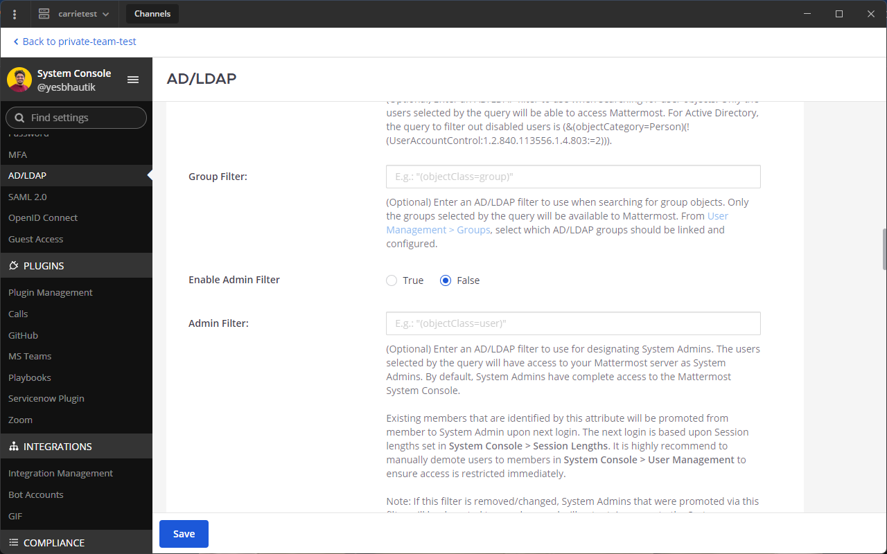
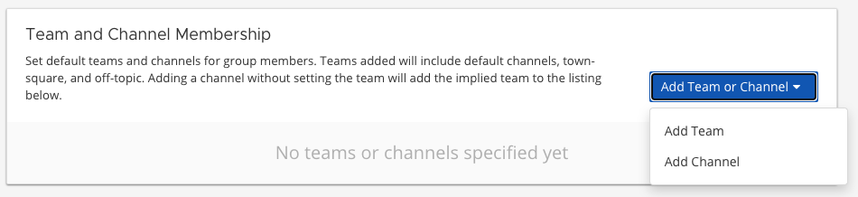
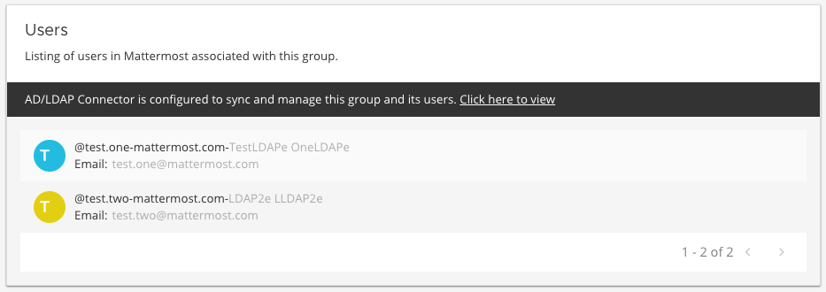

AD/LDAP Groups
==============

|enterprise| |cloud|

.. |enterprise| image:: ../images/enterprise-badge.png
  :scale: 30
  :target: https://mattermost.com/pricing
  :alt: Available in the Mattermost Enterprise subscription plan.

.. |cloud| image:: ../images/cloud-badge.png
  :scale: 30
  :target: https://mattermost.com/download
  :alt: Available for Mattermost Cloud deployments.

Overview
---------

The groups feature is useful for organizations that have many new users to onboard or that onboard users frequently and want to ensure users are added to default teams and channels that are pertinent to them. The group feature currently supports:

- Creating groups by synchronization with your AD/LDAP system groups.
- Syncing groups to pre-defined roles in Mattermost.
- AD/LDAP nested groups.
- Using synchronized groups to manage `membership of teams and private channels <https://docs.mattermost.com/onboard/cloud-groups.html>`__.

Pre-installation Notes
----------------------

If you have enabled synchronization with AD/LDAP, all groups matching the default filter ``(|(objectClass=group)(objectClass=groupOfNames)(objectClass=groupOfUniqueNames))`` will be available to be linked in the groups list view at **System Console > User Management > Groups**.

The group filter is an optional configuration setting available under **System Console > AD/LDAP** which allows you to specify the groups that should have access in Mattermost. The **Group** filter is independent of the **User** filter; however, it does leverage the Base DN attribute. You may need to adjust your Base DN to ensure group objects can be searched in your AD/LDAP tree.

The synchronization of groups happens with the synchronization of users, during which Mattermost queries AD/LDAP for updated account information. Please see the `Active Directory/LDAP Set up documentation <https://docs.mattermost.com/onboard/ad-ldap.html>`__. for more information. The group feature has no effect on users' authentication to Mattermost.

Enabling AD/LDAP Group Synchronization
--------------------------------------

To enable this feature, go to **System Console > Groups**.

Using AD/LDAP Group Synchronization
-----------------------------------

To synchronize specific AD/LDAP groups to Mattermost, specify the ``Group ID Attribute`` and the ``Group Display Name Attribute`` (e.g., "cn" for Common Name) under **System Console > Authentication > AD/LDAP**.

Additionally, you can specify the **Group** filter used to retrieve groups. If the **Group** filter configuration is left blank, then all groups matching the default filter ``(|(objectClass=group)(objectClass=groupOfNames)(objectClass=groupOfUniqueNames))`` are returned.

.. note::
   Attribute values for **Group ID** and **Group Display Name** are case-sensitive.

Group synchronization occurs after user synchronization and results for group synchronization are available on the synchonization status table (located at the bottom of the **AD/LDAP** configuration page).

After the AD/LDAP groups have been synchronized, go to **System Console > User Management > Groups** to link and configure Mattermost groups.

.. note::
   
   The sync process does not create Mattermost groups. Mattermost groups are created when you “link” the AD/LDAP group as outlined in the next section **Linking AD/LDAP groups to Mattermost groups**. Existing AD/LDAP users are added to the Mattermost groups on the next synchronization and new users are added on their first login.

On subsequent synchronizations and once groups are linked:

- Users that have been added to an AD/LDAP group will be added to the linked Mattermost group and to teams and channels configured for that group.
- Mattermost groups that are linked to AD/LDAP groups no longer included in your filter are deleted.
- Users removed from an AD/LDAP group are removed from the linked Mattermost group, but their channel and team membership is only revoked when the channel or team is synchronized to an AD/LDAP group.

.. image:: ../images/Group_Group_Member_Sync.png

Linking AD/LDAP Groups to Mattermost Groups
--------------------------------------------

Groups that have been returned from the default filter or your AD/LDAP group filter will be available in a list view on the Groups page. The link action will create Mattermost groups corresponding to the AD/LDAP group. AD/LDAP groups that have been linked to a Mattermost group will display the **Linked** icon. AD/LDAP groups that have not been linked to a Mattermost group will display the **Not Linked** icon. An AD/LDAP group that is not linked does not create a Mattermost group.

.. image:: ../images/Groups_listing.png

Groups can be linked individually by the inline **Linked** button. You can also use the checkbox next the group name to select multiple groups and choosing **Link Selected Groups**. When selecting multiple groups with a mix of **Linked** and **Not Linked** states, the bulk action of the button will be **Link Selected Groups** until all selected are marked **Linked**. Using the bulk action speeds the process of creating Mattermost groups from your AD/LDAP Groups.

If you see a **Link Failed** message, either click on the message or check the box alongside the group name to expose the inline link message and try again.

Configuring the Group
---------------------

AD/LDAP groups that have been linked to Mattermost groups can be configured to add team and channels. To configure the group, select **Configure > Group Configuration** and view the group profile which includes the group name. This name is automatically mapped from the AD/LDAP group common name attribute and is read only.

Adding Default Teams or Channels for the Group
-----------------------------------------------

To add the teams and channels that you want the group members to default in, select either **Add Team** or **Add Channel** from the **Add Team or Channel** button.

Channels are nested below the Team they belong to in the team and channel list.

Teams that are open for anyone to join are indicated by:

.. image:: ../images/open_team.png

Teams that are not open for anyone to join are indicated by:

.. image:: ../images/private_team.png

Public channels are indicated by:

Private channels are indicated by:

When a team is added, the ``Town Square``, ``Off-Topic`` channels will also be added as default, as well as any default channels set in the `ExperimentalDefaultChannels config setting <https://docs.mattermost.com/administration/config-settings.html?highlight=configuration%20settings#default-channels-experimental>`__.

When a channel is added without setting the team explicitly, the team will be shown in the **Team and Channel Membership** listing, but it will not be added to the group specifically. Because of this dependency, when the channel is removed, the team will also be removed. Teams are listed in parentheses after the channel name in the channel selector.

You can assign roles to group members using the options provided in the **Assigned Roles** column. Roles are updated on the next scheduled AD/LDAP synchronization. 

Synchronizing Teams and Channels
--------------------------------

For new users, default teams and channels will be added when they log in for the first time. For existing users, default teams and channels will be added after the next scheduled AD/LDAP sychronization.

It may take a few seconds to load all team and channel memberships for a user depending on the number of teams and channels the group is defaulted to. In our testing, it took six seconds for an organization with 200,000 users and 30,000 linked groups.

.. note::
   Users are not removed from the team or channel on subsequent synchronizations of the AD/LDAP groups. Users will need to be manually removed from the team or channel per the existing functionality. They will not be re-added if they were manually removed or removed themselves. To manage a team or private channel membership with synchronized groups, please see `this documentation <https://docs.mattermost.com/onboard/cloud-groups.html>`_.

.. image:: ../images/Team_Channel_Membership_Sync.png

Removing Configured Teams and Channels from a Group
---------------------------------------------------

To remove a team or channel configured for a group, select **Remove** to the right of the team or channel name. Users already part of the team and channel will not be removed from that channel by this action.

Viewing Users Belonging to the Group
------------------------------------

Users who have logged in and accessed Mattermost will be visible in the members list on the group object. Members are read-only at this time and new members can be added through management in your AD/LDAP system.

Users can be removed from the Mattermost group on subsequent synchronizations. However, they will not be removed from teams and channels unless the team or channel is group-synced.

.. note::
   When a member removes themselves manually from a channel, that action is tracked in the **Channel Member History** table. If a System Admin manually forces all members in a specific LDAP group to join the teams and channels synchronized to that group, members can potentially be re-added to channels from which they were previously removed.

Disabling and Reactivating AD/LDAP Users
-----------------------------------------
If a member is removed from an AD/LDAP group, deactivated in AD/LDAP, or filtered from the AD/LDAP user filter, that member loses access to Mattermost.

If that member is later re-added, reactivated, or included in the user filter, they aren't automatically re-added to Mattermost groups. A System Admin must re-add that member manually to Mattermost teams and channels.

Using the Mattermost API, System Admins can manually re-add all group members back into synchronized teams or channels by forcing members in an LDAP group to join the teams and channels synchronized to that group, even if members left on their own, were removed, were filtered out, or were deactivated. See our `Mattermost API documentation <https://api.mattermost.com/#operation/SyncLdap>`__ for details on synchronizing user attribute changes in the configured AD/LDAP server with Mattermost.

Managing Groups
---------------
Once a group has been configured, the default teams and channels can be changed via the **Edit** option on the group list view.

Deleting Groups
---------------
Mattermost groups can be deleted by adjusting your AD/LDAP group filter to remove the group or by unlinking the group on the groups listing page. If you add the group back by re-adjusting the AD/LDAP group filter and link the group again on the group configuration page, the previous team and channel configurations will be available.

Using AD/LDAP Synchronized Groups to Manage Team or Private Channel Membership
-------------------------------------------------------------------------------

Mattermost groups created with `synchronized AD/LDAP groups <https://docs.mattermost.com/onboard/ad-ldap.html>`_ can be used to manage the membership of private teams and private channels. When a team or private channel is managed by synchronized groups, users will be added and removed based on their membership to the synchronized AD/LDAP group.

For instance, you may have a AD/LDAP group that contains your development team that you want to synchronize to a developer team.  By using this feature, new developers will get added to the team when they are added to the synchronized AD/LDAP group and they will be removed from the team when removed from the AD/LDAP group.

Similarly, you may have a AD/LDAP group that contains your leadership team that you want to synchronize to a private channel for coordination and updates. This feature will help control the membership of the channel so that users outside of the synchronized group are prevented from being added to the channel mistakenly.

On teams that are managed by synchronized groups, users outside of the group are restricted from:

- Invitation through a team invite link
- Invitation through an email invite

Similarly on private channels that are managed by synchronized groups, users outside of the group are restricted from:

- Invitation through a mention
- Invitation through the ``/invite`` slash command
- Being added to the channel with “add members”

Users can remove themselves from teams and private channels managed by synchronized groups.

Managing Membership of a Team or Channel with Synchronized Groups
^^^^^^^^^^^^^^^^^^^^^^^^^^^^^^^^^^^^^^^^^^^^^^^^^^^^^^^^^^^^^^^^^

To manage membership of a private team with synchronized groups:

1. Go to **System Console > User Management > Teams**.
2. Select the team you want to manage with group synchronization.
3. Under **Team Management**, enable **Sync Group Members**. If **Anyone can join this team** is enabled, or if specific email domains are set, they will be disabled by the Sync Group Members feature.
4. Add one or more groups to the team. If there are existing groups associated with default users in the team, they will already be present.
5. Review the notice in the footer of the screen for any users that are not part of groups who will be removed from the team on the next synchronization.
6. Select **Save**. Members will be updated on the next scheduled AD/LDAP synchronization.

To manage membership of a private channel with synchronized groups:

1. Go to **System Console > User Management > Channels**.
2. Select the channel you want to manage with group synchronization.
3. Under **Channel Management**, enable **Sync Group Members**. Please ensure the channel is set to ``private``.
4. Add one or more groups to the channel. If there are existing groups associated with default users in the channel, they will already be present.
5. Review the notice in the footer of the screen for any users that are not part of groups, and who will be removed from the channel on the next synchronization.
6. Select **Save**. Members will be updated on the next scheduled AD/LDAP synchronization.

Assigning Roles to Group Members
^^^^^^^^^^^^^^^^^^^^^^^^^^^^^^^^^

Group members can be assigned predefined roles by System Admins, which are applied across the group during the scheduled sychronization. The roles are:

- Member (default)
- Team Admin (in Teams)
- Channel Admin (in Channels)

The permissions for each role can be viewed and modified in **System Console > Permissions**.

**To set the Team Admin role in a synced group**

1. Go to **System Console > User Management > Teams**.
2. Select **Edit** next to the team you want to configure.
3. Ensure that **Sync Group Members** is enabled.
4. Select **Add Group** to add one or more groups to the team. If there are groups already associated to default users into the team, they will already be present.
5. Select the arrow next to the current role in the **Roles** column to display and select the **Team Admin** option.
6. Repeat as needed for any other synced groups you have added.
7. Select **Save**.

Roles are updated on the next scheduled AD/LDAP synchronization.

**To set the Channel Admin role in a synced group**

1. Go to **System Console > User Management > Channels**.
2. Select **Edit** next to the team you want to configure.
3. Ensure that **Sync Group Members** is enabled.
4. Select **Add Group** to add one or more groups to the team. If there are groups already associated to default users into the team, they will already be present.
5. Select the arrow next to the current role in the **Roles** column to display and select the **Channel Admin** option.
6. Repeat as needed for any other synced groups you have added.
7. Select **Save**.

Roles are updated on the next scheduled AD/LDAP synchronization.

.. note::
  Members who have been synced as part of a group cannot have their role changed via **View Members** in Mattermost.

Adding or Removing Groups from Teams
^^^^^^^^^^^^^^^^^^^^^^^^^^^^^^^^^^^^

Once teams are managed by synchronized groups, a Team or System Admin can add additional groups from **Main Menu > Add Groups to Team**. This will add users on the next AD/LDAP synchronization, and any new users to the group will be added to the team on subsequent synchronizations. Team Admins can be prevented from changing the team to public by enabling **Team Settings > Allow any user with an account on this server to join this team**.

Team or System Admins can also remove groups from a team from **Main Menu > Manage Groups**. This will disassociate the group from the team. Users are removed on the next AD/LDAP synchronization.

The System Admin can also remove groups from  **System Console > User Management > Teams > Team Configuration > Synced Groups**.

Adding or Removing Groups from Private Channels
^^^^^^^^^^^^^^^^^^^^^^^^^^^^^^^^^^^^^^^^^^^^^^^

Once channels are managed by synchronized groups, a Team or System Admin can add additional groups from **Channel Menu > Add Groups to Channel**. This will add users on the next AD/LDAP synchronization and any new users to the group will be added to the channel on subsequent synchronizations.

Team or System Admins can also remove groups from a team from **Main Menu > Manage Groups**. This will disassociate the group from the team. Users are removed on the next AD/LDAP synchronization.

The System Admin can also remove groups from **System Console > User Management > Channels > Channel Configuration > Synced Groups**.

Managing Members
^^^^^^^^^^^^^^^^^

Users are automatically removed from the team or private channel when removed from a synchronized AD/LDAP group that is managing the membership of that team or channel.  Additionally, users who are not in the synchronized groups are prevented from being added through the ``/invite`` and mention flows within a channel.

A user can remove themselves from the team or from the private channel when it is managed by synchronized groups.  They can be added back by users who have permission to manage members for a team or private channel by using the ``/invite`` slash command or by mentioning the user in a channel.

If the user is removed from a synchronized group and later re-added to the group, they can be manually added back to the team or Private channel as noted above.

.. note:: 
  Users will not be automatically added back by the AD/LDAP synchronization once they remove themselves or are removed by the LDAP synchronized group.

Disabling Group Synchronized Management of Teams and Private Channels
^^^^^^^^^^^^^^^^^^^^^^^^^^^^^^^^^^^^^^^^^^^^^^^^^^^^^^^^^^^^^^^^^^^^^

To remove the management of members by synchronized groups in a team, disable **Sync Group Members** under **System Console > User Management > Teams > Team Management**.

To remove the management of members by synchronized groups in a channel, disable **Sync Group Members** under **System Console > User Management > Channels > Channel Management**.

Frequently Asked Questions
--------------------------

Why do my LDAP users and groups exist in Mattermost, but my groups have no members?
^^^^^^^^^^^^^^^^^^^^^^^^^^^^^^^^^^^^^^^^^^^^^^^^^^^^^^^^^^^^^^^^^^^^^^^^^^^^^^^^^^^

In order for Mattermost to detect group membership correctly, and to automatically add users to the group configured in the **System Console**, you must use one of the following AD/LDAP attributes to represent group members in Mattermost: ``member`` or ``uniqueMember``. These attributes use a ``Distinguished Name`` as the value on groups.

.. note::

  LDAP installations that use ``memberUid`` to indicate group membership are not supported because ``memberUid`` is an attribute of an object class ``posixGroup`` that does not use ``Distinguished Names`` as the value on groups.

Why can't my existing users see the teams and channels they have been synced to?
^^^^^^^^^^^^^^^^^^^^^^^^^^^^^^^^^^^^^^^^^^^^^^^^^^^^^^^^^^^^^^^^^^^^^^^^^^^^^^^^

Existing Mattermost users that are members of linked Mattermost groups will be added to teams and channels on the next scheduled synchronization job that is run after teams and channels are added to the Mattermost group. You can manually initiate a synchronization from **System Console > Authentication > AD/LDAP > AD/LDAP Synchronize Now**.

How do nested groups work with AD/LDAP Group Sync?
^^^^^^^^^^^^^^^^^^^^^^^^^^^^^^^^^^^^^^^^^^^^^^^^^^

Users within nested groups are included as members of parent groups. The group filter that you specify can include any type of AD/LDAP group on your system. The ``member`` AD/LDAP attribute is used to determine nested groups that belong to a parent group.

How do I manage a team or private channel membership with synchronized groups?
^^^^^^^^^^^^^^^^^^^^^^^^^^^^^^^^^^^^^^^^^^^^^^^^^^^^^^^^^^^^^^^^^^^^^^^^^^^^^^^^^^

You can do so by setting the team or channel management to synced groups instead defaulting a group to a team or channel. See `this documentation <https://docs.mattermost.com/deployment/ldap-group-constrained-team-channel.html>`__ to learn more.

How do I use AD/LDAP Group Sync with SAML?
^^^^^^^^^^^^^^^^^^^^^^^^^^^^^^^^^^^^^^^^^^^

You can use AD/LDAP Group Sync with SAML by enabling `SAML Synchronization with AD/LDAP <https://docs.mattermost.com/onboard/sso-saml-okta.html#configure-saml-synchronization-with-ad-ldap>`__. You do not need to enable LDAP sign-in for this feature to work.

However, is critical that the unique Mattermost ID identifier that you have chosen as your attribute in your directory service (AD/LDAP) is the same for both the SAML and AD/LDAP configurations.

For instance, if ``ObjectGUID`` has been chosen as the Mattermost ID in your AD/LDAP configuration, then an attribute that has the same value should also be mapped to the ID attribute in your SAML assertion. We also recommend that the ID attribute you select is unique and unchanging (such as a ``GUID``).

Why aren’t public channels supported with synchronized groups?
^^^^^^^^^^^^^^^^^^^^^^^^^^^^^^^^^^^^^^^^^^^^^^^^^^^^^^^^^^^^^^

Public channels are available to all members to discover and join. Managing membership with synchronized groups removes the ability for Public channels to be accessible to users on the team. Private channels typically require a more controlled membership management, which is why this feature applies to Private channels. Groups can be assigned to public teams and Public channels as described in `this documentation <https://docs.mattermost.com/onboard/ad-ldap-groups-synchronization.html#adding-default-teams-or-channels-for-the-group>`__.

Does a team with its membership managed by groups have any effect on public channel access?
^^^^^^^^^^^^^^^^^^^^^^^^^^^^^^^^^^^^^^^^^^^^^^^^^^^^^^^^^^^^^^^^^^^^^^^^^^^^^^^^^^^^^^^^^^^^

Only users that are members of groups synchronized to team are able to discover and join public channels.  Private channels can also be managed by synchronized groups when a team is managed by synchronized groups.

Why don't users get readded to teams or channels once they have been removed from and then later re-added to the LDAP group?
^^^^^^^^^^^^^^^^^^^^^^^^^^^^^^^^^^^^^^^^^^^^^^^^^^^^^^^^^^^^^^^^^^^^^^^^^^^^^^^^^^^^^^^^^^^^^^^^^^^^^^^^^^^^^^^^^^^^^^^^^^^^^

The implementation of group removals does not currently differentiate between users who have removed themselves or have been removed by the LDAP synchronization process. Our design optimizes for users who have removed themselves from a team or channel. In the future, we may add the ability for Admins to re-add users who have been removed, and even prevent users from leaving, a team or channel.

Additionally, LDAP users who are not accessible to Mattermost based on filters will be removed from the groups and from group synced teams and channels. If they were removed from teams and channels then they will not be re-added to those teams and channels upon becoming subsequently reaccessible to Mattermost.

Why aren’t Public channels supported with AD/LDAP Synchronized Groups?
^^^^^^^^^^^^^^^^^^^^^^^^^^^^^^^^^^^^^^^^^^^^^^^^^^^^^^^^^^^^^^^^^^^^^^

Public channels are available to all members to discover and join. Managing membership with synchronized groups removes the ability for Public channels to be accessible to users on the team. Private channels typically require a more controlled membership management, which is why this feature applies to Private channels. Groups can be assigned to public teams and Public channels as described in `this documentation <https://docs.mattermost.com/onboard/ad-ldap-groups-synchronization.html#adding-default-teams-or-channels-for-the-group>`__.

Does a team with its membership managed by groups have any effect on Public channel access?
^^^^^^^^^^^^^^^^^^^^^^^^^^^^^^^^^^^^^^^^^^^^^^^^^^^^^^^^^^^^^^^^^^^^^^^^^^^^^^^^^^^^^^^^^^^

Only users that are members of groups synchronized to a team are able to discover and join Public channels. Private channels can also be managed by synchronized groups when a team is managed by synchronized groups.

Why aren't users readded to teams or channels after being removed from, then later re-added to, the LDAP group?
^^^^^^^^^^^^^^^^^^^^^^^^^^^^^^^^^^^^^^^^^^^^^^^^^^^^^^^^^^^^^^^^^^^^^^^^^^^^^^^^^^^^^^^^^^^^^^^^^^^^^^^^^^^^^^^

The implementation of group removals does not currently differentiate between users who have removed themselves or have been removed by the LDAP synchronization process. Our design optimizes for users who have removed themselves from a team or channel. In the future, we may add the ability for admins to re-add users who have been removed, and even prevent users from leaving a team or channel.

Additionally, LDAP users who are not accessible to Mattermost based on filters will be removed from the groups and from group-synced teams and channels. If they were removed from teams and channels then they will not be re-added to those teams and channels upon becoming subsequently re-accessible to Mattermost.
