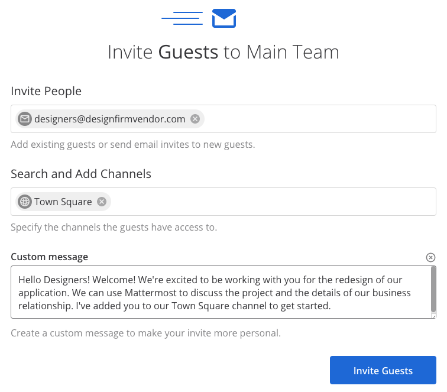

.. _guest-accounts:

Guest Accounts
==============

|enterprise| |professional| |cloud| |self-hosted|

.. |enterprise| image:: ../images/enterprise-badge.png
  :scale: 30
  :target: https://mattermost.com/pricing
  :alt: Available in the Mattermost Enterprise subscription plan.

.. |professional| image:: ../images/professional-badge.png
  :scale: 30
  :target: https://mattermost.com/pricing
  :alt: Available in the Mattermost Professional subscription plan.

.. |cloud| image:: ../images/cloud-badge.png
  :scale: 30
  :target: https://mattermost.com/download
  :alt: Available for Mattermost Cloud deployments.

.. |self-hosted| image:: ../images/self-hosted-badge.png
  :scale: 30
  :target: https://mattermost.com/deploy
  :alt: Available for Mattermost Self-Hosted deployments.

*Available in legacy Enterprise Edition E10 and E20*

Guest Accounts are a way to collaborate with individuals (such as vendors and contractors) outside of your organization by controlling their access to channels and team members. For example, Guest Accounts can be used to collaborate with customers on a support issue or work on a website project with resources from an external design firm.

Guests can:

- Pin messages to channels
- Use slash commands (excluding restricted commands such as invite members, rename channels, change headers, etc)
- Favorite channels
- Mute channels
- Update their profile

Guests cannot:

- Discover Public channels
- Join open teams
- Create Direct Messages or Group Messages with members who aren’t within the same channel
- Invite people

Additionally, guests are not automatically added to the default ``Town-square`` and ``Off-topic`` channels upon logging in and need to be invited/added to them manually.

Enabling Guest Accounts
------------------------

1. Go to **System Console > Authentication > Guest Access**.
2. Set **Enable Guest Access** to **true**.
3. (Optional) Specify the **Whitelisted Guest Domains** that are acceptable for guest access. This allows the System Admin to set a list of approved guest domains.
4. (Optional) Set **Enforce Multi-factor Authentication** to **true**. If you're enforcing MFA for your users, you can optionally choose to also enforce MFA for your guest users.
 
.. note::

  If you have team domain restrictions, you also need to add your guest domain in **System Console > User Management > Teams**. Select a team, then enable **Only specific email domains can join this team**.

Guest Authentication
---------------------

Guests can access the Mattermost server via email invitation, and be authenticated using AD/LDAP or SAML 2.0.

Before you proceed, ensure that the authentication method you wish to use is correctly configured on your server and enabled in Mattermost. For configuration steps and technical documentation, see `Active Directory/LDAP Setup <https://docs.mattermost.com/onboard/ad-ldap.html>`_ and `SAML Single-Sign-On <https://docs.mattermost.com/onboard/sso-saml.html>`__.

Converting a member user to a guest will not change the channels they are in. However, they will be restricted from discovering additional channels and are unable to Direct Message/Group Message users outside of the channels they are in. They can be added to channels by System Admins and other roles that have the correct permissions to invite guests.

Inviting Guests to the Mattermost Server via Email
---------------------------------------------------

Guests can be invited into one or more Mattermost channels within a team by System Admins and other roles that have the correct permission to invite guests. A guest can be invited into channels on multiple teams.

.. note::
  
  Guest invitations are revoked after 48 hours per the member email invitation process. If your guest has not accepted the invitation within that period, please follow the steps below to resend an invitation to the guest.

To invite guests into one or more Mattermost channels:

1. Go to **System Console > Signup > Enable Email Invitations** to enable email invites.
2. Select your team's name at the top of the channel sidebar and choose **Invite People**.
3. Select **Invite Guests**.
4. Enter the guest’s email address.
5. Choose the channels the guest can join (excluding managed teams).
6. (Optional) Enter a custom message.

Configuring AD/LDAP Authentication
----------------------------------

When enabled, the **Guest Filter** in Mattermost identifies external users whose AD/LDAP role is ``guest`` and who are invited to join your Mattermost server. These users will have the ``guest`` role applied immediately upon first sign-in instead of the default member user role. This eliminates having to manually assign the role in the System Console.

1. Go to **System Console > Authentication > Guest Access** to enable guest access.
2. Go to **System Console > Authentication > AD/LDAP**.
3. Complete the **Guest Filter** field.
4. Select **Save**.

If a Mattermost guest user has the ``guest`` role removed in the AD/LDAP system, the synchronization process will not automatically promote them to a member user role. This is done manually via **System Console > User Management**. If a member user has the **Guest Attribute** added, the synchronization processes will automatically demote the member user to the guest role.

When a guest logs in without having any channels assigned to their account, they're advised to contact a Mattermost System Admin. 

Configuring SAML 2.0 Authentication
------------------------------------

When enabled, the **Guest Attribute** in Mattermost identifies external users whose SAML assertion is guest and who are invited to join your Mattermost server. These users will have the ``guest`` role applied immediately upon first sign-in instead of the default member user role. This eliminates having to manually assign the role in the System Console.

If a Mattermost guest user has the guest role removed in the SAML system, the synchronization processes will not automatically promote them to a member user role. This is done manually via **System Console > User Management**. If a member user has the **Guest Attribute** added, the synchronization processes will automatically demote the member user to the guest role.

1. Go to **System Console > Guest Access** to enable guest access.
2. Go to **System Console > Authentication > SAML 2.0**.
3. Complete the **Guest Attribute** field.
4. Select **Save**.

When a guest logs in without having any channels assigned to their account, they're advised to contact a Mattermost System Admin.

Guest Permission Settings
-------------------------

In Mattermost Enterprise and Professional, you can control which users can invite guests. By default, only the System Admins can invite guests. 

There are `additional permissions <https://docs.mattermost.com/onboard/advanced-permissions.html>`__ in Mattermost Enterprise that can be adjusted under **System Console > User Management > Permissions > System Scheme** to control a guest’s ability to:

 - Edit posts
 - Delete posts
 - Post reactions
 - Create private channels with members they are allowed to collaborate with

Guest Identification
---------------------

Guests are identified with a **Guest** badge. This badge is visible in various places on the interface and mobile apps, such as on a guest’s profile and next to their name on user lists, including @mentions. When guests are added to a channel, a system message informs other channel members that the added user is a guest.

Channels containing guests will have their header automatically updated with a message stating: *This channel has guests*.

.. image:: ../images/Guest_Badges.png

Managing Guests
---------------

Adding Guests to Additional Channels
^^^^^^^^^^^^^^^^^^^^^^^^^^^^^^^^^^^^

Users with the permissions to invite guests can **Invite Guests** to additional channels. A system message will be posted in the channels to let other members know a guest user has been added.

Removing Guests from Channels and Teams
^^^^^^^^^^^^^^^^^^^^^^^^^^^^^^^^^^^^^^^^

Guests can be removed from a channel through **Manage members**, or by using the ``/kick`` or ``/remove`` slash commands.

When a guest has been removed from all channels within a team, and if they belong to other teams, they will default into the last channel on the last team they have accessed. If they are removed from all channels on all teams, they'll be taken to a screen letting them know they have no channels assigned.

Promoting and Demoting User Roles
^^^^^^^^^^^^^^^^^^^^^^^^^^^^^^^^^^

System Admins can demote a member to a guest by updating their role in **System Console > User Management > Users**. Select the member, then select **Demote to Guest**. 

The demoted user retains their existing channel and team memberships but is restricted from discovering public channels and collaborating with users outside of the channels they're in. This is useful if you're already collaborating with external contractors, and want to restrict their abilities within Mattermost.

System Admins can also promote a guest to member by updating their role in **System Console > User Management > Users**. Select the guest, then select **Promote to Member**.

.. note::
  
  You can filter the list in **System Console > User Management > Users** to view all guests in the system.

Disabling Guest Accounts
------------------------

To disable the Guest Accounts feature, go to **System Console > Authentication > Guest Access**, then set **Enable Guest Access** to **False**. To deactivate individual Guest Accounts, go to **System Console > User Management > Users**. Select a user, then select **Deactivate**. You can re-activate individual Guest Accounts by selecting **Activate**.

From Mattermost Server version 5.18 and in Mattermost Cloud:

- Wwhen a single Guest Account is deactivated or the Guest Account feature is disabled, guests are marked as ``inactive``, are logged out of Mattermost, and all guest sessions are revoked. In Mattermost Server versions prior to 5.18, disabling the Guest Account feature leaves current Guest Accounts as active until they are manually deactivated.
- If you're using AD/LDAP and the Guest Access setting is disabled, the Guest Filter and existing guest users in System Console are deactivated. Additionally, no new guests can be invited or added using the filter as an authentication method. If a previous guest's credentials match the user filter (the only filter which is active when Guest Access is disabled), they will be reactivated and promoted to a member user upon their next login.
- Similarly, for SAML, when the Guest Access setting is disabled, the Guest Attribute and existing guest users in System Console are deactivated. Additionally, no new guests can be invited or added using the attribute as an authentication method. If a previous guest's credentials match the user attribute (the only attribute which is active when Guest Access is disabled), they will be reactivated and promoted to a member user upon their next login.

You can disable individual guest accounts in **System Console > User Management** via **Manage Members**. When a single Guest Account is disabled or the feature is disabled, the guest will be marked as ``inactive``, be logged out of Mattermost, and all their sessions will be revoked.

Reinstating Guest Accounts
--------------------------

When Guest Access is re-enabled for AD/LDAP, the Guest Filter is reinstated. 

New users matching the Guest Filter will be authenticated as new guest users on login.

Previous guest users will be activated with the next synchronization. If their credentials still match the Guest Filter, they will retain their guest status. If they no longer match the Guest Filter but do match the User Filter, they will be not be promoted to member user automatically on login - this must be done manually. If a previous guest was reactivated as a member user when Guest Access was disabled, and now are identified by the Guest Filter once again, they will automatically be demoted to Guest upon their login.

Similarly, for SAML, when Guest Access is re-enabled, the SAML Guest Attribute is reinstated. New users matching the Guest Attribute will be authenticated as new guest users on login.

Previous guest users will be activated with the next synchronization.  If their credentials still match the Guest Attribute, they will retain their guest status. If they no longer match the Guest Attribute but do match the User Filter, they will be not be promoted to member user automatically on login - this must be done manually. If a previous guest was reactivated as a member user when Guest Access was disabled, and now are identified by the Guest Attribute once again, they will automatically be demoted to Guest upon their login.

Frequently Asked Questions
---------------------------

How am I charged for Guest Accounts?
^^^^^^^^^^^^^^^^^^^^^^^^^^^^^^^^^^^^^

Guests are charged as a user seat.

Why doesn’t Mattermost have single-channel guests?
^^^^^^^^^^^^^^^^^^^^^^^^^^^^^^^^^^^^^^^^^^^^^^^^^^^

We wanted to support collaboration with external guests for the broadest use cases without limiting guests' access to channels. In the future, we may consider adding single-channel guests.

Can I set an expiration date for guests?
^^^^^^^^^^^^^^^^^^^^^^^^^^^^^^^^^^^^^^^^^

Currently, you cannot. This feature may be added at a later stage.

Can MFA be applied selectively?
^^^^^^^^^^^^^^^^^^^^^^^^^^^^^^^

If MFA is enforced for your users, it can be applied to Guest Accounts. Guests can configure MFA in by going to their avatar and selecting **Profile > Security**. If MFA is not enforced for your users, it can't be applied to Guest Accounts.

Has the Guest Accounts feature been reviewed by an external security firm?
^^^^^^^^^^^^^^^^^^^^^^^^^^^^^^^^^^^^^^^^^^^^^^^^^^^^^^^^^^^^^^^^^^^^^^^^^^^

The Guest Account feature was reviewed by the Mattermost security team. We do not have an external firm review scheduled but will include this feature in future reviews.

How can I validate my guests' identity?
^^^^^^^^^^^^^^^^^^^^^^^^^^^^^^^^^^^^^^^^

Guests can be authenticated via SAML and/or AD/LDAP to ensure that only the named guest can sign in. Alternatively, you can whitelist domains via **System Console > Authentication > Guest Access > Whitelisted Guest Domains**.

Can I restrict guests' ability to upload content?
^^^^^^^^^^^^^^^^^^^^^^^^^^^^^^^^^^^^^^^^^^^^^^^^^^

It is not currently possible to selectively disable upload/download functionality as it is a server-wide configuration.
