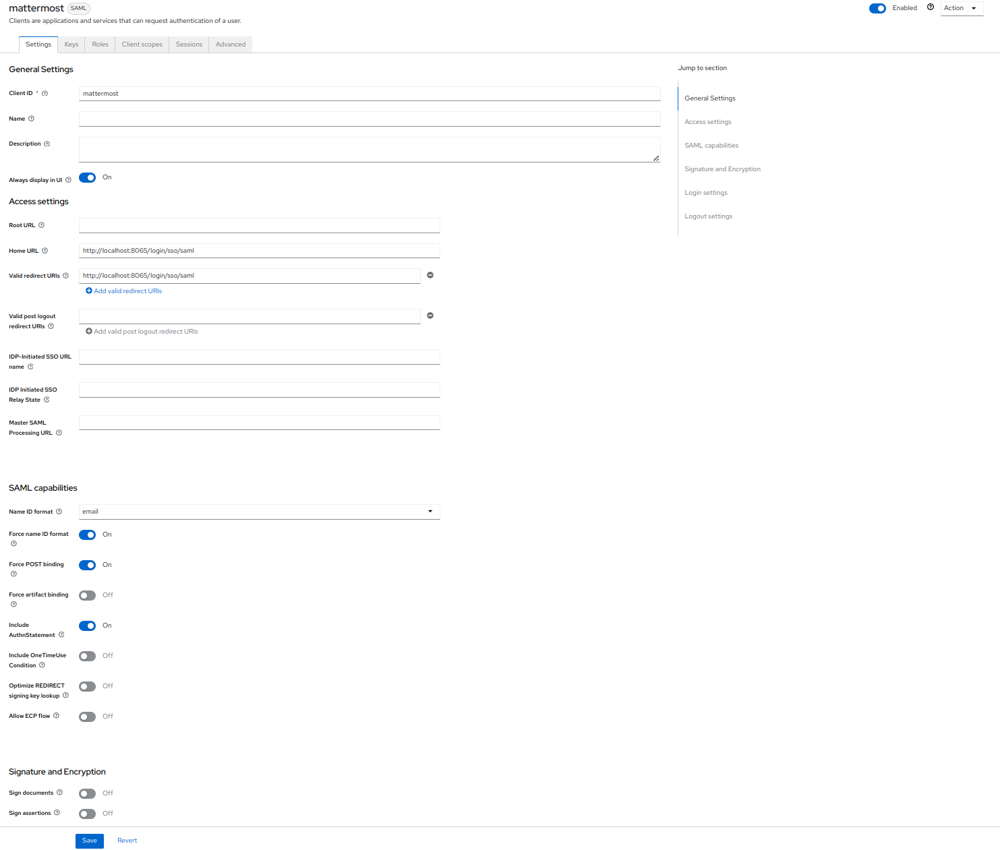
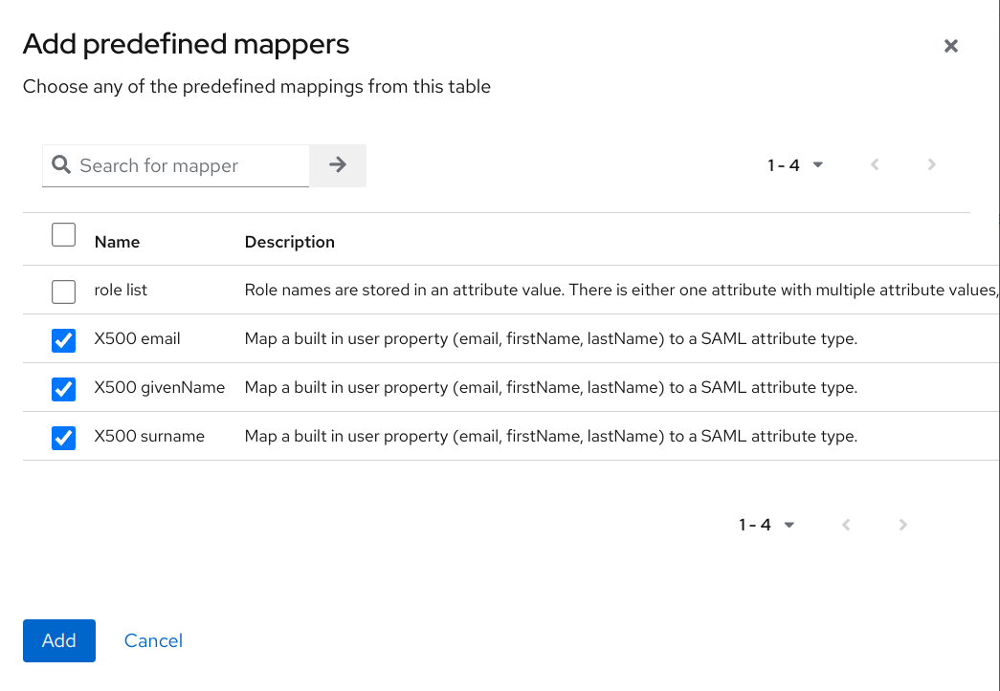
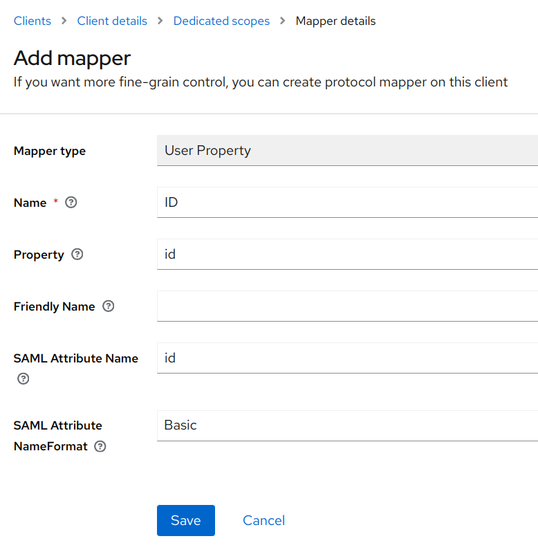
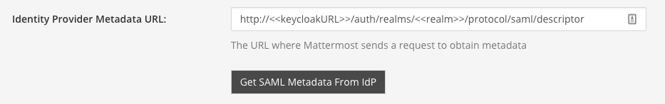
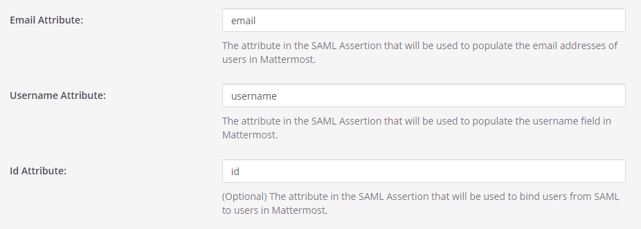

Configure SAML with Keycloak
============================

The following process provides steps to configure SAML with Keycloak for Mattermost.

.. contents::
  :backlinks: top
  :local:

Set up a connection app for Mattermost SSO
-------------------------------------------

1. Sign in to Keycloak as an administrator.

2. Click **Clients** then **Create** and save. You'll use this client ID in a later step.

    - **Client ID**: ``mattermost``
    - **Client Protocol**: ``saml``

3. Edit the Mattermost client to have the below values:

    - **Enabled**: **ON**
    - **Encrypt Assertions**: **ON**
    - **Force Name ID Format**: **ON**
    - **Name ID Format**: **Email**
    - **Valid Redirects**: ``https://<<siteURL>>/login/sso/saml``
    - **Base URL**: ``https://<<siteURL>>/login/sso/saml``

4. Save the client config.

5. Navigate to **Keys** within the client config.

6. Select **Generate new keys**.

7. Select **Export**, use the values below, and then select **Download**.

    - **Archive Format**: ``PKCS12``
    - **Key Alias**: ``mattermost``
    - **Key Password**: ``mattermost``
    - **Store Password**: ``mattermost``

.. image:: ../../source/images/keycloak_2_saml_keys.png

8. Add the default attributes:

    a. Within your Mattermost client select **Mappers**.
    b. Select **Add Buildin**
    c. Select the **X500 email**, **X500 givenName**, and **X500 surname** attributes.
    d. Select **Add selected**.

9. Add the username and ID attribute.

    a. With the **Mappers** section of your client, select **Create**.
    b. Set **Name** to ``Username``.
    c. Under Mapper Type select **User Property**.
    d. Set **Property** to ``username`` (This is case sensitive and must be lowercase).
    e. Set **SAML Attribute Name** to ``username``.
    f. Select **Save**.
    g. Repeat this step and use the property of ``id`` to create the ID Attribute.

  10. Get the metadata URL from Keycloak:

    a. Within your Realm, select **Realm Settings**.
    b. At the bottom of the **General** tab you should see a **SAML 2.0 Identity Provider Metadata** endpoint. Right-click and copy this URL. Store for the next step.

Configure SAML for Mattermost
-----------------------------

1. Start the Mattermost server and sign in to Mattermost as a System Administrator. Go to **System Console > Authentication > SAML**.

2. Set the **Identity Provider Metadata URL** to the value you copied from the step above and select **Get SAML Metadata from IdP**. The metadata import will populate fields related to your Keycloak configuration.

    If you have any issues with this import, you can check the ``mattermost.log`` file for more information. You will need to turn on debug logging and try again if you do not already have debug logging enabled.

3. Set the below fields:

    - **Verify Signature**: **false**
    - **Service Provider Login URL**: ``http://<<siteURL>>/login/sso/saml``
    - **Service Provider Identifier**: ``mattermost``

    The Service Provider Identifier will match the **Client ID** that you configured in the second Keycloak step.

4. Configure the Encryption using the key you downloaded in step 8 of the Keycloak config.

    a. Generate the ``.crt`` file from the ``.p12`` file.
    
        ``openssl pkcs12 -in keystore.p12 -out mattermost.crt -nodes``

    b. Generate the ``.key`` file from the ``.p12`` file.
    
        ``openssl pkcs12 -in keystore.p12 -out mattermost.key -nodes -nocerts``
        
    c. Upload both of these files within the Mattermost System Console. Make sure to select **Upload**.
    
      - **Service Provider Private Key**: ``mattermost.key``
      - **Service Provider Private Certificate**: ``mattermost.crt``

5. (Optional) Set up request signing with the below parameters.

6. Set attributes for the SAML Assertions, which will update user information in Mattermost. Attributes for email and username are required to match the values you configured in Keycloak in steps 9 and 10. See `documentation on SAML configuration settings <http://docs.mattermost.com/administration/config-settings.html#saml-enterprise>`__ for more detail.

    - **Email Attribute**: ``email``
    - **Username Attribute**:  ``username``
    - **Id Attribute**: ``id``

7. Select **Save**.

You’re done! If you’d like to confirm SAML SSO is successfully enabled, switch your System Administrator account from email to SAML-based authentication via **Profile > Security > Sign-in Method > Switch to SAML SSO** and sign in with your SAML credentials to complete the switch.

It's also recommended to post an announcement about how the migration will work for users.

You may also configure SAML for Keycloak by editing ``config.json``. Before starting the Mattermost server, edit ``config.json`` to enable SAML based on `SAML configuration settings <http://docs.mattermost.com/administration/config-settings.html#saml-enterprise>`__. You must restart the Mattermost server for the changes to take effect.

.. include:: sso-saml-ldapsync.rst

.. include:: sso-saml-faq.rst
