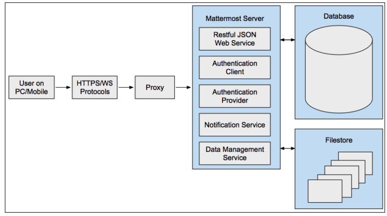
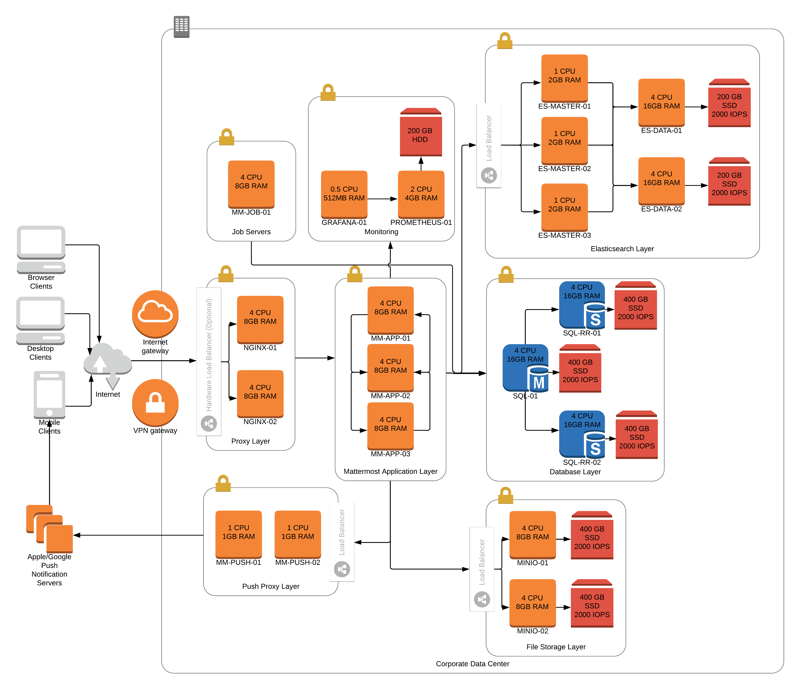
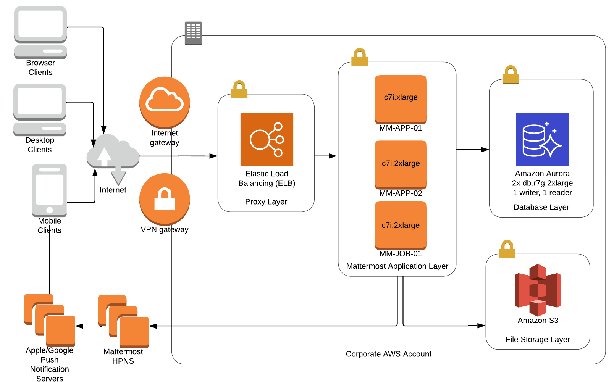

Architecture Overview
=====================

This page provides an overview of the Mattermost architecture with reference architecture. For a more detailed deployment overview, `check out our deployment wiki <https://docs.mattermost.com/deployment/deployment.html>`__.

.. toctree::
    :maxdepth: 2

Basics
------

At its core, Mattermost is a single-compiled Go binary that is exposed as a Restful JSON web server with Javascript and Go clients. See the Restful API docs `here <https://api.mattermost.com>`__.

It is configured using `config/config.json <https://docs.mattermost.com/administration/config-settings.html>`__ and provides the following:

- **Authentication client**, which provides the functionality for users to log into Mattermost via email address and password in Team Edition. Enterprise E10 adds the ability for users to authenticate using Active Directory or LDAP, and Enterprise E20 adds the ability to authenticate using SAML SSO providers like ADFS, OneLogin and Okta.
- **Authentication provider**, which enables the Mattermost server to authenticate to other services like GitLab and Zapier using OAuth 2.0.
- **Notification service**, which sends notifications via SMTP or a Push Notification Service for mobile applications.
- **Data management service**, which connects to supported databases and file storage solutions (local, network-attached storage, Amazon S3, etc), and manages the reading and writing of data to and from them.

The binary talks to a database, typically MySQL or PostgreSQL, and a filestore.

.. image:: ../images/architecture_basics.png

Push Notification Service
~~~~~~~~~~~~~~~~~~~~~~~~~

The Mattermost `hosted push notification service <https://docs.mattermost.com/mobile/mobile-hpns.html>`__ can be used to send push notifications to mobile clients. Team Edition users can deploy the service using the Mattermost `test push notification service <https://docs.mattermost.com/overview/faq.html#tpns>`__ or deploy their own push notification service and `compile their mobile applications <https://docs.mattermost.com/mobile/mobile-compile-yourself.html>`__ to use that service.

Proxy
~~~~~

A proxy server is a server (a computer system or an application) that acts as an intermediary for requests from clients seeking resources from other servers. Mattermost recommends using a proxy in front of Mattermost to increase security, performance and the ability to monitor and shape traffic connecting to Mattermost:

- **Security**: A proxy server can manage Secure Socket Layer (TLS/SSL) encryption and set policy on how network traffic will be routed to the Mattermost server.
- **Performance**: In a high availability configuration, the proxy server balances the network load across multiple Mattermost servers for optimized performance. A hardware proxy with dedicated devices for processing SSL encryption and decryption can also be used to increase performance.
- **Monitoring**: A proxy server can monitor connection traffic and record traffic in standard audit logs that common monitoring tools like Kibana and Splunk can consume and report on. Some of the events that can be captured include file uploads and downloads, which are not tracked by the Mattermost Server logging process.

Mattermost provides documentation and support for the `NGINX proxy <https://www.nginx.com/>`__. For information on how to install and configure NGINX for your environment, see `our guide <https://docs.mattermost.com/guides/administrator.html#installing-mattermost>`__. Mattermost also unofficially supports other proxies including `Apache 2 <https://docs.mattermost.com/install/config-apache2.html>`__.

.. image:: ../images/architecture_with_proxy.png

Communication Protocols
~~~~~~~~~~~~~~~~~~~~~~~

There are also communication protocols (HTTPS and WS) that define the type of connection the user makes with the Mattermost server.

**HTTPS Connection** (Secure Hypertext Transfer Protocol)

HTTPS connections to the Mattermost Server render pages and provide access to core platform functionality, but do not include real-time interactivity (which is enabled by WSS connections).

HTTPS is a secure, encrypted protocol and is highly recommended for production. Unencrypted HTTP connections may be used in initial testing and configuration, but should never be used in a production environment.

**WSS Connection** (Secure WebSocket Protocol)

Secure WebSocket (WSS) connections to the Mattermost Server enable real-time updates and notifications between clients and the server.

If a WSS connection is not available and HTTPS is substituted, the system will appear to work but real-time updates and notifications will not. In this mode of operation, updates will only appear on a page refresh. WSS has a persistent connection to the Mattermost Server when a client is connected, while HTTPS has an intermittent connection and only connects to the server when a page or file is requested.

High Availability and Scalability
---------------------------------

Enterprise Edition E20 supports:

1) Clustered Mattermost servers, which minimize latency by:

- Storing static assets over a global CDN.
- Deploying multiple Mattermost servers to host API communication closer to the location of end users.

They can also be used to handle scale and failure handoffs in disaster recovery scenarios.

2) Database read replicas, where replicas can be:

- Configured as a redundant backup to the active database server.
- Used to scale up the number of concurrent users.
- Deployed closer to the location of end users, reducing latency.

Moreover, search replicas are also supported to handle search queries.

.. image:: ../images/architecture_high_availability.png

Reference Architectures
-----------------------

The following diagrams show the suggested architecture configurations for E20 enterprise deployments of Mattermost at different scales. These diagrams are meant as guidelines for typical Mattermost deployments. Hardware and infrastructure requirements can vary significantly based on usage and policies.

There are two versions of each diagram. One is generalized while the other focuses on AWS.

Each generalized diagram represents a full high availability deployment across all critical components. The proxy, database, file storage and Elasticsearch layers can be replaced by cloud services. Push proxy can be replaced by the Mattermost `HPNS <https://docs.mattermost.com/mobile/mobile-hpns.html>`__.

Each AWS diagram represents a full high availability deployment on Amazon Web Services making full use of the available services. Push proxy can optionally be deployed manually in place of HPNS.

5,000 Users on E20 - General
~~~~~~~~~~~~~~~~~~~~~~~~~~~~~

.. image:: ../images/MattermostDeployment5kUsers.png

5,000 Users on E20 - AWS
~~~~~~~~~~~~~~~~~~~~~~~~

.. image:: ../images/MattermostDeployment5kaws.png

10,000 Users on E20 - General
~~~~~~~~~~~~~~~~~~~~~~~~~~~~~

10,000 Users on E20 - AWS
~~~~~~~~~~~~~~~~~~~~~~~~~

.. image:: ../images/MattermostDeployment10kaws.png

25,000 Users on E20 - General
~~~~~~~~~~~~~~~~~~~~~~~~~~~~~

.. image:: ../images/MattermostDeployment25kUsers.png

25,000 Users on E20 - AWS
~~~~~~~~~~~~~~~~~~~~~~~~~

50,000 Users on E20 - AWS
~~~~~~~~~~~~~~~~~~~~~~~~~

.. image:: ../images/MattermostDeployment50kaws.png

Database with VIPs
~~~~~~~~~~~~~~~~~~

The following diagram is a suggested configuration for highly-available databases through virtual IPs.

.. image:: ../images/DatabasewithVIPs.png

Load Testing
~~~~~~~~~~~

Mattermost Enterprise Edition was `load tested <https://github.com/mattermost/mattermost-load-test>`__ with 60,000 concurrent active users with:

- 6 Mattermost servers: m4.2xlarge (8 vCPU, 32 GB RAM)
- 1 MySQL database server with 5 read replicas: db.r4.2xlarge (8 vCPU, 61 GB RAM)
- 3 load test runners (for running the loadtest)
- 3 NGINX proxies
