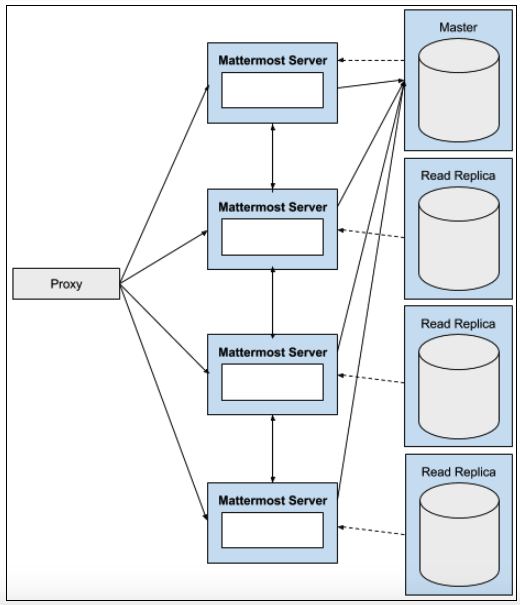

Architecture Overview
==================

This page provides an overview of the Mattermost architecture with a reference architecture. For a deployment overview, `see here <https://docs.mattermost.com/deployment/deployment.html>`_.

.. toctree::
    :maxdepth: 2

Basics
----------

At its core, Mattermost is a single compiled Go binary that is exposed as Restful JSON Web server with Javascript and Go clients. See the Restful API docs `here <https://api.mattermost.com>`_.

It is configured using `config/config.json <https://docs.mattermost.com/administration/config-settings.html>`_ and provides the following:

- **Authentication client**, which authenticates users to Mattermost. Enterprise Edition supports advanced authentication services such as AD/LDAP and SAML 2.0.
- **Authentication provider**, which authenticates users via the OAuth 2.0 provider such as GitLab.
- **Notification service** for email and mobile push.
- **Data management service** to connect to database and filestore.

The binary talks to a database, typically MySQL or PostgreSQL, and a filestore which can be a local file storage, NAS (network-attached storage) or an Amazon S3 bucket.

.. image:: ../images/architecture_basics.png

Proxy
^^^^^^^^^^^^^^^^^^^^^^^^^^^^^^^^
Proxy increases security, performance and the ability to monitor traffic connecting to Mattermost:

- **Security**: The proxy manages Secure Socket Layer (TLS/SSL) encryption and sets the policy on how network traffic will be routed to the Mattermost server.
- **Performance**: In a high availability configuration, the proxy balances network load across multiple Mattermost servers for optimized performance. A hardware proxy with dedicated devices for processing SSL encryption and decryption can also increase performance.
- **Monitoring**: The proxy monitors traffic, such as requests and connection statistics, and records audit logs for file uploads and downloads.

.. image:: ../images/architecture_with_proxy.png

Communication Protocols
^^^^^^^^^^^^^^^^^^^^^^^^^^^^^^^^
There are also communication protocols (HTTPS and WS) that define the type of connection the user makes with the Mattermost server.

**HTTPS Connection** (Secure Hypertext Transfer Protocol)

The HTTPS connection to the Mattermost server renders pages and provides core functionality. It is a secure, encrypted protocol and is highly recommended for production.

**WSS Connection** (Secure WebSocket Protocol)

The WSS connection to the Mattermost server enables real-time updates and notifications. It is a secure, encrypted connection and is highly recommended.

.. image:: ../images/architecture_with_protocol.png

High Availability and Scalability
-------------------------------------------

Enterprise Edition E20 supports

1) Clustered Mattermost servers, which minimize latency by

- storing static assets over a global CDN
- deploying multiple Mattermost servers to host API communication closer to the location of end users

They can also be used to handle scale and failure hand offs in disaster recovery scenario.

2) Database read replicas where replicas can be

- configured as a redundant backup to the active database server
- used to scale up the number of concurrent users
- deployed closer to the location of end users, reducing latency

Moreover, search replicas are also supported to handle search queries.

Reference Architecture
----------------------------------

Mattermost Enterprise Edition was `load tested <https://github.com/mattermost/mattermost-load-test>`_ with 60,000 concurrent active users with:

- 6 Mattermost servers: m4.2xlarge (8 vCPU, 32 GB RAM)
- 1 MySQL database server with 5 read replicas: db.r4.2xlarge (8 vCPU, 61 GB RAM)
- 3 load test runners (for running the loadtest)
- 3 NGINX proxies

