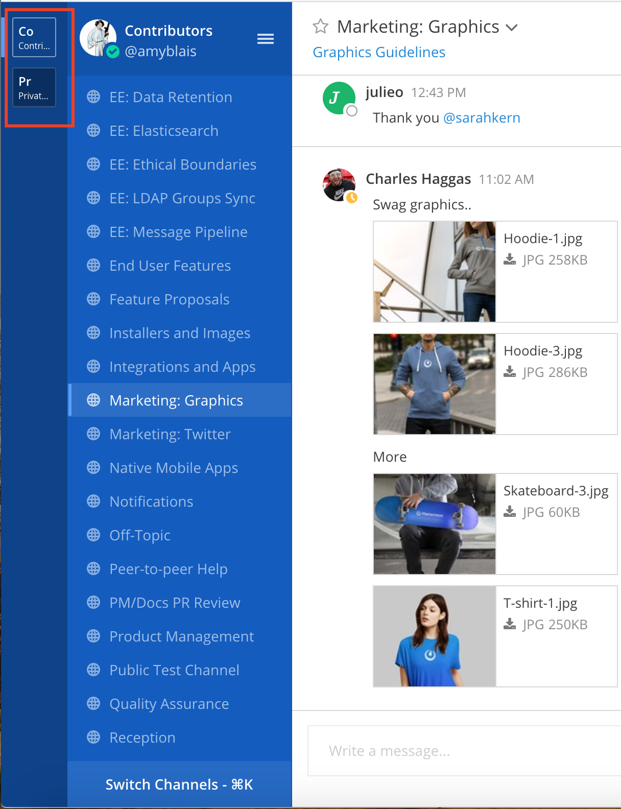

============================
Features Overview
============================

This page gives an overview of some of the features available in Mattermost Team Edition and Enterprise Edition.

Team Edition Feature
----------------------------------------------

1. **1-1 and group messaging**

Chat in real-time with individuals and teams. See all your conversations in one place.

.. image:: ../images/messaging.png

2. **File sharing**

Share documents, videos, images, and other rich media, with inline previews.

.. image:: ../images/file_sharing.png

3. **Custom Emojis**

Express yourself with a full set of emojis, and add your own custom ones.

.. image:: ../images/custom_emojis.png

4. **Webhooks**

Tightly integrate chat with line-of-business systems using incoming and outgoing webhooks.

.. image:: ../images/webhooks.png

5. **Slash commands**

Invoke custom automation from chat - create and update tickets, kick off builds, and more.

.. image:: ../images/slash_commands.png

6. **Plug-in framework**

Customize your chat interface with deep integrations with JIRA, directory information, and other systems.

.. image:: ../images/plugin_framework.png

7. **Mobile applications**

Collaborate with your teams on the go with rich native mobile apps, available for iOS and Android.

.. image:: ../images/mobile_apps.png

8. **Desktop applications**

Use the full featured web interface, or native client apps for Windows, OSX, and Linux.

.. image:: ../images/desktop_apps.png

9. **Multi-team support**

Work across multiple teams and projects from the same rich interface.

10. **Threaded conversations**

Keep conversations organized and on-point with threading and markdown formatting.

.. image:: ../images/threaded_conversations.png

11. **Theme colors**

Personalize your experience with build-in and custom themes.

.. image:: ../images/theme_colors.png

12. **Multi-language support**

Work across borders with one messaging system.

.. image:: ../images/multi-language_support.png

Enterprise Edition Features
----------------------------------------------

1. **AD/LDAP SSO**

Streamline user provisioning and permissions with directory service integration.

.. image:: ../images/AD_LDAP_SSO.png

2. **Advanced Permissions**

Set detailed custom policies and granular permissions for your system.

.. image:: ../images/advanced_permissions.png

3. **MFA**

Add an additional layer of security with multi-factor authentication.

.. image:: ../images/MFA.png

4. **Enterprise support**

Get access to enterprise-level support to accelerate your deployment and rollout.

.. image:: ../images/enterprise_edition_support.png

5. **SAML-based SSO**

Enable single sign-on with SAML integration to your directory service.

.. image:: ../images/SAML_based_SSO.png

6. **Performance Monitoring**

Get detailed service monitoring, with Prometheus and Grafana integration.

.. image:: ../images/performance_monitoring.png

7. **High availability**

Scale to support the entire organization with high availability clustering.

.. image:: ../images/network_diagram.png

8. **Compliance Reporting**

Meet compliance and governance requirements with Global Relay and Actiance integration.

.. image:: ../images/compliance_reports.png

9. **Data Retention**

Set custom policies for how long messages and file uploads are kept in channels and direct messages.

.. image:: ../images/data_retention.png

10. **Custom Branding**

Customize your system to match your company identity, and even completely white-label the user experience.

.. image:: ../images/custom_branding.png

11. **Enterprise Search**

Provide instantaneous full text search with Elasticsearch integration.

.. image:: ../images/enterprise_search.png
