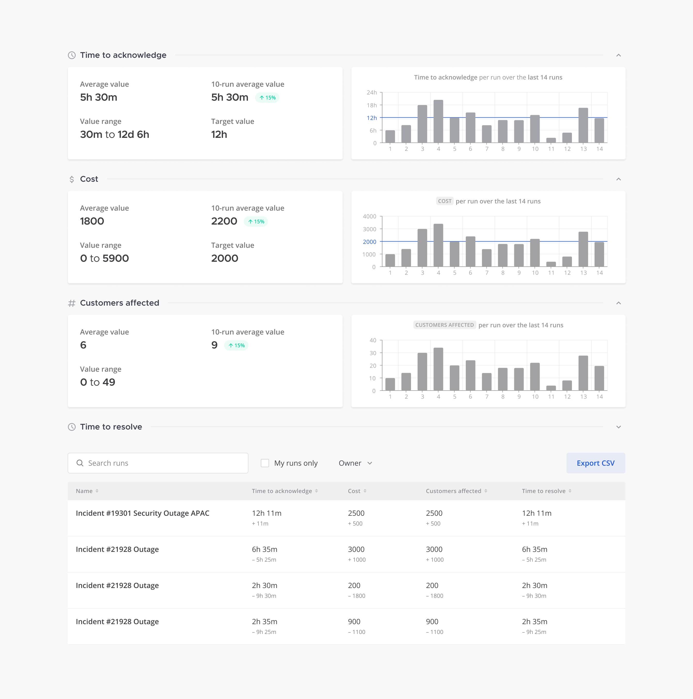

Metrics and goals
=================

.. include:: ../_static/badges/allplans-cloud-selfhosted.rst
  :start-after: :nosearch:

Retrospectives help teams identify areas of improvement in workflows. Each time a playbook is run you can create and publish a retrospective for the team and stakeholders to review. Retrospective components are customized per playbook.

.. note::

   Some metrics and goals functionality (such as timeline and retrospectives) is only available on a paid plan. For more information, visit `https://mattermost.com/pricing <https://mattermost.com/pricing>`_.

Configure retrospectives before a run
-------------------------------------

Open Playbooks and select the **Playbooks** tab. Locate the playbook you want to modify, select the **...** icon under **Actions** and then select **Edit**. In the next screen, select **Retrospective**. Move the toggle to **Enable Retrospective**.

You can set a reminder to fill out the retrospective after a run is finished. The configured template is pre-populated in the run's retrospective.

Use the run timeline to help write an accurate retrospective. Events such as owner changes, status updates, and task assignments appear automatically. Selected posts may also be added to the timeline by using the post context menu.

.. image:: ../images/Retro.gif
   :alt: Create and publish retrospective reports.

Metrics
-------

Use metrics to identify key areas where you want to extract valuable insights by measuring performance and improvement. Metrics are enabled when you enable retrospectives. Calibrate the type of metric you want to measure, and once a run is finished you can view the output in the retrospective. You can have multiple metrics configured per playbook and you can edit them at any time. Metrics can be configured based on numeric, time, or value input.

These metrics can be anything that's of interest to you and your team. For example, for a software release playbook you might want to have a metric tracking how many bugs were detected during a run. The output of the metrics you've added is provided in the retrospective. Over time, you can use metrics across retrospectives to examine anomalies and refine goals.

Another example is a support incident playbook. The time to resolution metric can be applied and used to identify areas that need more refinement, such as tasks that might work better if they're split up so goals are reached faster.

When you delete configured metrics from a playbook, the data isn't deleted, but you no longer see those metrics in the dashboard. In addition, the corresponding metric field is removed from the retrospective form and from published retrospectives.

Metrics dashboard
^^^^^^^^^^^^^^^^^

For each run, you can enter a value per metric under the retrospective section. This value can be based on whatever you are measuring, such as number of bugs found per run. 

You can edit this value as many times as you'd like - for example to ensure you have the correct parameters for your metric - until you've published the retrospective at which point both the metrics and report are no longer editable. The final value only shows up in the playbook dashboard once the retrospective has been published.

The playbook dashboard reports on each metric for all runs by showing:

- Average value for all runs
- The last 10-run average value and difference with prev 10-run average
- The value range for all runs
- The target value
- The actual values chart for last 10-runs

The lower half of the page shows a list of finished runs with metrics values. You can filter or sort a list by metrics values.

Channel export
^^^^^^^^^^^^^^

Exporting the contents of a channel requires the channel export plugin. See the `Channel Export plugin documentation <https://github.com/mattermost/mattermost-plugin-channel-export#readme>`_ for more information.
