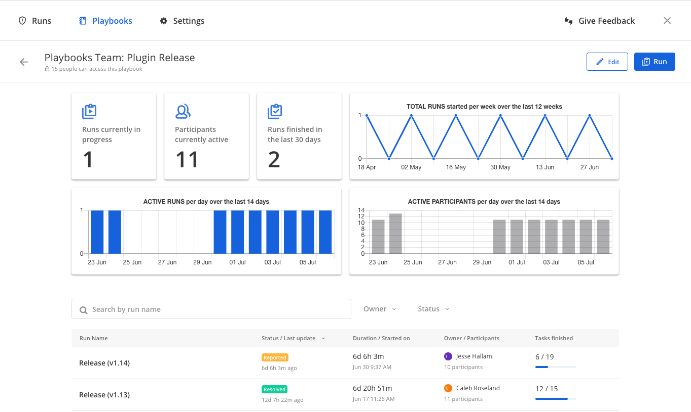

Run a playbook
==============

|all-plans| |cloud| |self-hosted|

.. |all-plans| image:: ../images/all-plans-badge.png
  :scale: 30
  :target: https://mattermost.com/pricing
  :alt: Available in Mattermost Free and Starter subscription plans.

.. |cloud| image:: ../images/cloud-badge.png
  :scale: 30
  :target: https://mattermost.com/deploy
  :alt: Available for Mattermost Cloud deployments.

.. |self-hosted| image:: ../images/self-hosted-badge.png
  :scale: 30
  :target: https://mattermost.com/deploy
  :alt: Available for Mattermost Self-Hosted deployments.

You can start a playbook run using the **Toggle Playbook List** icon in a channel header. Then, select the **Run** icon next to a playbook name. A new channel will be created for your run, which you can access in the channel sidebar.

From the dialog box, you can create a new playbook or proceed with the playbook you chose. Provide a name for your run, then select **Start run**. The creator of a playbook run is automatically added as the first member and becomes the owner. 

Lastly, if you've configured a broadcast channel and enabled it, when the playbook run is created it's announced in the associated channel by the Playbook Bot.
 
You can also use slash commands to initiate playbook runs, make announcements, and get information about a playbook run.

Join a playbook run
-------------------

Open Playbooks to see a list of runs, to which you have access. If the channel is public, you can join it without permission. You can also search for and join the channel via **Find channel** in the channel sidebar.

If the run channel is private, an existing member must invite you.

Work with checklists
~~~~~~~~~~~~~~~~~~~~

Checklists contain tasks - they can be pre-configured task templates and they can also be added, edited, and removed as needed during an active run. Any member of the playbook run can work with tasks. Note that if you edit, add, or delete a task during an active run it applies only to that run. The change isn't applied to the playbook. If you decide to retain that change, edit the playbook's checklist.

If you aren't able to open the checklists to see completed tasks, hover over any area of the checklist. Then in the top right corner, select the filter icon. Under the **Task State** section, select **Show checked tasks**.

* To mark a task as completed, select the unchecked checkbox next to the task. To undo this, clear the checkbox.
* To assign a task to a member of the incident channel, select **No Assignee** (or the existing assignee's username), then select a user.
* To view any description associated with a task, select the information icon to the right of the task name.
* To execute a slash command associated with a task, select **Run** next to the listed slash command. Configured slash commands may be run as often as necessary.

.. image:: ../images/IC-ad-hoc-tasks.gif

Change owners
~~~~~~~~~~~~~

To change playbook owners you can run the ``/playbook owner @username`` slash command from within the run's channel. To change the owner to a user who is not in the channel, first add the user to the channel.

Status updates 
--------------

Status updates ensure that stakeholders remain informed about the playbook run's progress. To post a status update:

1. Select **Toggle Playbook List** from the channel header.
2. Open the run you want to update and select **Go to channel**.
3. Select **Post update**.

 * If this is the first status update and the playbook has a defined template, that template will be pre-populated here.
 * If this is a subsequent status update, the message from the last status update will be pre-populated here.

4. Select a status and add a Markdown-formatted message.
5. Optionally set a reminder to prompt for the next status update.

 * If this is the first status update and the playbook has a defined default reminder timer, that timer will be pre-selected here.
 * If this is a subsequent status update, the last reminder timer will be pre-populated here.

6. Select **Post** to post your status update.

 * Status updates are posted to the run channel as a message from the person posting it.
 * If the playbook has a defined broadcast channel, status updates are copied to the broadcast channel as a message from the Playbooks bot.

The most recent status post will also appear in the right-hand sidebar of the run channel. To correct or remove a status post, edit or delete the post as needed. Note that status updates that are broadcast to another channel won't be updated or removed if the original post is edited or deleted.

End a playbook run
------------------

Run members can end an incident using the ``/playbook end`` slash command. Playbook runs can also be ended from the desktop or browser:

1. Select the **Playbook** icon in the channel header to open the RHS.
2. Find the playbook run you're looking for and select **Go to channel**.
3. Select **Update Status**.
4. From the **Status** drop-down menu, select **Resolved**.
5. Enter a message with additional details.
6. Select **Update Status**.

Ending a playbook run signals to all members of the channel that the playbook run is complete. Members of the team can continue to post in the channel, mark tasks as complete, and change the owner if needed.

Restart a playbook run
~~~~~~~~~~~~~~~~~~~~~~~

If a playbook run was ended prematurely, it can be restarted within the channel using the ``/playbook restart`` slash command. Runs can also be restarted from the desktop or browser:

1. Select the **Playbook** icon in the channel header to open the RHS.
2. Find the playbook run you're looking for and select **Go to channel**.

Slash commands
--------------

Slash commands are available for playbooks. The ``/playbook`` slash command allows interaction with incidents via the post textbox on desktop, browser, and mobile. To run a playbook use the ``/playbook start`` slash command from any channel.

Available slash commands include:

- ``/playbook start`` - Start a playbook run.
- ``/playbook end`` - End a playbook run.
- ``/playbook update`` - Update the current playbook run's status.
- ``/playbook restart`` - Restart an ended playbook run.
- ``/playbook check [checklist item]`` - Check/uncheck the specified task.
- ``/playbook announce ~[channels]`` - Announce the current playbook run in other channels.
- ``/playbook list`` - List all your ongoing playbook runs.
- ``/playbook owner [@username]`` - Show or change the current playbook run owner.
- ``/playbook info`` - Show a summary of the current playbook's activities.
