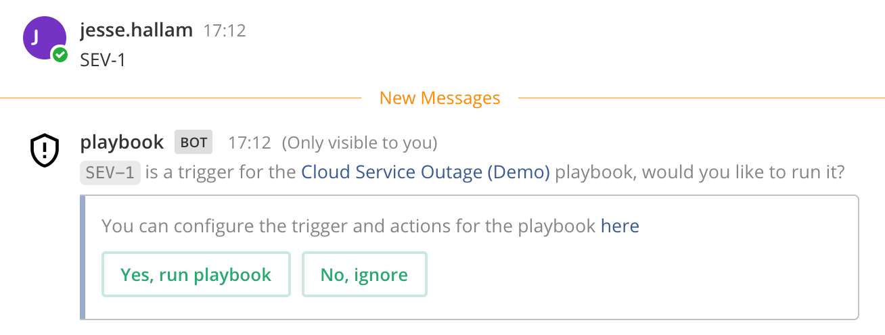

Create a Playbook
==================

|all-plans| |cloud| |self-hosted|

.. |all-plans| image:: ../images/all-plans-badge.png
  :scale: 30
  :target: https://mattermost.com/pricing
  :alt: Available in Mattermost Free and Starter subscription plans.

.. |cloud| image:: ../images/cloud-badge.png
  :scale: 30
  :target: https://mattermost.com/deploy
  :alt: Available for Mattermost Cloud deployments.

.. |self-hosted| image:: ../images/self-hosted-badge.png
  :scale: 30
  :target: https://mattermost.com/deploy
  :alt: Available for Mattermost Self-Hosted deployments.
  
Playbooks help streamline and manage complex processes while decreasing the risk of forgotten steps or tasks. They also support tool integration, status updates in a dedicated channel, and can be edited on the fly. When a playbook run is finished, you can review the entire run to assess any areas of improvement for the next run.

Playbooks are made up of:

- **Checklists:** The list of tasks to be completed for the run. Checklists can be edited ad-hoc during a run.
- **Templates:** Templates for frequently-used actions such as updates and reminders. You can create your own templates or use default ones.
- **Actions:** Automation options for inviting members, webhooks, welcome messages, channel export settings, and more.
- **Permissions:** Manage permissions at a channel and a playbook level.

Make checklists
----------------

1. Open Playbooks and select the **Playbooks** tab.
2. Start a **Blank Playbook**, or use the built-in template.
3. Name your playbook and provide a description.
4. Select the **Checklists** tab.

  You can start with the default checklist and edit it or you can delete it and select **+ New checklist**.

    * Within each checklist, select **+ New task** to add tasks that are meant to be completed together.
    * Drag and drop to reorganize checklists and tasks.
    * Add task descriptions to give additional context to members of the playbook. Descriptions support a limited form of Markdown, including text styling and hyperlinks.
    * Add a slash command to the task that can be executed by members of the playbook as needed.

5. Choose **Save**.
  
Configure templates
-------------------

Templates are standardized sets of content that are used for communicating reminders and updates. Open Playbooks and select the **Templates** tab.

Broadcast channels
~~~~~~~~~~~~~~~~~~

Setting up a dedicated broadcast channel is an easy way to centralize status updates, decrease noise, and remember where everything is. Configure a broadcast channel to which status updates will be copied. If you are not a member of the configured broadcast channel, **Unknown Channel** is displayed instead of the channel name.

Reminder timers
~~~~~~~~~~~~~~~

Configure the default reminder timer used to prompt for regular updates. The reminder timer may be changed when a status update is written.

Update templates
~~~~~~~~~~~~~~~~

Configure a template to use for the first status update. Subsequent status updates will start with the text of the most recent update.

Define actions
--------------

You can customize actions associated with your playbook by setting up keyword triggers, automate member invites, and add a welcome message for new members.

Select the **Actions** tab to view the automation options available.

Keywords
~~~~~~~~

When you use the **Keywords** action any team member who has access to the playbook and who uses one of the listed keywords will see a message like this:

If you find your keywords result in too many false positives, consider refining your list and also consider that URLs used by run members may also contain monitored keywords.

Webhooks
~~~~~~~~

- For information about the webhook payload for run start, see the `PlaybookRunWebhookPayload struct <https://github.com/mattermost/mattermost-plugin-playbooks/blob/b4c8058d8660efe35050bc7eb080e3819c7ab09c/server/app/playbook_run_service.go#L176-L185>`_. An example of the JSON payload for a run start `is available here <https://gist.github.com/icelander/b68f2bf2b4ffefec93400cb050211cf1>`_.
- For information about the webhook payload for status update, see the `PlaybookRunWebhookPayload struct <https://github.com/mattermost/mattermost-plugin-playbooks/blob/b4c8058d8660efe35050bc7eb080e3819c7ab09c/server/app/playbook_run_service.go#L176-L185>`_. An example JSON payload for a status update `is available here <https://gist.github.com/icelander/2f9938ad68d1e0aa656f97969895d080>`_.

Set permissions
---------------

1. Go to **Main Menu > Playbooks**, and then select **Permissions**.

 * **Channel access**: Decide whether the automatically-created channel should be Public or Private within the team.
 * **Playbook access**: Share this playbook with other members of the team to allow them to use the playbook to start a run, as well as edit the playbook.

Edit a playbook
---------------

You can change a playbook's configuration at any time, but changes will only be applied to future incidents. Ongoing or ended incidents previously started from that playbook remain unchanged.

1. Go to **Main Menu > Playbooks**.
2. Find the playbook to be edited.

 * Only playbooks of which you are a member are listed. System Admins have unrestricted access to all playbooks on the team.

3. Select the name of the playbook.

 * To edit the playbook directly select the **Actions** menu next to the playbook name, then select **Edit**.
 * To access the playbook dashboard, select the hyperlinked playbook name.

4. Configure the playbook the same way a playbook is created or edited.
