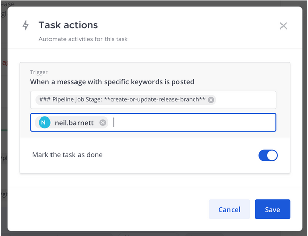

Work with tasks
===============

Tasks and due dates
-------------------

In some workflows, there are time constraints on tasks and others may have more flexible timeframes. Associating tasks with deliverable dates provides visibility into workloads and helps everyone stay accountable during the run.

To assign a due date to a task, select the **Toggle Run Details** icon to open the **Run Details** screen. Hover over the task you’d like to edit and select the calendar icon to assign a due date. Due dates can be used to sort tasks in the run overview.

When a due date is assigned to a task, and the task is overdue or due today, a reminder is added to the Playbooks daily digest along with tasks that don't have an assigned due date. As tasks are completed, they're removed from the daily digest reminders. You can refresh the list of assigned tasks at any time using the ``/playbook todo`` slash command.

Due dates can be entered in text (e.g., "two minutes ago") or numerically (e.g., "15 March 2023").

Task actions
------------

You can automatically complete tasks in a playbook run using keyword triggers. When the keywords you've entered are mentioned in the run, the task is marked as completed.

For this to work accurately you should use a string of text rather than individual words. The search is an ``ANY`` search, meaning that if you used the individual words "target" and "completed", either of those words will trigger the action to be marked as complete. If you're using phrases that have formatting, make sure you use the Markdown formatting in the text field.

When you edit a task, you'll see the following: 

- The text to search for in the messages
- Ability to limit this for posts from a specific user (or bot)
- Option to mark the task as done (or not).

Task inbox
----------

In addition to the daily digest, you also have access to a task inbox. The task inbox provides you with a cross-run overview of the tasks you're accountable for, sorted by due date.

You can:

- Access each task directly, without having to visit the individual runs.
- Mark tasks as complete or skip them.
- Change the task assignee from yourself to another team member. The task will then be removed from your inbox.
- You can change the due date of tasks to manage priorities and urgency.

To view your task inbox, open the playbooks tab. In the header, next to your profile photo, select the tasks list icon. A list of every task assigned to you from every run that's in progress is displayed.
