.. _theme-colors:

Customize your Mattermost theme
===============================

.. include:: ../_static/badges/allplans-cloud-selfhosted.rst
  :start-after: :nosearch:

.. |gear-icon| image:: ../images/settings-outline_F08BB.svg
  :alt: Use the Settings icon to customize your Mattermost user experience.

The colors of the Mattermost user interface are customizable. You can choose from `five standard themes <#standard-themes>`__ designed by the Mattermost team, design your own theme based on a standard theme, or `import your theme colors from a Slack instance <#import-theme-from-slack>`__. Your theme changes apply to all teams you're a member of, and are visible across all Mattermost clients.

.. tip::

   Mattermost Enterprise customers can configure a different theme for every team they're a member of.

To customize your Mattermost theme:

.. tabs::

  .. tab:: Browser/desktop

    Select the **Settings** |gear-icon| icon, then go to **Display > Theme**. Select **Theme Colors** to choose from five standard themes designed by the Mattermost team. 

    Using Mattermost in a browser or the desktop app, you can customize a standard theme further to truly make it your own. After selecting a standard theme, select **Custom Theme** and modify your color choices based on your preferences. See the `custom themes <#custom-themes>`__ documentation to learn what's configurable, and see the `custom theme examples <#custom-theme-examples>`__ documentation for inspiration.

  .. tab:: Mobile

    Tap your profile picture, and select **Settings**, then go to **Display > Theme**.

Custom themes
-------------

Select **Custom Theme**, then expand the `Sidebar Styles </preferences/customize-your-theme.html#sidebar-styles>`__, `Center Channel Styles </preferences/customize-your-theme.html#center-channel-styles>`__, and `Link and Button Styles </preferences/customize-your-theme.html#link-and-button-styles>`__ options to customize individual interface colors, such as backgrounds, links, text, and borders. 

Your custom theme changes are applied in Mattermost as you make them. Select **Save** to confirm your theme changes. Discard your changes by exiting the **Display Settings** window and selecting **Yes, Discard**.

Sidebar styles
~~~~~~~~~~~~~~

Sidebar BG
  	Background color of the Channels pane, and Account and Team settings navigation sidebars.
Sidebar Text
  	Text color of read channels in the Channels pane, and tabs in the Account and Team settings navigation sidebar.
Sidebar Header BG
 	Background color of the header above the Channels pane and all dialog window headers.
Team Sidebar BG
	Background color of the Global Header.
Sidebar Header Text
 	Text color of the header above the Channels pane and all dialog window headers.
Sidebar Unread Text
	Text color of unread channels in the Channels pane.
Sidebar Text Hover BG
	Background color behind channel names and settings tabs as you hover over them.
Sidebar Text Active Border
	Color of the rectangular marker on the left side of the Channels pane or Settings sidebar indicating the active channel or tab.
Sidebar Text Active Color
	Text color of the active channel or tab in the Channels pane or Settings sidebar.
Online Indicator
	Color of the online indicator appearing next to team members names in the direct messages list.
Away Indicator
	Color of the away indicator appearing next to team members names in the direct messages list when they have had no browser activity for 5 minutes.
Do Not Disturb Indicator
	Color of the do not disturb indicator appearing next to team members names in the direct messages list.
Mention Jewel BG
	Background color of the jewel indicating unread mentions that appears to the right of the channel name. This is also the background color of the “Unread Posts Below/Above” indicator appearing at the top or bottom of the Channels pane on shorter browser windows.
Mention Jewel Text
	Text color on the mention jewel indicating the number of unread mentions. This is also the text color on the “Unread Posts Below/Above” indicator.

Center channel styles
~~~~~~~~~~~~~~~~~~~~~

Center Channel BG
	Color of the center pane, right-hand sidebar and all dialog window backgrounds.
Center Channel Text
	Color of all the text - with the exception of mentions, links, hashtags and code blocks - in the center pane, right-hand sidebar, and dialogs.
New Message Separator
	The new message separator appears below the last read message when you navigate to a channel with unread messages.
Error Text Color
	Color of all error text.
Mention Highlight BG
	Highlight color behind your words that trigger mentions in the center pane and right-hand sidebar.
Mention Highlight Link
	Text color of your words that trigger mentions in the center pane and right-hand sidebar.
Code Theme
	Background and syntax colors for all code blocks.

Link and button styles
~~~~~~~~~~~~~~~~~~~~~~

Link Color
	Text color of all links, hashtags, teammate mentions, and low priority UI buttons.
Button BG
	Color of the rectangular background behind all high priority UI buttons.
Button Text
	Text color appearing on the rectangular background for all high priority UI buttons.

Export your custom theme
-------------------------

Export a theme from Mattermost by copying the theme values from the Custom Theme menu.
  
Import a custom theme
----------------------

Import a theme into Mattermost by pasting the theme values into the Custom Theme menu. Copy existing theme values, then paste the theme values into the **Copy and paste to share theme colors** field. Select **Save** to confirm your theme changes.

Import theme from Slack
-----------------------

To import a theme, in Slack, go to **Preferences > Themes**, select **Create a custom theme**, then copy the theme color values.

In Mattermost, select **Import theme colors from Slack**, then paste the color values into the input box and select **Submit**. Any theme settings that are not customizable in Slack will default to the “Mattermost” standard theme settings. Select **Save** to confirm your theme changes.

Custom theme examples
----------------------

Customize your theme colors and share them with others by copying and pasting theme values into the input box. Below are some example themes with their corresponding theme values.

Mattermost
~~~~~~~~~~

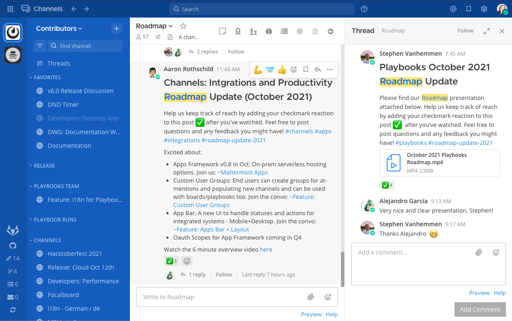

Want this theme? Copy and paste the following code into Mattermost:

.. code-block:: none

	{"sidebarBg":"#145dbf","sidebarText":"#ffffff","sidebarUnreadText":"#ffffff","sidebarTextHoverBg":"#4578bf","sidebarTextActiveBorder":"#579eff","sidebarTextActiveColor":"#ffffff","sidebarHeaderBg":"#1153ab","sidebarTeamBarBg":"#0b428c","sidebarHeaderTextColor":"#ffffff","onlineIndicator":"#06d6a0","awayIndicator":"#ffbc42","dndIndicator":"#f74343","mentionBg":"#ffffff","mentionBj":"#ffffff","mentionColor":"#145dbf","centerChannelBg":"#ffffff","centerChannelColor":"#3d3c40","newMessageSeparator":"#ff8800","linkColor":"#2389d7","buttonBg":"#166de0","buttonColor":"#ffffff","errorTextColor":"#fd5960","mentionHighlightBg":"#ffe577","mentionHighlightLink":"#166de0","codeTheme":"github"}

Organization
~~~~~~~~~~~~

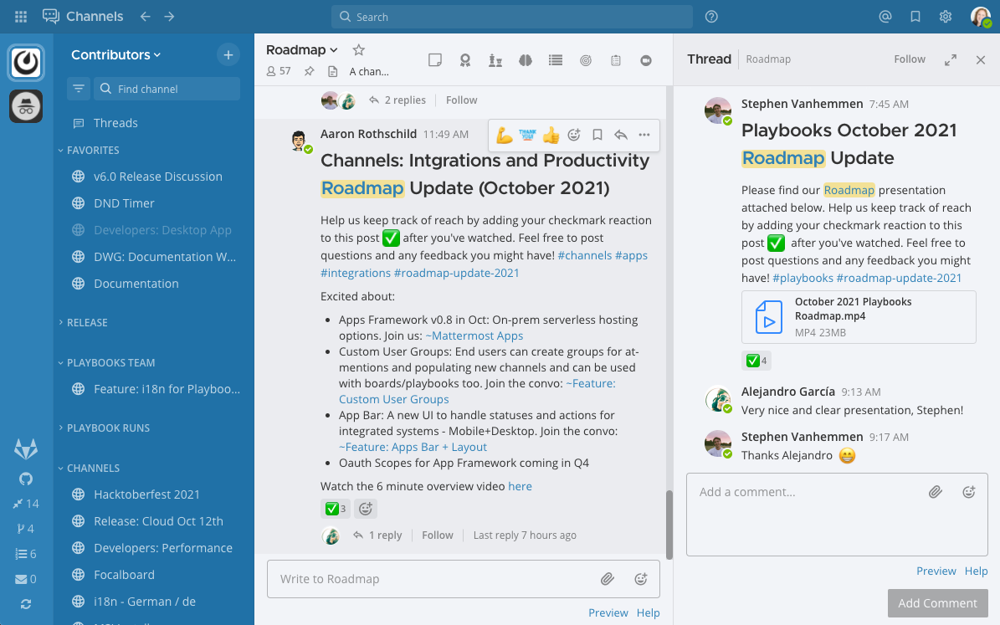

Want this theme? Copy and paste the following code into Mattermost:

.. code-block:: none

	{"sidebarBg":"#2071a7","sidebarText":"#ffffff","sidebarUnreadText":"#ffffff","sidebarTextHoverBg":"#136197","sidebarTextActiveBorder":"#7ab0d6","sidebarTextActiveColor":"#ffffff","sidebarHeaderBg":"#2f81b7","sidebarTeamBarBg":"#256996","sidebarHeaderTextColor":"#ffffff","onlineIndicator":"#7dbe00","awayIndicator":"#dcbd4e","dndIndicator":"#ff6a6a","mentionBg":"#fbfbfb","mentionColor":"#2071f7","centerChannelBg":"#f2f4f8","centerChannelColor":"#333333","newMessageSeparator":"#ff8800","linkColor":"#2f81b7","buttonBg":"#1dacfc","buttonColor":"#ffffff","errorTextColor":"#a94442","mentionHighlightBg":"#f3e197","mentionHighlightLink":"#2f81b7","codeTheme":"github"}

Mattermost Dark
~~~~~~~~~~~~~~~~

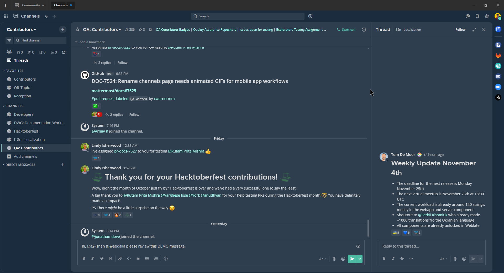

Want this theme? Copy and paste the following code into Mattermost:

.. code-block:: none

	{"sidebarBg":"#1b2c3e","sidebarText":"#ffffff","sidebarUnreadText":"#ffffff","sidebarTextHoverBg":"#4a5664","sidebarTextActiveBorder":"#66b9a7","sidebarTextActiveColor":"#ffffff","sidebarHeaderBg":"#1b2c3e","sidebarTeamBarBg":"#152231","sidebarHeaderTextColor":"#ffffff","onlineIndicator":"#65dcc8","awayIndicator":"#c1b966","dndIndicator":"#e81023","mentionBg":"#b74a4a","mentionColor":"#ffffff","centerChannelBg":"#2f3e4e","centerChannelColor":"#dddddd","newMessageSeparator":"#5de5da","linkColor":"#a4ffeb","buttonBg":"#4cbba4","buttonColor":"#ffffff","errorTextColor":"#ff6461","mentionHighlightBg":"#984063","mentionHighlightLink":"#a4ffeb","codeTheme":"solarized-dark"}

Windows Dark
~~~~~~~~~~~~

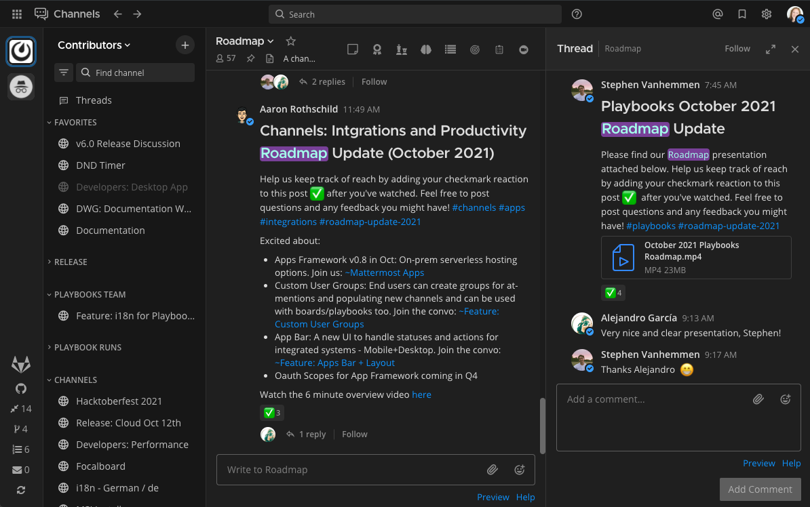

Want this theme? Copy and paste the following code into Mattermost:

.. code-block:: none

	{"sidebarBg":"#171717","sidebarText":"#ffffff","sidebarUnreadText":"#ffffff","sidebarTextHoverBg":"#302e30","sidebarTextActiveBorder":"#196caf","sidebarTextActiveColor":"#ffffff","sidebarHeaderBg":"#1f1f1f","sidebarTeamBarBg":"#181818","sidebarHeaderTextColor":"#ffffff","onlineIndicator":"#399fff","awayIndicator":"#c1b966","dndIndicator":"#e81023","mentionBg":"#0177e7","mentionColor":"#ffffff","centerChannelBg":"#1f1f1f","centerChannelColor":"#dddddd","newMessageSeparator":"#cc992d","linkColor":"#0d93ff","buttonBg":"#0177e7","buttonColor":"#ffffff","errorTextColor":"#ff6461","mentionHighlightBg":"#784098","mentionHighlightLink":"#a4ffeb","codeTheme":"monokai"}

GitHub Theme
~~~~~~~~~~~~

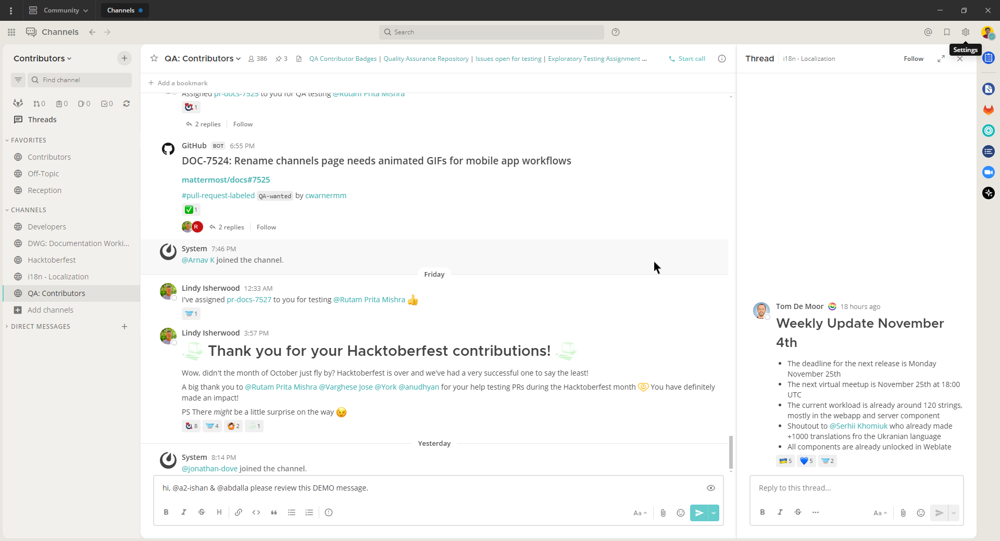

Want this theme? Copy and paste the following code into Mattermost:

.. code-block:: none

	{"awayIndicator":"#D4B579","buttonBg":"#66CCCC","buttonColor":"#FFFFFF","centerChannelBg":"#FFFFFF","centerChannelColor":"#444444","codeTheme":"github","linkColor":"#3DADAD","mentionBg":"#66CCCC","mentionColor":"#FFFFFF","mentionHighlightBg":"#3DADAD","mentionHighlightLink":"#FFFFFF","newMessageSeparator":"#F2777A","onlineIndicator":"#52ADAD","sidebarBg":"#F2F0EC","sidebarHeaderBg":"#E8E6DF","sidebarHeaderTextColor":"#424242","sidebarText":"#2E2E2E","sidebarTextActiveBorder":"#66CCCC","sidebarTextActiveColor":"#594545","sidebarTextHoverBg":"#E0E0E0","sidebarUnreadText":"#515151"}

Monokai Theme
~~~~~~~~~~~~~

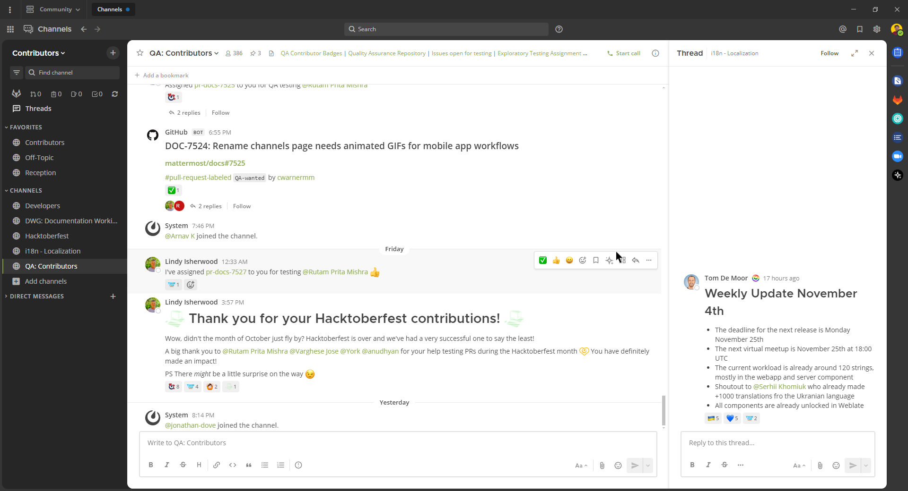

Want this theme? Copy and paste the following code into Mattermost:

.. code-block:: none

	{"awayIndicator":"#B8B884","buttonBg":"#90AD58","buttonColor":"#FFFFFF","centerChannelBg":"#FFFFFF","centerChannelColor":"#444444","codeTheme":"monokai","linkColor":"#90AD58","mentionBg":"#7E9949","mentionColor":"#FFFFFF","mentionHighlightBg":"#54850C","mentionHighlightLink":"#FFFFFF","newMessageSeparator":"#90AD58","onlineIndicator":"#99CB3F","sidebarBg":"#262626","sidebarHeaderBg":"#363636","sidebarHeaderTextColor":"#FFFFFF","sidebarText":"#FFFFFF","sidebarTextActiveBorder":"#7E9949","sidebarTextActiveColor":"#FFFFFF","sidebarTextHoverBg":"#525252","sidebarUnreadText":"#CCCCCC"}

Solarized Dark Theme
~~~~~~~~~~~~~~~~~~~~

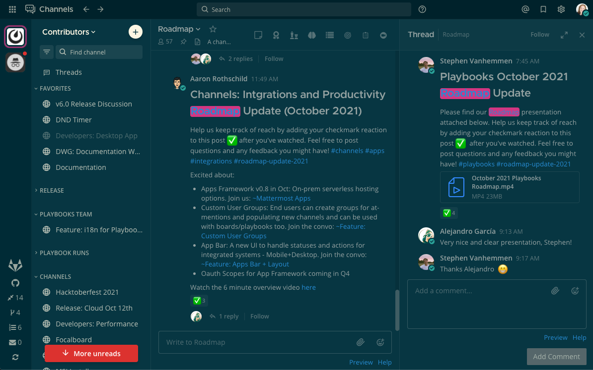

Want this theme? Copy and paste the following code into Mattermost:

.. code-block:: none

	{"awayIndicator":"#E0B333","buttonBg":"#859900","buttonColor":"#fdf6e3","centerChannelBg":"#073642","centerChannelColor":"#93a1a1","codeTheme":"solarized-dark","linkColor":"#268bd2","mentionBg":"#dc322f","mentionColor":"#ffffff","mentionHighlightBg":"#d33682","mentionHighlightLink":"#268bd2","newMessageSeparator":"#cb4b16","onlineIndicator":"#2AA198","sidebarBg":"#073642","sidebarHeaderBg":"#002B36","sidebarHeaderTextColor":"#FDF6E3","sidebarText":"#FDF6E3","sidebarTextActiveBorder":"#d33682","sidebarTextActiveColor":"#FDF6E3","sidebarTextHoverBg":"#CB4B16","sidebarUnreadText":"#FDF6E3","errorTextColor":"#dc322f"}

Gruvbox Dark Theme
~~~~~~~~~~~~~~~~~~~

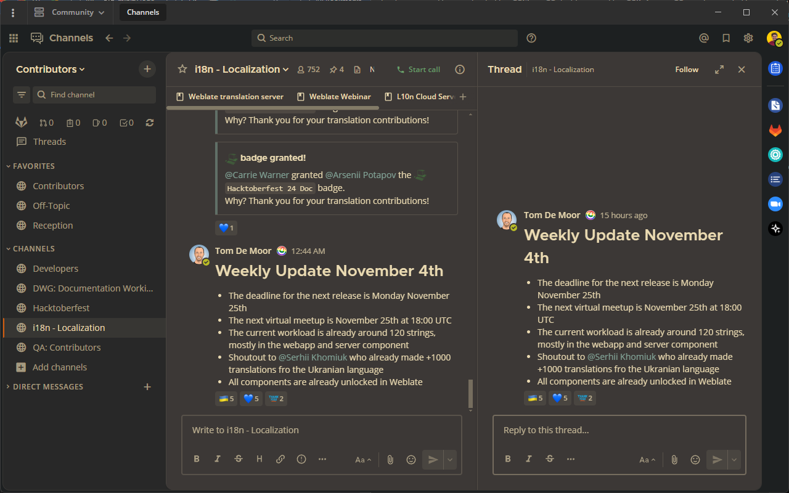

Want this theme? Copy and paste the following code into Mattermost:

.. code-block:: none

	{"awayIndicator":"#fabd2f","buttonBg":"#689d6a","buttonColor":"#ebdbb2","centerChannelBg":"#3c3836","centerChannelColor":"#ebdbb2","codeTheme":"monokai","errorTextColor":"#fb4934","linkColor":"#83a598","mentionBg":"#b16286","mentionColor":"#fbf1c7","mentionHighlightBg":"#d65d0e","mentionHighlightLink":"#fbf1c7","newMessageSeparator":"#d65d0e","onlineIndicator":"#b8bb26","sidebarBg":"#282828","sidebarHeaderBg":"#1d2021","sidebarHeaderTextColor":"#ebdbb2","sidebarText":"#ebdbb2","sidebarTextActiveBorder":"#d65d0e","sidebarTextActiveColor":"#fbf1c7","sidebarTextHoverBg":"#d65d0e","sidebarUnreadText":"#fe8019"}

One Dark Theme
~~~~~~~~~~~~~~

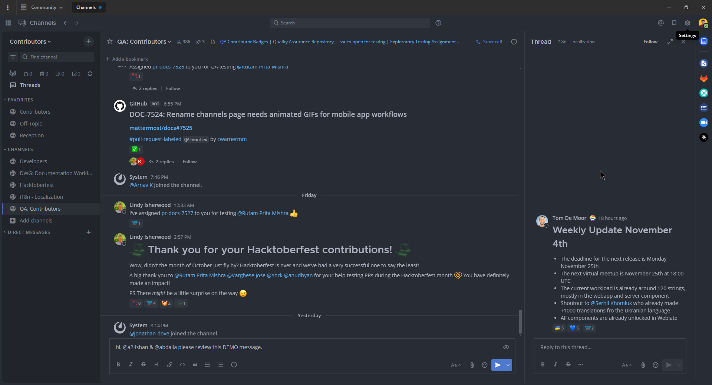

`Visit the one-dark-mattermost GitHub repository online: <https://github.com/georgewitteman/one-dark-mattermost>`__.

Want this theme? Copy and paste the following code into Mattermost:

.. code-block:: none

	{"sidebarBg":"#21252b","sidebarText":"#abb2bf","sidebarUnreadText":"#abb2bf","sidebarTextHoverBg":"#3a3f4b","sidebarTextActiveBorder":"#4d78cc","sidebarTextActiveColor":"#d7dae0","sidebarHeaderBg":"#282c34","sidebarHeaderTextColor":"#abb2bf","onlineIndicator":"#98c379","awayIndicator":"#d19a66","dndIndicator":"#be5046","mentionBg":"#98c379","mentionColor":"#ffffff","centerChannelBg":"#282c34","centerChannelColor":"#abb2bf","newMessageSeparator":"#c67add","linkColor":"#61afef","buttonBg":"#4d78cc","buttonColor":"#ffffff","errorTextColor":"#f44747","mentionHighlightBg":"#525a69","mentionHighlightLink":"#61afef","codeTheme":"monokai","mentionBg":"#98c379"}

Discord Dark Theme
~~~~~~~~~~~~~~~~~~

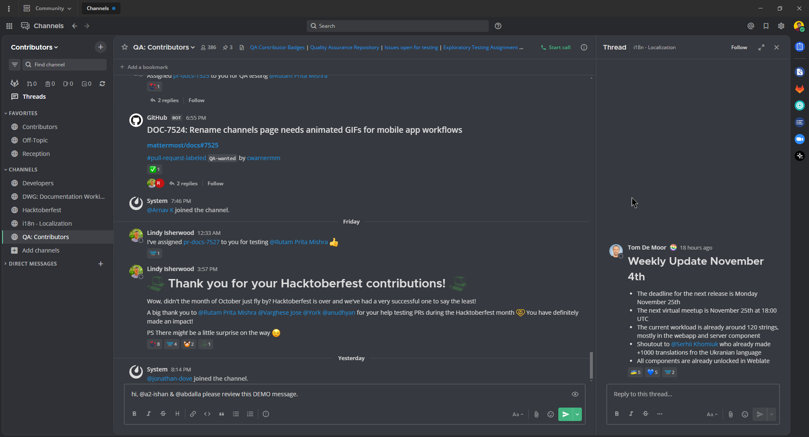

`Visit the mattermost-discord-dark GitHub repository online: <https://github.com/danger89/mattermost-discord-dark>`__.

Want this theme? Copy and paste the following code into Mattermost:

.. code-block:: none

	{"sidebarBg":"#2f3136","sidebarText":"#ffffff","sidebarUnreadText":"#ffffff","sidebarTextHoverBg":"#33363c","sidebarTextActiveBorder":"#66cfa0","sidebarTextActiveColor":"#ffffff","sidebarHeaderBg":"#27292c","sidebarHeaderTextColor":"#ffffff","onlineIndicator":"#43b581","awayIndicator":"#faa61a","dndIndicator":"#f04747","mentionBg":"#6e84d2","mentionBg":"#6e84d2","mentionColor":"#ffffff","centerChannelBg":"#36393f","centerChannelColor":"#dddddd","newMessageSeparator":"#6e84d2","linkColor":"#2095e8","buttonBg":"#43b581","buttonColor":"#ffffff","errorTextColor":"#ff6461","mentionHighlightBg":"#3d414f","mentionHighlightLink":"#6e84d2","codeTheme":"monokai"}

Night Owl Dark Theme
~~~~~~~~~~~~~~~~~~~~

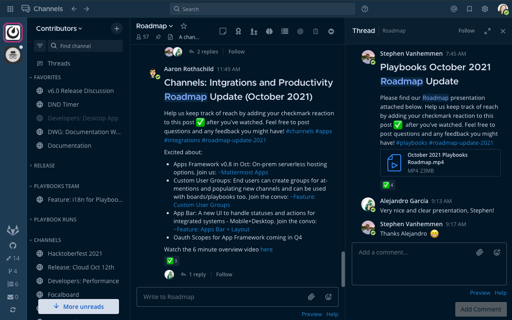

Want this theme? Copy and paste the following code into Mattermost:

.. code-block:: none

	{"sidebarBg":"#011627","sidebarText":"#d6deeb","sidebarUnreadText":"#d6deeb","sidebarTextHoverBg":"#1d3b53","sidebarTextActiveBorder":"#ff2c83","sidebarTextActiveColor":"#82aaff","sidebarHeaderBg":"#1d3b53","sidebarHeaderTextColor":"#d6deeb","onlineIndicator":"#addb67","awayIndicator":"#ffbc42","dndIndicator":"#f74343","mentionBg":"#d6deeb","mentionBg":"#d6deeb","mentionColor":"#145dbf","centerChannelBg":"#011627","centerChannelColor":"#d6deeb","newMessageSeparator":"#ff8800","linkColor":"#2389d7","buttonBg":"#166de0","buttonColor":"#011627","errorTextColor":"#fd5960","mentionHighlightBg":"#0b2942","mentionHighlightLink":"#82aaff","codeTheme":"solarized-dark"}

Dark Theme (desktop app only)
-----------------------------

On Windows and macOS, the system display preference that you set on your computer (e.g., Light Mode or Dark Mode) is also applied to the Mattermost desktop app.

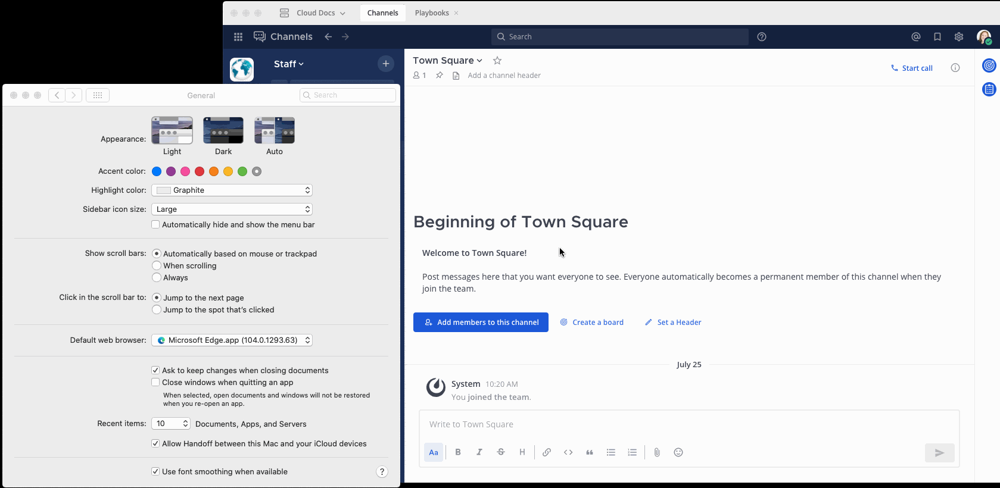

On Linux, you can manage this manually via the **View** menu.