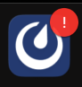

Manage your mobile notifications
=================================

.. include:: ../_static/badges/allplans-cloud-selfhosted.rst
  :start-after: :nosearch:

.. |numbered-badge| image:: ../images/numbered-badge.png
  :alt: A numbered badge means you have at least 1 unread message, @mention, or one of your keywords has triggered a notification.
  :width: 50px

Enable notifications
--------------------

From Mattermost v9.9, Mattermost prompts you to enable notifications in the mobile app the first time you open the app.

When you enable notifications, you'll start receiving notifications for all Mattermost activity with `badges <#badge-based-notifications>`__, and `push notifications <#push-notifications>`__. See the section below on `customizing your notifications <#customize-your-notifications>`__ based on how you prefer to be notified about Mattermost activity on your mobile device.

Badge-based notifications
-------------------------

Mattermost mobile app icons display numbered badges for unread :ref:`direct <collaborate/channel-types:direct messages>` and :ref:`group <collaborate/channel-types:group messages>` messages, and :doc:`@mentions </preferences/manage-your-mentions-keywords-notifications>`, :doc:`keywords </preferences/manage-your-mentions-keywords-notifications>` you're actively watching. 

|numbered-badge|

.. note::

  - The Mattermost mobile app doesn't display dot badges indicating other unread activity by design. You're notified about the activity you're most likely to care about on mobile because you're directly involved.
  - Android users may see Mattermost notifications in the Android Notification Shade while the Mattermost icon shows no badge. This is because the Android notification system may also display badges unread activity.

Push notifications
------------------

You'll see mobile push notification messages on your device as follows:

- **iOS**: On the Lock Screen, Notification Center, and as Banners/Alerts based on your iOS settings.
- **Android**: On the Lock Screen, Notification Shade, and as Banners/Heads-Up Notifications based on your Android settings.

Customize your notifications
----------------------------

.. tip::

  Are you a desktop app user who also uses mobile? You can customize your mobile notifications in the Mattermost desktop app.

  1. Go to **Settings > Desktop and mobile notifications**.
  2. Enable notifications for **all new messages**, or **mentions, direct messages and group messages**.
  3. Select **Use different settings for my mobile devices**.

Reduce mobile notifications
~~~~~~~~~~~~~~~~~~~~~~~~~~~

To reduce the number of notifications you receive on your mobile device, tap your profile picture, then tap **Settings > Notifications**.

- Tap **Mentions** to disable notifications based on keywords that trigger mentions, including first name, username, channel-wide @mentions, and keywords you've specified.
- Tap **Push Notifications** to get notified about **mentions, direct messages, and group messages** only, and only when you're **away or offline**, or only when you're **offline**.

Incoming Call notifications
~~~~~~~~~~~~~~~~~~~~~~~~~~~

Want to hear a sound on your mobile device when a Mattermost call starts? If your Mattermost admin :ref:`enables this Beta feature <configure/plugins-configuration-settings:enable call ringing>`, select **Call Notifications** to choose the sound that plays when a call is started within a direct or group message you're participating in.

.. tip::

  - From Mattermost mobile app v2.19, incoming call sounds also include device vibration, as well as vibration-only when your device is in silent mode.
  - If you prefer a separate call sound on mobile, your mobile change applies only to your mobile device.

Receive push notifications for all channel messages
~~~~~~~~~~~~~~~~~~~~~~~~~~~~~~~~~~~~~~~~~~~~~~~~~~~

To receive push notifications for all new messages in specific channels, tap the channel name > tap **Mobile Notifications > All new messages**.

Disable all mobile notifications
~~~~~~~~~~~~~~~~~~~~~~~~~~~~~~~~

To disable all Mattermost mobile notifications, tap **Push Notifications > Nothing**.

Frequently asked questions
--------------------------

Are mobile notification counts the same as other Mattermost clients?
~~~~~~~~~~~~~~~~~~~~~~~~~~~~~~~~~~~~~~~~~~~~~~~~~~~~~~~~~~~~~~~~~~~~~

No. You're only notified of unread threads with @mentions on your mobile device. You're not notified of general unread activity on mobile.

What does a Mattermost icon with an exclamation point mean?
~~~~~~~~~~~~~~~~~~~~~~~~~~~~~~~~~~~~~~~~~~~~~~~~~~~~~~~~~~~

A Mattermost icon with an exclamation point means that you're logged out of at least 1 Mattermost server you connect to using the mobile app. Log back in to any servers as needed. See the :doc:`Connect to multiple workspaces </preferences/connect-multiple-workspaces>` documentation for details.