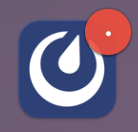
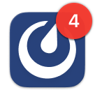

Manage your notifications
=========================

.. include:: ../_static/badges/allplans-cloud-selfhosted.rst
  :start-after: :nosearch:

.. |gear| image:: ../images/settings-outline_F08BB.svg
  :alt: Use the Settings icon to customize your Mattermost user experience.

.. |channel-info| image:: ../images/information-outline_F02FD.svg
  :alt: Use the Channel Info icon to access additional channel management options.

.. |more-icon| image:: ../images/dots-horizontal_F01D8.svg
    :alt: Use the More icon to access additional message options.

Mattermost notifies you of new activity in the following ways:

- **Badges**: In Mattermost, badges show you when you have unread messages and threads.

    - |dot-badge| A dot on the badge means you have unread activity in at least one channel you're a member of.
    - |numbered-badge| A numbered badge means you have at least one unread `direct message </collaborate/channel-types.html#direct-messages>`__, `group message </collaborate/channel-types.html#group-messages>`__, `@mention </collaborate/mention-people.html>`__, or one of your keywords has triggered a notification.
- **Banner alerts**: Pop-ups alert you to new activity.
- **Push notifications**: Mobile app alert you to new activity when you're on the go.
- **Sounds**: Audible sounds alert you to new activity.

.. include:: ../_static/badges/academy-notifications.rst
  :start-after: :nosearch:

Get notified
-------------

You can configure Mattermost to receive increase or decrease the number of notifications based on your preferences.

In a web browser or the desktop app, select the **Settings** |gear| icon located in the top right corner of the screen to manage your notification preferences.

On mobile, select the **Settings** |gear| icon and tap **Notifications**.

.. tabs::
    
    .. tab:: Web/Desktop
        
        By default, you're notified of all Mattermost activity in both a web browser and the desktop app with badges, banner alerts, and sounds. In supported web browsers, the tab's favicon also notifies you of unread messages with an asterisk (*) and a count.
            
        **Too many notifications!**

        If that's too many notifications, you can configure Mattermost to notify you for only mentions and direct messages. Select **Desktop Notifications > Only for mentions and direct messages**. 

        Disable web and desktop notifications altogether by selecting **Desktop Notifications > Never**.

        **Too loud**

        You can change or disable the audible sound for notifications. Go to **Desktop notifications > Notification sound**, and choose a different sound or turn the sound off.

        **Incoming call sounds**

        Want to hear a sound when a Mattermost call starts? If your Mattermost admin `enables this beta feature </configure/plugins-configuration-settings.html#enable-call-ringing-beta>`__, you can choose the sound that plays when a call is started within a direct or group message you're participating in by going to **Desktop notifications > Notification sound for incoming calls**.
        
        You can disable incoming call sounds altogether if preferred.

    .. tab:: Email 
        
        By default, you're notified of all Mattermost activity by email right away when you're offline or away from Mattermost for more than 5 minutes.

        **Too many notifications!**

        Turn off email notifications altogether by selecting **Email Notifications > Never**.

        **Group email notifications in batches**

        Mattermost also supports the ability to group multiple email notifications together into a single email. If your Mattermost admin `enables this feature </configure/site-configuration-settings.html#notification-enableemailbatching>`__, you'll receive batches of notifications by email every 15 minutes, or as configured by your admin.

    .. tab:: Mobile

        By default, you're notified of all Mattermost activity in the mobile app when you're away or offline for more than 5 minutes.

        **Too many notifications!**

        If that's too many notifications, you can configure Mattermost to notify you for only mentions and direct messages. Select **Mobile Push Notifications > For mentions and direct messages**.

        **Only notify me when I'm offline**

        If you prefer to be notified of all activity, but only when you're offline, select **For all activity** and then select **Offline**.

        Turn off all mobile notifications by selecting **Mobile Push Notifications > Never**.

        **Not enough notifications**

        If you prefer to always be notified, regardless of your user status, select **Mobile Push Notifications > Trigger push notifications when > Online, away or offline**.

    .. tab:: @mentions/keywords

        By default, you’re notified when you’re @mentioned in a message or a thread by your username or first name, or when a thread you’re following has a new response. For all other messages, the channel is highlighted to indicate unread messages.

        You're also notified when someone uses channel-wide mentions including @channel, @all, and @here. 

        **Customize notification keywords**

        You can customize any additional non case-sensitive keywords to trigger notifications. For example, you can receive notifications for all messages and threads related to a specific topic, project name, or customer. Separate multiple keywords using commas or by pressing :kbd:`Tab`, and use :kbd:`Backspace` to manage keywords.

    .. tab:: Replies

        If `Collapsed Reply Threads </collaborate/organize-conversations.html>`__ is disabled, you won't be notified in reply threads unless you're @mentioned. However, you can configure Mattermost to notify you when someone replies to a thread you started, or started or have participated in. Select **Reply notifications** to choose the option that works best for you. This setting is hidden when Collapsed Reply Threads is enabled.

        **Automatic replies**

        Mattermost also supports the ability to automatically send custom replies to direct messages. If your Mattermost admin enables this experimental feature, you can go to **Automatic Direct Message Replies** to select **Enable** this feature and compose your message.
        
        Enabling this feature also sets your status to **Out of Office** and disables all email and push notifications until you disable it.

    .. tab:: Per channel/category

       You can set notification preferences at the channel level for every channel you're a member of. You have 2 ways to access  channel preferences: 
       
       - Select the channel name, then select **Notification Preferences**. 
       - Or select the **View Info** |channel-info| icon, and select **Notification Preferences** in the right pane.

       **Mute channel**

       All channels are unmuted by default. Using Mattermost in a web browser or the desktop app, mute a channel any time by selecting **Mute Channel**. Mute a direct message or group message by selecting **Mute Conversation**. You can unmute channels the same way by selecting **Unmute Channel** and **Unmute Conversation**.

       Using the mobile app:

       1. Tap the channel or conversation you want to mute.
       2. Tap the **More** |more-icon| icon located in the top right corner of the app.
       3. Tap **Mute**.
       4. Unmute the channel or conversation by tapping **Mute** again.

       Once a channel is muted:

       - Email, desktop, incoming call ring tones, and push notifications are disabled.
       - A mute icon displays next to the channel, direct message, or group message’s name.
       - The channel is dimmed in the channel sidebar, and isn’t bolded to indicate unread messages unless you’re @ mentioned directly.

       **Ignore channel-wide @mentions**
        
       By default, you’ll be notified every time someone on your team mentions an entire channel using @channel, @all, or @here.

       When using Mattermost in a web browser or the desktop app, stop being notified for channel-wide @mentions, by selecting the **Ignore mentions for @channel, @here and @all** option. Mention notifications for channel-wide mentions are ignored, but the channel is marked as unread unless it's muted.
        
       Using the mobile app:

       1. Tap the channel where you want to mute mention notifications.
       2. Tap the **More** |more-icon| icon located in the top right corner of the app to access additional message options.
       3. Tap **View info**.
       4. Tap **Ignore @channel, @here, @all** to disable the option.

       **Desktop notifications**

       By default, your web and desktop notification preferences apply to all channels you’re a member of. You can customize notifications on a channel by channel basis if preferred by selecting **Desktop notifications**. Select **(Default**) options to revert back to your global preferences.

       **Mobile push notifications**

       By default, your mobile push notification preferences apply to all channels you’re a member of. You can customize notifications on a channel by channel basis if preferred by selecting **Mobile push notifications**. Select **(Default**) options to revert back to your global preferences.

       **Auto-follow all new threads in this channel**

       By default, you don’t automatically follow new conversation threads unless you start a thread or reply to a thread, follow a thread, or are @mentioned in a thread.

       You can configure Mattermost to automatically follow every thread in a channel. When enabled, you can access all threads in the **Threads** view, and unfollow individual threads as you prefer.

.. tip:: 
    
    Missing notifications? Visit our `notifications knowledge base article <https://support.mattermost.com/hc/en-us/articles/19161390661780>`__ for troubleshooting tips and tricks.