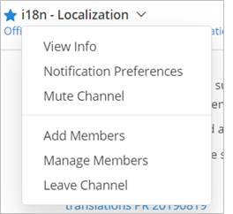
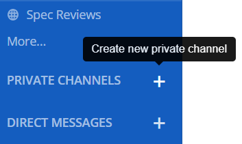
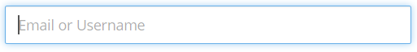
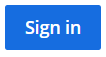
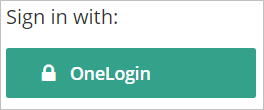
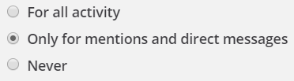
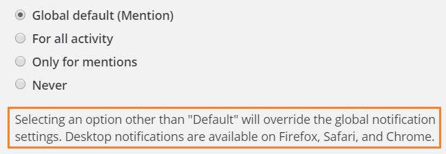
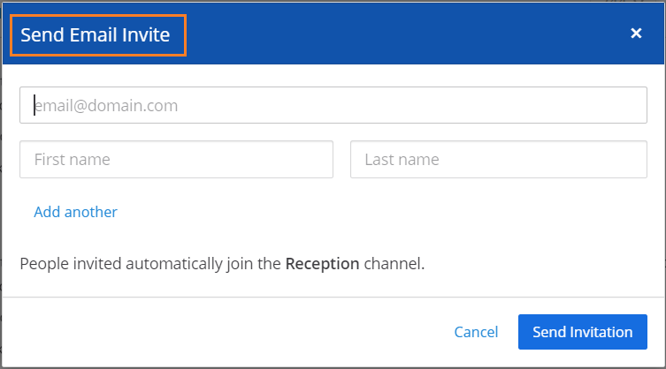
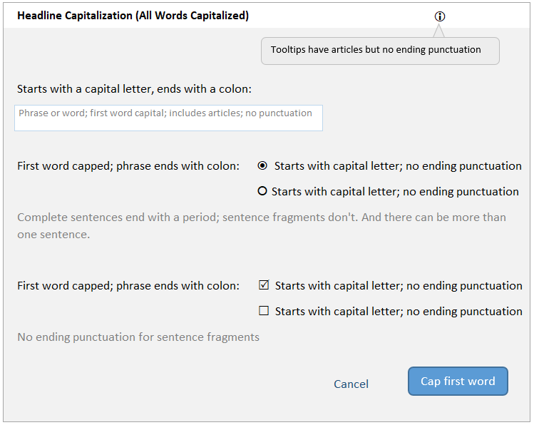

User Interface Text Guidelines
===============================
This is the Mattermost style guide for text used in the Mattermost product. Use these guidelines to ensure the text on the Mattermost user interface (UI) is consistent and clear.  These guidelines cover two types of UI text:

- Messages triggered because something happened
- Static text on the user interface

.. note::

Contributions that do not adhere to this style guide will receive edit requests; we'll merge your contribution once you edit the text to conform to these guidelines. You might want to look at the `UX design guidelines`_ as well.

....

.. contents:: 
   :depth: 2

....

General principles for in-product text
---------------------------------------

- Keep in mind that your users are from all over the world. Use words that are clear and easy to understand.
- Be concise.
- Use the active voice, except for these cases:

   - If you'll end up blaming the user. For example, don't say *You entered an incorrect password*. Instead, say *The password is incorrect*.
   - If you're describing what just happened. For example, it's okay to say *Your incoming webhook is been set up*.
   - If the subject (the doer of an action) is the Mattermost application itself. For example, it's okay to say *The image is deleted* instead of *The server deleted the image*.
   
- Use the past tense to say what's already happened, the present tense to describe a current state or condition, and the future tense to state something that is very definitely going to happen.
- If you're asking the user to do or not do something, use imperatives (command phrases). For example, say *Do not change the Hostname* instead of saying *It is not recommended to change the Hostname*. Better still, explain what could go wrong if they do or don't do something. For example, say *Do not change the Hostname because if you do so <this bad thing will happen>.*

Guidelines for messages
------------------------

Don't blame the user. Inform them about what happened, explain why it happened, and suggest a way forward.

Try to use complete sentences in your messages. If a message contains variables (tokens):

- Do not use verbs or adjectives as variables.
- Do not create plurals of variables by adding an *s*.
- If the variable is a noun, use a qualifier after the variable. For example, say *The {channel_name} channel was created* instead of saying *The {channel_name} was created*.

Messages can be of the following types: notification, confirmation, warning, and error. The following sections contain guidelines that are specific to each of these types.

Notification messages
~~~~~~~~~~~~~~~~~~~~~~

A notification message is for informing somebody about something that happened. Such messages do not need any user input, and do not prevent a user from continuing to use Mattermost.

- Use either a complete sentence or a sentence phrase. 
- If using a complete sentence, end it with a period.
- Examples:

  - *Member added to channel*
  - *The plug-in was installed.*

Confirmation messages
~~~~~~~~~~~~~~~~~~~~~~

A confirmation message is for asking somebody to confirm whether the immediately preceding command should be proceeded with. The user cannot use Mattermost until a confirmation is given or denied.

- Use complete sentences.
- Include a question that has a Yes/No answer.
- Examples:

  - *Are you sure you want to delete this channel?*
  - *A plug-in with this ID already exists. Would you like to overwrite it?*

Warning messages
~~~~~~~~~~~~~~~~

A warning message is for alerting somebody about something that might go wrong. The user can continue using Mattermost unless the warning message needs an explicit user input.

- Use complete sentences.
- Explain what has happened or can happen, and what can go wrong as a consequence.
- If the message contains a question, phrase it in such a manner so that it has a Yes/No answer (unless you have specific action buttons for the message).

- Examples:

  - *The Enterprise license expires in 2 days. If you do not renew it, some features will be disabled on licence expiry.*
  - *If you claim this AD/LDAP account, you will no longer be able to log in with your email. Do you want to continue?*

Error messages
~~~~~~~~~~~~~~~

An error message is for telling somebody that something went wrong. Errors prevent a user from doing a task or accessing a feature till the error is resolved.

- Use complete sentences.
- If what went wrong isn't obvious, explain in one sentence.
- If a solution or workaround isn't obvious, suggest one.
- Examples:

  - *This message is too long. Shorten it to 120 characters.*
  - *The passwords do not match.*

Guidelines for UI elements
---------------------------
Use this table when writing the text for UI elements such as windows, dialog boxes, labels, and prompts.

.. list-table::
   :widths: 10 30 10 15 35
   :header-rows: 1

   * - Element
     - Image 
     - Capitalization
     - Phrasing
     - Examples     
   * - Menu
     - |menu.png|
     - All words
     - - Noun, noun phrase, or verb
       - No punctuation
       - Not more than three words
     - - *Members*
       - *Account Preferences*
       - *Log Out*
   * - Tooltip
     - |tooltip.png|
     - First word
     - - Sentence fragment or sentence
       - No punctuation
       - Include articles (*a*, *an*, *the*)
     - - *Start a Zoom meeting*
       - *Flag for following up*
       - *Remove from this list*
   * - In-field text
     - |field.png|  
     - First word
     - - Sentence fragment, sentence, or word
       - No punctuation
       - Include articles (*a*, *an*, *the*)
     - - *Add a comment*
       - *Search*
   * - Action button
     - |action.png|
     - All words
     - - Verb or verb phrase
       - No articles (*a*, *an*, *the*)
       - Exceptions: *OK*, *Yes*, *No*
     - - *Add Comment*
       - *Edit*
   * - Label before a UI element
     - |label_before.png|
     - First word
     - - Noun, verb, or sentence fragment
       - End with a colon
       - Include articles (*a*, *an*, *the*)
     - - *Sign in with:*
       - *Other words, separated by commas:*
   * - Label after a UI element
     - |label_after.png|
     - First word
     - - Noun, verb, or sentence fragment
       - No punctuation
     - - *Channels grouped by type*
       - *Alphabetically*
   * - Help text
     - |help.png|
     - First word
     - Complete sentences, with punctuation
     - - *You can add 20 more people.*
       - *People are invited automatically to join the channel.*
   * - Title
     - |title.png|
     - All words
     - - Sentence fragment or sentence
       - No punctuation
     - - *Notification Preferences for Channel*
       - *Contributors*
   
Cheatsheet: UI text
-----------------------
|cheatsheet.png|

.. _UX design guidelines: https://docs.mattermost.com/developer/fx-guidelines.html#design-guidelines
