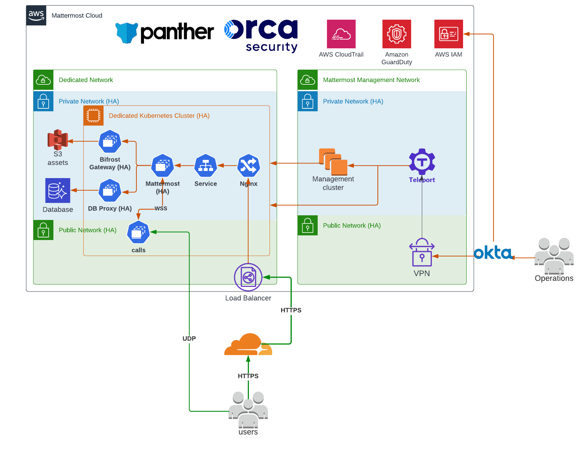
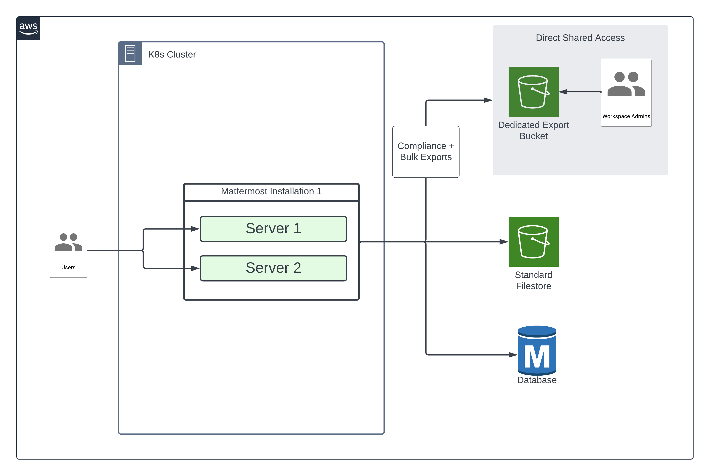

Cloud Dedicated
===============

Mattermost Cloud Dedicated is designed for larger organizations with higher demands for performance, scalability, customizability, and compliance looking to offload operational overhead and focus on more business-critical tasks.

Your own private Mattermost instance running :doc:`Mattermost Enterprise </product-overview/editions-and-offerings>` is a Kubernetes cluster hosted and managed by Mattermost that runs on dedicated cloud infrastructure, where resources are exclusively available for your organization.

Reference architecture
----------------------

Available features
------------------

Zero-downtime upgrades
~~~~~~~~~~~~~~~~~~~~~~

Mattermost releases biweekly updates and leverages recurring maintenance windows to keep your instance up-to-date with new stable or beta features behind feature flags, fix security issues, and ensure the overall reliability and performance of your environment. Maintenance windows are announced in advance on https://status.mattermost.com/

Additional support options, including quicker response times, dedicated support personnel, and stronger service level agreements (SLAs), are also available.

Disaster Recovery
~~~~~~~~~~~~~~~~~

Mattermost Cloud Dedicated supports data failover to a secondary region/site should the primary instance experiences an unrecoverable outage with guaranteed recovery times.

Mattermost supports a **multi-AZ (availability zones)** strategy in the same site/region.

Daily backups of the database, object storage, and high availability clusters are captured and retained for 30 days.

In addition, highly available observability tools with automated alerting, long-term metrics, and logs retention are retained for a duration of 1 year, or longer, if requred.

Security
~~~~~~~~

You have access to all the resources required to run the Mattermost application with the highest security standards, including data encryption at rest and in transit.

Your pre-configured cluster is secure by default, based on industry best practices including Data encryption at rest and in transit, TLS certificates life cycle management, and automatic security updates.

Mattermost maintains control over network and security policies, including `encryption <#encryption>`__, database, data, object storage, backup schedules, and compliance certifications. 

Authentication and authorization
~~~~~~~~~~~~~~~~~~~~~~~~~~~~~~~~

Mattermost offers advanced security and authentication options for integrating with corporate directories, including :doc:`Active Directory/LDAP </administration-guide/onboard/ad-ldap>`, :doc:`Okta </administration-guide/onboard/sso-saml-okta>`, :doc:`OneLogin </administration-guide/onboard/sso-saml-onelogin>`, :doc:`SAML </administration-guide/onboard/sso-saml>`, :doc:`Google </administration-guide/onboard/sso-google>`, :doc:`EntraID </administration-guide/onboard/sso-entraid>`, and :doc:`OpenID </administration-guide/onboard/sso-openidconnect>`.

Secure networking
~~~~~~~~~~~~~~~~~~

Mattermost Cloud Dedicated supports :doc:`IP filtering </administration-guide/manage/cloud-ip-filtering>` through CIDR-based IP ranges, providing flexibility for system administrators to include various authorized IPs or IP ranges for seamless access control. Users attempting to access their :doc:`workspace </end-user-guide/end-user-guide-index>` from IPs outside defined ranges are restricted from entry. Cloud system admins can :ref:`configure IP filtering <administration-guide/manage/cloud-ip-filtering:configure ip filtering>` through their Mattermost System Console.

Encryption
~~~~~~~~~~~

Mattermost provides encryption-in-transit and encryption-at-rest capabilities. Mattermost supports :doc:`TLS encryption </deployment-guide/server/setup-tls>`, including AES-256 with 2048-bit RSA on all data transmissions, between Mattermost client applications and the Mattermost server. You may either set up TLS on the Mattermost Server or :doc:`install a proxy such as NGINX </deployment-guide/server/setup-nginx-proxy>`, and set up TLS on the proxy.

Connections to :doc:`Active Directory/LDAP </administration-guide/onboard/ad-ldap>` can :ref:`optionally be secured with TLS or stunnel <administration-guide/configure/authentication-configuration-settings:ad/ldap port>`.

Connections to calls are secured with a combination of:

- TLS: The existing WebSocket channel is used to secure the signaling path.
- DTLS v1.2 (mandatory): Used for initial key exchange. Supports ``TLS_ECDHE_ECDSA_WITH_AES_128_GCM_SHA256`` and ``TLS_ECDHE_ECDSA_WITH_AES_256_CBC_SHA`` algorithms.
- SRTP (mandatory): Used to encrypt all media packets (i.e. those containing voice or screen share). Supports ``AEAD_AES_128_GCM`` and ``AES128_CM_HMAC_SHA1_80`` algorithms.

Cloud native exports
~~~~~~~~~~~~~~~~~~~~

Mattermost supports optional :ref:`filestore configuration settings <administration-guide/configure/environment-configuration-settings:enable dedicated export filestore target>` to direct compliance and bulk export data to a separate S3 bucket from standard files. This separate bucket can be configured to allow for secure access by Mattermost Cloud teams as well as admins who manage a given Mattermost deployment. The exports can also be accessed by generating unique download links as needed.

The following diagram provides a high-level view of how this functionality works:

SMTP
~~~~

Email sent from Mattermost Cloud Dedicated uses SendGrid, and the connection to SendGrid is encrypted.

Audit and observability
~~~~~~~~~~~~~~~~~~~~~~~

Mattermost Cloud Dedicated provides access to :doc:`audit and system logs </administration-guide/manage/logging>` generated by the application. 

Customization
~~~~~~~~~~~~~~

The following Mattermost plugins are available for cloud-based deployments:

.. include:: ./cloud-supported-integrations.rst
  :start-after: :nosearch:

Migrate from a self-hosted instance
------------------------------------

See our :ref:`self-hosted to cloud migration <administration-guide/manage/cloud-data-export:migrate from self-hosted to cloud>` documentation to learn more about migrating from a self-hosted to a Mattermost Cloud instance.
