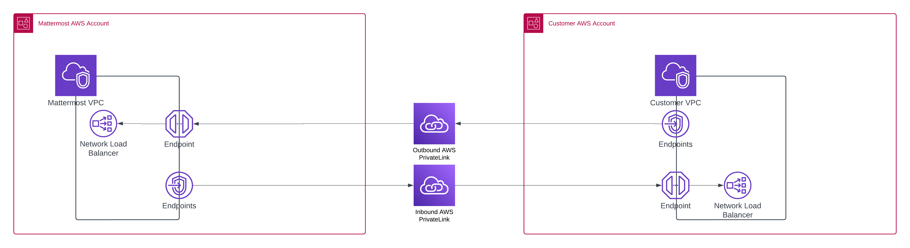

Cloud VPC Private Connectivity
===============================

.. include:: ../_static/badges/ent-cloud-dedicated.rst
   :start-after: :nosearch:

Virtual Private Cloud (VPC) Private Connectivity (Private Link) offers Enterprise Cloud customers tailored solutions for private connectivity needs with Mattermost Cloud. These options enable customers to access Mattermost Cloud through AWS's network without using the public internet, or allow the Mattermost Infrastructure team to manage a Mattermost instance hosted in the customer's VPC via an EKS cluster.
It also provides the ability for customers to connect from Mattermost Cloud to their private webhooks,endpoints and integrations.

The key objectives of this offering are to:

- Allow customers to access Mattermost Cloud within their internal network.
- Enable the Mattermost Infrastructure team to perform operations on a Mattermost instance hosted in the customer’s VPC, upon request.
- Establish connectivity between the customer's VPC and Mattermost exclusively through AWS’s network, without exposure to the public internet.
- Ensure the setup process is straightforward and easy to implement.
- Adhere to all security best practices.

Architecture
-------------

Configure VPC Private Connectivity
-----------------------------------

- Mattermost will provide Terraform modules tailored to the customer’s requirements.
- Both Mattermost and customer Infrastructure teams will collaborate to establish connectivity on both sides.
- AWS Private Link will be used to connect AWS accounts.

Requirements
~~~~~~~~~~~~~

- Customers must own their AWS Account.

Considerations
~~~~~~~~~~~~~~~

- Proper communication is essential for setting expectations and scheduling changes.

