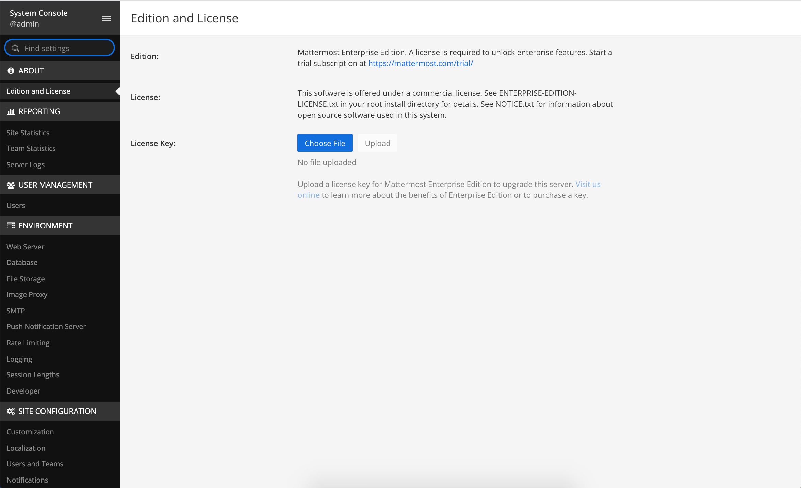
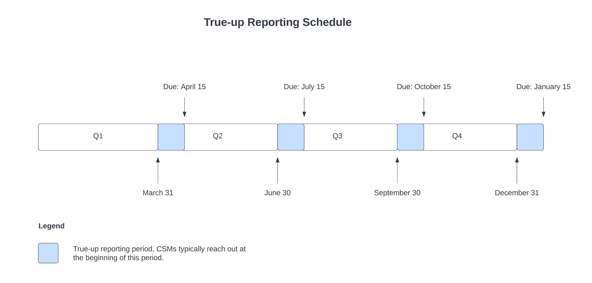

Self-Hosted
============

Buy a subscription
------------------

To purchase a commercial subscription for Mattermost Enterprise or Mattermost Professional, please visit our pricing page online: https://mattermost.com/pricing/

Apply your license
------------------

Once downloaded, your Mattermost license is ready to use and is applied via the Mattermost System Console.

System admin access is required in order to apply the license. If you're not a Mattermost system admin, contact your organization's Mattermost system admin for assistance.

Mattermost installed
~~~~~~~~~~~~~~~~~~~~

Check your email for a purchase confirmation from Mattermost. Download the attached license. In Mattermost, follow the steps provided in **System Console > About > Edition and License** to apply your license key.

You can also use the :ref:`mmctl <administration-guide/manage/mmctl-command-line-tool:mmctl license>` to apply the license.

Mattermost not yet installed
~~~~~~~~~~~~~~~~~~~~~~~~~~~~

If you haven't yet installed and deployed a Mattermost instance, visit the :doc:`Deployment Guide </deployment-guide/deployment-guide-index>` to get started. For information on creating a system admin account, visit our :doc:`Administrator Tasks </administration-guide/upgrade/admin-onboarding-tasks>` documentation.

Add more users to your subscription
-----------------------------------

If at any time you'd like to add more users to your Mattermost subscription, talk to a `Mattermost Expert <https://mattermost.com/contact-sales/>`_

Quarterly true-up reports
-------------------------

When you buy an annual Mattermost subscription, you agree to provide Mattermost with quarterly reports of the actual number of activated users within your system. An activated user is a user who has a Mattermost account and doesn't show as **Deactivated** in **System Console > User Management > Users**.

We'll send you an email notice around the end of the quarter reminding you to send us your report.

If you have more total activated users than you purchased in your annual subscription, your Customer Success Manager will provide you with a true-up quote for the new users added. The additional invoice will be pro-rated based on the number of months left in your subscription term, including the months for the calendar quarter for the time you pull the report. Mattermost won't provide downward adjustments. Mattermost will invoice based on Mattermost’s `current list prices <https://mattermost.com/pricing/>`_.

A system admin must take a screenshot of the **System Console > Site Statistics** page and send it to Mattermost in an email.

- Please ensure your screenshot is taken from the top of the page and includes both **Total Activated Users** and the **Monthly Active Users** metrics. 
- Please include the date of the screenshot in the file name.
- We don't need your server address, so if it appears on your screenshot, you can redact it from the image.

.. tip:: 

   Not sure where to take the screenshot? Please reach out to your account executive, your Customer Success Manager, orders@mattermost.com, or `create a support ticket <https://support.mattermost.com/hc/en-us/requests/new?ticket_form_id=11184911962004>`_ for assistance.
   
Renew your subscription
-----------------------

System admins will be alerted 60 days prior to license expiry via a banner in Mattermost. You can also dismiss the banner and renew your license at a later date via **System Console > Edition and License**. To renew your license, talk to a `Mattermost Expert <https://mattermost.com/contact-sales/>`_

Frequently asked questions
--------------------------

What is the minimum number of users I can purchase on a subscription? 
~~~~~~~~~~~~~~~~~~~~~~~~~~~~~~~~~~~~~~~~~~~~~~~~~~~~~~~~~~~~~~~~~~~~~~~

The minimum purchase for a Mattermost license subscription is **more than 10 users** (i.e., at least 11). There is no set maximum — you can buy as many user seats as your organization requires.

What is a true-up report and why is the true-up notice necessary? 
~~~~~~~~~~~~~~~~~~~~~~~~~~~~~~~~~~~~~~~~~~~~~~~~~~~~~~~~~~~~~~~~~

A true-up report is our quarterly request for you to provide us with the actual number of activated users within your system to determine if you have more activated users now than when you bought your subscription.

As your organization grows, you may need to add additional users during your subscription period. Mattermost needs to have insight into changes in your activated user count so that we can charge you appropriately for your self-hosted license usage. Additionally, we don’t want to over estimate/charge activated users at your renewal time. 

When you receive the quarterly true-up notice from Mattermost, please share your activated user count with us.

How do I renew my subscription if I don't have internet access?
~~~~~~~~~~~~~~~~~~~~~~~~~~~~~~~~~~~~~~~~~~~~~~~~~~~~~~~~~~~~~~~~

If you don't have access to the internet, please `create a support ticket <https://support.mattermost.com/hc/en-us/requests/new?ticket_form_id=11184911962004>`_ for assistance.

Can I use the same license key on multiple self-hosted servers?
~~~~~~~~~~~~~~~~~~~~~~~~~~~~~~~~~~~~~~~~~~~~~~~~~~~~~~~~~~~~~~~

License keys for unlocking the advanced features in Mattermost can only be applied to a single deployment. A deployment consists of either a single Mattermost server or multiple linked Mattermost servers in a High Availability configuration with access to a single database.

Customers who are eligible to purchase the `Premier Support add-on <https://mattermost.com/support/>`_ are licensed to run with a single deployment of Mattermost license key in production and up to four non-production deployments of Mattermost (for example: development, staging, user acceptance testing, etc.)

Is my license key available immediately?
~~~~~~~~~~~~~~~~~~~~~~~~~~~~~~~~~~~~~~~~

Yes, once your payment is successfully processed your license is available to download immediately.

How will I know when to renew my subscription?
~~~~~~~~~~~~~~~~~~~~~~~~~~~~~~~~~~~~~~~~~~~~~~

You'll be notified 60 days prior to your subscription expiry, via a blue banner displayed at the top of your Mattermost window. This banner is only visible to system admins.

You can select **Renew license now** to begin the renewal process. You can also select the **x** to dismiss the notification. The notification is reactivated when your browser is refreshed or you reload the Mattermost Desktop App.

How long does it take to renew a subscription?
~~~~~~~~~~~~~~~~~~~~~~~~~~~~~~~~~~~~~~~~~~~~~~

Once you’ve started the renewal process, we'll be in contact with you to confirm your order and send you the order form. There may be additional paperwork required. Once we have the signed order form and (if applicable) the necessary paperwork from you, we're able to process the renewal and issue your license key within 24 hours.

What happens to my subscription if I don't renew in time?
~~~~~~~~~~~~~~~~~~~~~~~~~~~~~~~~~~~~~~~~~~~~~~~~~~~~~~~~~

If you don't renew within the 60-day renewal period, a 10-day grace period is provided. During this period your Mattermost installation runs as normal, with full access to commercial features. During the grace period, the notification banner is not dismissable.

When the grace period expires, your Mattermost Enterprise or Professional plan is downgraded to the Free plan and other plan features are disabled.
 
What happens when my subscription expires?
~~~~~~~~~~~~~~~~~~~~~~~~~~~~~~~~~~~~~~~~~~

If you don't renew within the 10-day grace period, your Mattermost version is automatically downgraded to Free plan so you can still access and use Mattermost. However, subscription features will no longer be available, and if you are currently using them, the functionality will no longer be accessible.

When you renew, the subscription features will become available with the previous configuration (provided no action such as user migration has been taken).

Why can't I dismiss the expiry notification banner?
~~~~~~~~~~~~~~~~~~~~~~~~~~~~~~~~~~~~~~~~~~~~~~~~~~~~

If there's a red expiry announcement banner stating: "Enterprise license is expired and some features may be disabled. Please contact your system admin for details." it means your grace period has expired. This announcement banner persists until the license is renewed, and is visible to all users.

Once a new license is applied, the banner will no longer be visible.

If you don't plan to renew your subscription, revoke the expired license in **System Console > Edition and License**.

Where can I find the license agreement for Mattermost Enterprise Edition?
~~~~~~~~~~~~~~~~~~~~~~~~~~~~~~~~~~~~~~~~~~~~~~~~~~~~~~~~~~~~~~~~~~~~~~~~~~

Mattermost Enterprise Edition is the name for the binary of the Mattermost self-hosted Enterprise and Professional editions. This edition can be used for free without a license key as commercial software functionally equivalent to the open source Mattermost Team Edition licensed under MIT. When a license key is purchased and applied to Mattermost Enterprise Edition, additional features unlock. The license agreement for Mattermost Enterprise Edition is included in the software and also available `here <https://mattermost.com/enterprise-edition-license/>`_.
