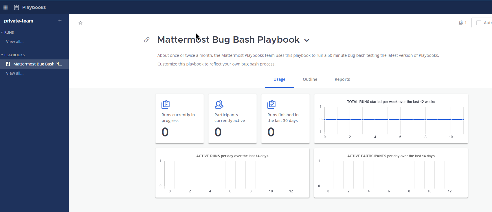
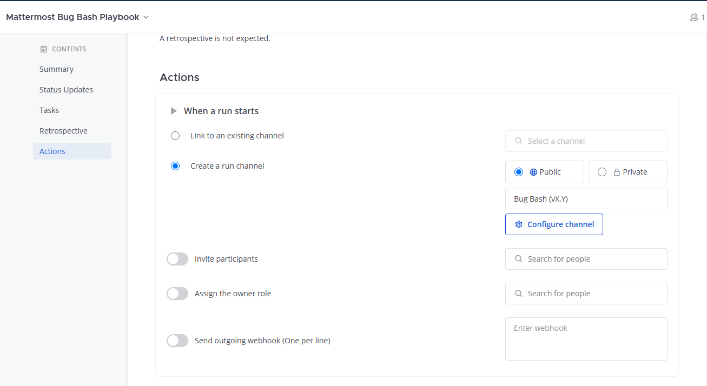

:orphan:

.. This page is intentionally not accessible via the LHS

Mattermost Recipe: How to use Mattermost for product vulnerability incidents
============================================================================

Problem
-------

After getting access to your Mattermost instance, you’d like to set up a workflow for security incident handling using Mattermost. Visit our `deployment section <https://mattermost.com/deploy/>`__ if you want to learn more about how to deploy your own Mattermost instance.

Solution
--------

This guide walks through the set up of a product security incident room using the Mattermost `Playbooks </guides/playbooks.html>`__ and `Channels </guides/channels.html>`__ with voice calling and screen sharing functionalities.

1. Workspace setup
~~~~~~~~~~~~~~~~~~

For Cloud customers, all the functionalities works out-of-the-box with no technical setup. Simply invite your team members to your workspace and move onto the next section. For self-hosted deployments, refer to `the calls configuration documentation </configure/configuration-settings.html#calls-beta>`__ to configure voice calling and screen sharing.

2. Playbooks setup
~~~~~~~~~~~~~~~~~~

Now that your workspace and teammates are ready, the next step is to create a playbook for incident handling. For this recipe, we're using an adapted playbooks template used by the Mattermost Product Security team that's available for `download here <https://github.com/mattermost/mattermost-security/blob/master/product_security/playbooks/security_vulnerability_playbook.json>`__.

After downloading the template above, connect to your Mattermost workspace. Then open the product menu and select **Playbooks**.

.. image:: ../images/recipe/prod-vuln-incident1.png
   :alt: From the product menu, select Playbooks.

Next, open the **Playbooks** menu, select **Import**, and navigate to the file you downloaded.

.. image:: ../images/recipe/prod-vuln-incident2.png
   :alt: Select the Playbooks tab, select Import, and go to the template file you downloaded.

When you've imported the file, you should have a new playbook called **Security Vulnerability Playbook**. Select the three dots to edit the playbook.

Modify any tasks or actions to suit your use case. In our scenario, we’ve assigned the playbook owner role by default to Alice and added three other team members to be automatically added in the **Actions** tab. We recommend changing these to the members of your security team.

Select **Save**. Then, hit **Run**.

.. image:: ../images/recipe/prod-vuln-incident5.png
   :alt: Save your changes then run the playbook by selecting Run.

Set the title on a scenario that makes sense for your environment and select **Start Run** to create a new channel and invite the members as you’ve predefined.

.. image:: ../images/recipe/prod-vuln-incident6.png
   :alt: Give your playbook run a name. When you select Start Run, a new channel is created and members are invited based on how you set up the playbook.

3. Using calls for voice chat and screen sharing
~~~~~~~~~~~~~~~~~~~~~~~~~~~~~~~~~~~~~~~~~~~~~~~~

For Mattermost Professional and Enterprise customers, you can select **Start call** in the run channel header to kick-off a channel call. The call can only be joined by participants of the incident channel.

.. image:: ../images/recipe/prod-vuln-incident7.png
   :alt: If you're running Mattermost Enterprise or Professional, select Start Call in the channel header that other channel participants can join.

In the bottom-left corner of Mattermost, select the expand icon to open a separate pop-out window for the call, with additional options to start presenting.

.. image:: ../images/recipe/prod-vuln-incident8.png
   :alt: In a call, expand the call screen using the Expand icon. Expanding the call also provides you with additional options to share your screen.

For Mattermost Team Edition, only 1:1 calls are supported. Open a direct message with another incident responder and follow the same steps as above. 

.. note:: 
   
   Want to try out calls? Select **Start call** in the incident channel to start a free 30-day trial of Mattermost Enterprise to enable this functionality for all channels.

Discussion
----------

Using Mattermost Playbooks you can ensure a streamlined approach to incident resolution. Our playbook template walks through a typical product vulnerability remediation aims to provide a structure resolution and also keeping the right stakeholder informed.

The playbook starts with a **Triage** stage that verifies the validity of the issue, continues with an **Investigation** of exploitation (if possible) and follows with an active **Remediation** of the issue. After the issue is mitigated, the incident can go into **Resolution** and be closed with an incident post-mortem.

When running the playbook, you can add key events, such as messages, to the timeline for easier reporting. To do so, select the app icon when hovering over a message.

.. image:: ../images/recipe/prod-vuln-incident9.png
   :alt: When running a playbook, add key events to the timeline by hovering over a message and selecting the App icon.

Give it a short summary that will be shown on the incident overview, with the ability to jump to the message linked.

.. image:: ../images/recipe/prod-vuln-incident10.png
   :alt: Provide a short summary visible on the incident overview. When you publish the message to the timeline, other users will be able to jump to the linked message.

The timeline is a great feature to provide an overview of the most significant events for both active and previous events for both responders and for management.

The process and playbook shared here is only the starting point for your unique environment. By `customizing the playbooks <https://mattermost.com/blog/getting-started-with-playbooks/>`__ and `adding additional integrations <https://mattermost.com/blog/how-to-make-your-incident-response-plan-with-mattermost/>`__ to automatically be notified about new incidents you can further accelerate your response times. Additional integrations with SIEM solutions and platforms such as HackerOne will be released in the next months.
