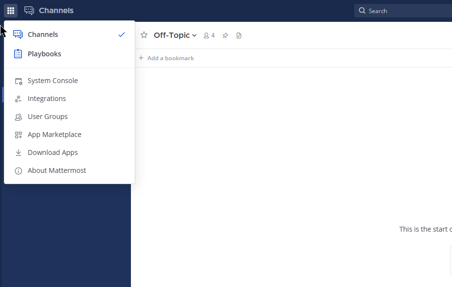
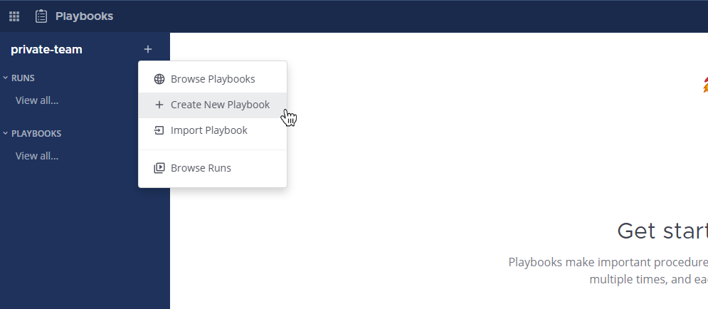
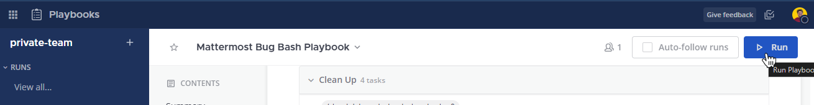
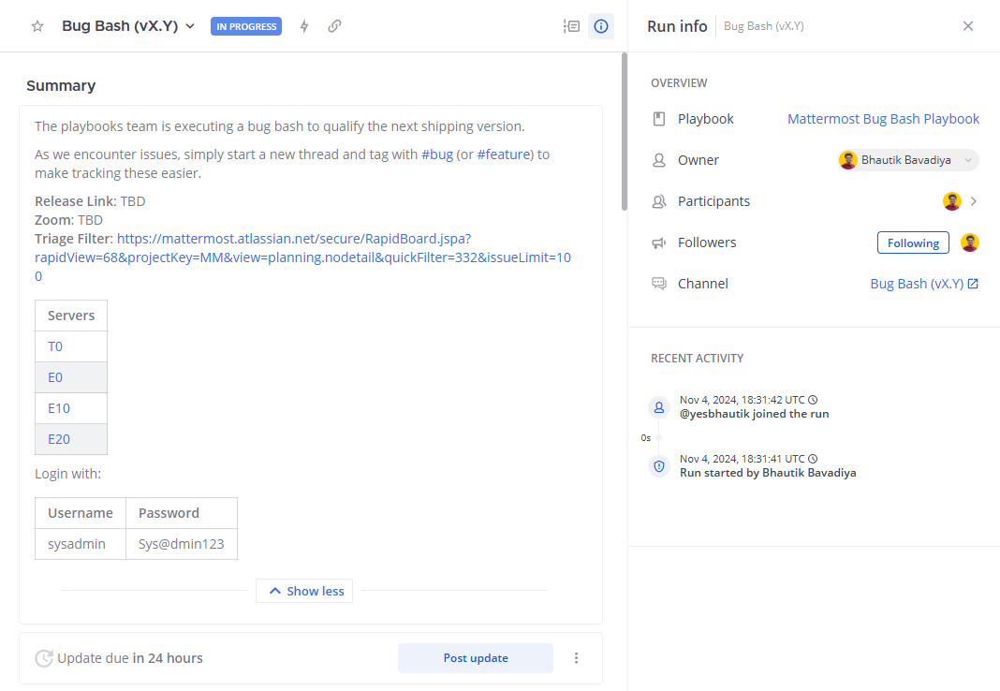
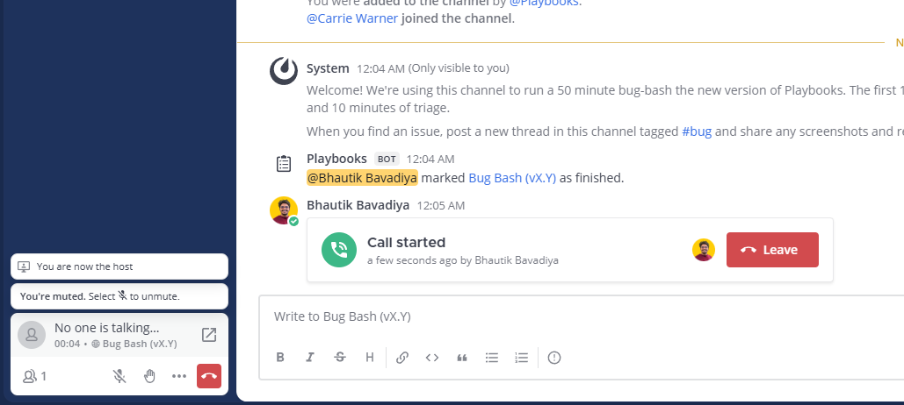
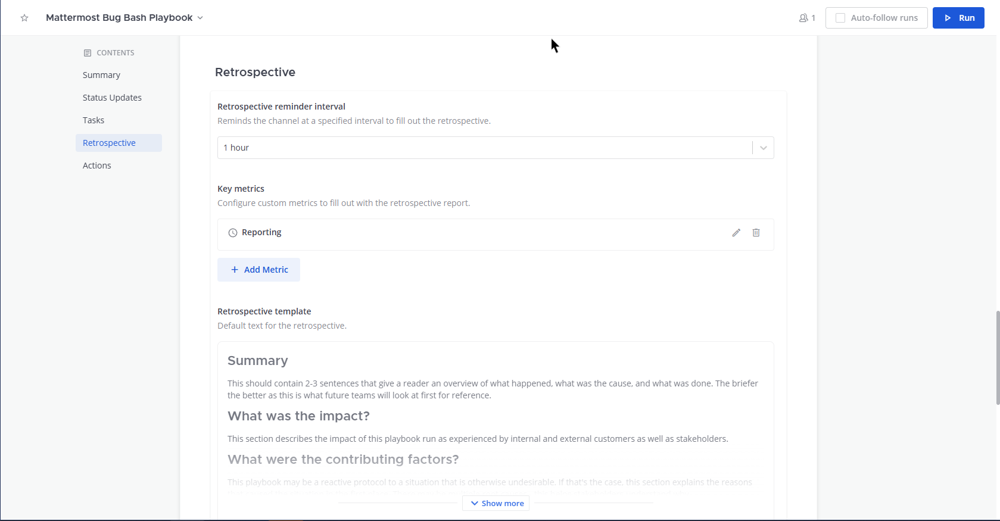

Mattermost Recipe: How to use Mattermost for Product Vulnerability Incidents
=====================

Problem
---------------

After getting access to your Mattermost instance, you’d like to set up a workflow for security incident handling using
Mattermost. Click `here<https://mattermost.com/deploy/>`__ if you want to learn more about how to deploy your own Mattermost instance.

Solution
---------------------

The following guide will walk through the set up of a product security incident room using the Mattermost `Playbooks<https://docs.mattermost.com/guides/playbooks.html>`__ and
`Channels<https://docs.mattermost.com/guides/channels.html>`__ with the voice calling and screen sharing functionalities.

1. Workspace Setup
~~~~~~~~~~~~~~~~~~~~~~~~~~

For Cloud customers, all the functionalities will work out-of-the-box with no technical setup. Simply invite your team
members to your workspace and move onto the next section For self-hosted installations, refer to `this admin guide<https://docs.mattermost.com/configure/configuration-settings.html#calls-beta>`__ to
configure voice calling and screen sharing functionalities.

2. Playbooks Setup
~~~~~~~~~~~~~~~~~~~~~~~~~~

Now that your workspace and teammates are ready, the next step is to create a playbook for incident handling. For this
recipe, we will be using an adapted playbooks template used by the Mattermost Product Security Team that is available for
`download here<https://github.com/mattermost/mattermost-security/blob/master/product_security/playbooks/security_vulnerability_playbook.json>`__.

After downloading the template above, open your Mattermost instance and click in the top-left menu on “Playbooks”:

Afterwards, open the “Playbooks” menu and click the “Import” button, where you can then navigate to the file
downloaded above:

After importing the file, you should have a new playbook called “Security Vulnerability Playbook”. Click on the three
dots and hit “Edit”:

.. image:: ../images/recipe/prod-vuln-incident3.png
   :alt: ..

Modify any tasks or actions as you see fit. In our scenario, we’ve assigned the playbook owner role by default to
“alice” and added 3 other team members to be automatically added in the actions tab. We recommend changing these to the
members of your security team:

.. image:: ../images/recipe/prod-vuln-incident4.png
   :alt: ..

Afterwards, click Save and you are good to go. Hit the “Run” button on the Playbook:

Set the title on a scenario that makes sense for your environment and click “Start Run”, which creates a new channel and
invites the members as you’ve predefined:

3. Using Calls for Voice Chat and Screen Sharing
~~~~~~~~~~~~~~~~~~~~~~~~~~
For Mattermost Professional and Enterprise, after the playbook channel was created, click on the top-right button
“Start Call” to kick-off a channel call. The call can only be joined by participants of the incident channel:

In the bottom-left, click on the expand icon to open a separate pop-out window for the Calls, with additional options to
start presenting:

.. image:: ../images/recipe/prod-vuln-incident8.png
   :alt: ..

For Mattermost Team Edition, only 1:1 calls are supported. Open a direct message with another incident responder and
follow the same steps as above. Upon clicking the “Start Call” button of an incident channel, you will be guided to
start a free 30-day trial of Mattermost Enterprise to enable this functionality for all channels.

Discussion
---------------------------------

Through the usage of Mattermost Playbooks you can ensure a streamlined approach to incident resolution. Our playbook
template that walks through a typical product vulnerability remediation aims to provide a structure resolution and also
keeping the right stakeholder informed.

The playbook starts with a **Triage** stage that verifies the validity of the issue, continues with an **Investigation**
of exploitation (if possible) and follows with an active **Remediation** of the issue. After the issue was mitigated,
the incident can go into **Resolution** and be closed with an incident post-mortem.

When running the Playbook, you can add key events, such as messages, to the Timeline for easier reporting. To do so,
click on the App icon when hovering over a message:

Give it a short summary that will be shown on the incident overview, with the ability to jump to the message linked:

The timeline is a great feature to provide an overview of the most significant events for both active but also previous
events for both responders and for management.

The process and playbook shared here is only the starting point for your unique environment. By `customizing the
playbooks<https://mattermost.com/blog/getting-started-with-playbooks/>`__ and
`adding additional integrations<https://mattermost.com/blog/how-to-make-your-incident-response-plan-with-mattermost/>`__
to automatically be notified about new incidents you can further accelerate your response times. Additional integrations
with SIEM solutions and platforms such as HackerOne will be released in the next months.
