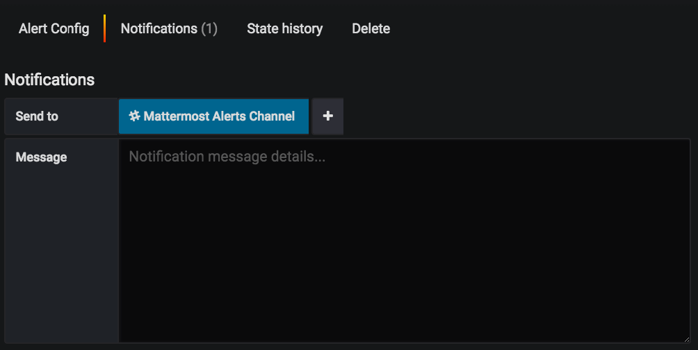

Mattermost Performance Alerting Guide
======================================

|enterprise| |cloud| |self-hosted|

.. |enterprise| image:: ../images/enterprise-badge.png
  :scale: 30
  :target: https://mattermost.com/pricing
  :alt: Available in the Mattermost Enterprise subscription plan.

.. |cloud| image:: ../images/cloud-badge.png
  :scale: 30
  :target: https://mattermost.com/pricing
  :alt: Available for Mattermost Cloud deployments.

.. |self-hosted| image:: ../images/self-hosted-badge.png
  :scale: 30
  :target: https://mattermost.com/deploy
  :alt: Available for Mattermost Self-Hosted deployments.

*Available in legacy Mattermost Enterprise Edition E20*

Mattermost recommends using Prometheus and Grafana to track performance metrics of the Mattermost application servers. The purpose of this guide is to help you set up alerts on your Grafana dashboard.  

.. note:: 
  We highly recommend setting up performance alerting for deployments above 5,000 users, where additional servers have been added for performance load-balancing.

**Prerequisites**

Set up performance monitoring for Mattermost. See our `Performance Monitoring <https://docs.mattermost.com/scale/performance-monitoring.html>`__ documentation to learn more.

To get alerts, first set up a Notification Channel in Grafana. Here’s how you can set it up to automatically post alerts in Mattermost:

1. In Mattermost:

  a. Create an Alerts channel.
  b. Create an `incoming webhook <https://developers.mattermost.com/integrate/admin-guide/admin-webhooks-incoming/>`__ for the Alerts channel and copy the URL.

2. In Grafana:

  a. Under the alert icon in the sidebar, click **Notification channels**.
  b. Click **Add channel**.
  c. Enter **Mattermost Alerts Channel** as the name.
  d. For type, select **Slack**.
  e. Paste your webhook URL into the URL field.
  f. Include an @ mention in the mention field, if you want to send mentions when an alert is posted to Mattermost.
  g. Press **Send Test** to test the alert.

If you would also like to get email alerts, you can follow `these instructions <https://grafana.com/docs/grafana/latest/alerting/>`__ to set that up.

**Configuring Alerts**

The `Mattermost dashboards <https://grafana.com/dashboards?search=mattermost>`__ for Grafana come with some partially pre-configured alerts on the following charts:

* CPU Utilization Rate
* Memory Usage
* Number of Goroutines
* Number of API Errors per Second
* Mean API Request Time

To configure alerts, set an appropriate threshold and enable notifications. Enabling notifications is the same for each chart, but setting the correct threshold can have some variances that are better handled on a per-chart basis.

1. For each chart, click on the chart name and click **Edit**:

2. Then click on the **Alert** tab:

3. The alert threshold, which will be discussed in the sections below, is the last field under **Conditions** (the one set to 600 in the screenshot above).

See the sections below for how to set the threshold for each individual chart. If you would like to add your own custom alert conditions, configure them here.

4. To enable the notifications for any alerts, click on the **Notification** tab on the left and select **Mattermost Alerts Channel** under **Send to**:

Enter a message if you would like to add more context to the alert.

By default, the alerts are configured to check the average of a chart over the last minute to see if that value is above a threshold. If it’s above the threshold, the alert will be triggered. Since it’s an average over the last minute, small spikes that go past the threshold won’t necessarily cause an alert. This helps prevent false positives that would result from natural spikes in usage. The alert state for each chart is evaluated every minute.

The sections below describe each chart in more detail.

CPU Utilization Rate
---------------------

CPU Utilization Rate is fairly straightforward. CPU Utilization Rate tracks the CPU usage of the app servers as a percentage. The maximum percentage is based on the number of CPU cores or vCPUs your app server has. For example, if you have four CPU cores and your app server was at 100% utilization rate on all four cores, the graph would show 400% for that app server.

It’s best to set the alert threshold based on your average CPU utilization and how many cores/vCPUs your app servers have. Take a look at the chart over the last seven days. You’ll want to set the threshold somewhere between your maximum CPU usage (cores * 100) and the CPU usage you see. The lower you set the threshold, the more alerts, and therefore the more false positives, you will get. Set the threshold too high and you may not receive an alert for an incident until it’s gotten worse. The same principle applies to all alerts, regardless of the chart.

For example, on our community server, we have the threshold set to 15%:

This value is below our maximum CPU usage and above our average usage at peak times. Therefore, we will get alerts if we begin experiencing unusually high CPU usage.

Memory Usage
-------------

Memory Usage tracks the megabytes of RAM that your app servers are using. Set the threshold similar to the CPU Utilization Rate: below maximum available memory and above your average usage during peak times.

Here’s how we have the alert set on our Community server: 

Number of Goroutines
---------------------

Goroutines are functions or methods that run concurrently with other functions and methods. Goroutines are like lightweight threads with low-creation costs. A rising number of goroutines can be a good measure of the performance of your app servers. A continuous increase indicates your app server can't keep up and is creating goroutines faster than they can complete their tasks and stop.

Set the threshold somewhere above the average number of goroutines you see during peak load times. Small spikes are usually nothing to worry about. It’s the uncontrolled climbing of goroutines that you want to watch out for.

Here’s how we have it set on our Community server:

Number of API Errors per Second
--------------------------------

Any 4xx or 5xx HTTP response status codes are counted as a REST API error. API errors themselves are not necessarily a problem. There are many legitimate reasons for an API error to occur, such as users’ sessions expiring or clients requesting to see if a resource exists and is being given a ``404 Not Found`` response. It is normal to have some API errors that scale with your installation base.

That said, errors against the REST API can be indicative of deployment and other issues. For example, if one of your app servers did not deploy correctly for whatever reason, it may begin returning a high number of API errors. Another example would be a rogue bot spamming the API with bad requests. Alerts on API errors per second would help catch these and other issues.

Here’s how it’s set on our Community server:

Mean API Request Time
----------------------

The Mean API Request Time is the average amount of time a REST API request to the Mattermost app server takes to complete. If an app server starts to perform poorly, you’ll likely see a rise in the mean request time as it takes longer to complete requests. This could also happen if your database can’t sustain the load from the app servers. It may also be indicative of an issue between the app servers and your proxy.

You’ll want to set the alert threshold a little above what the mean request time is during your peak load times.

Here’s how it’s set on our community server:

Plugin Hooks
-------------

You can trace hooks and plugin API calls with Prometheus. Below are some examples of hooks and API Prometheus metrics that you may want to be aware of when troubleshooting or monitoring your server's performance.

.. code-block:: none

  # HELP mattermost_plugin_hook_time Time to execute plugin hook handler in seconds.
  # TYPE mattermost_plugin_hook_time histogram
  mattermost_plugin_hook_time_bucket{hook_name="ChannelHasBeenCreated",plugin_id="com.mattermost.demo-plugin",success="true",le="0.005"} 0
  mattermost_plugin_hook_time_bucket{hook_name="ChannelHasBeenCreated",plugin_id="com.mattermost.demo-plugin",success="true",le="0.01"} 0

.. code-block:: none

  # HELP mattermost_plugin_multi_hook_time Time to execute multiple plugin hook handler in seconds.
  # TYPE mattermost_plugin_multi_hook_time histogram
  mattermost_plugin_multi_hook_time_bucket{plugin_id="com.mattermost.custom-attributes",le="0.005"} 100
  mattermost_plugin_multi_hook_time_bucket{plugin_id="com.mattermost.custom-attributes",le="0.01"} 100

.. code-block:: none

  # HELP mattermost_plugin_multi_hook_server_time Time for the server to execute multiple plugin hook handlers in seconds.
  # TYPE mattermost_plugin_multi_hook_server_time histogram
  mattermost_plugin_multi_hook_server_time_bucket{le="0.005"} 1043
  
.. code-block:: none

  # HELP mattermost_plugin_api_time Time to execute plugin API handlers in seconds.
  # TYPE mattermost_plugin_api_time histogram
  mattermost_plugin_api_time_bucket{api_name="AddUserToChannel",plugin_id="com.mattermost.plugin-incident-response",success="true",le="0.005"} 0
  mattermost_plugin_api_time_bucket{api_name="AddUserToChannel",plugin_id="com.mattermost.plugin-incident-response",success="true",le="0.01"} 0

Other Alerts
-------------

If you want more alerts, you can set them up on any of the Grafana charts you'd like. We recommend reviewing custom metrics listed on our `Performance Monitoring feature documentation <https://docs.mattermost.com/scale/performance-monitoring.html#statistics>`_.
