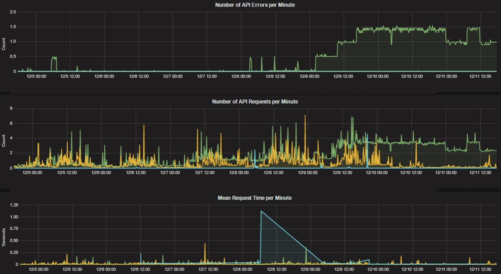
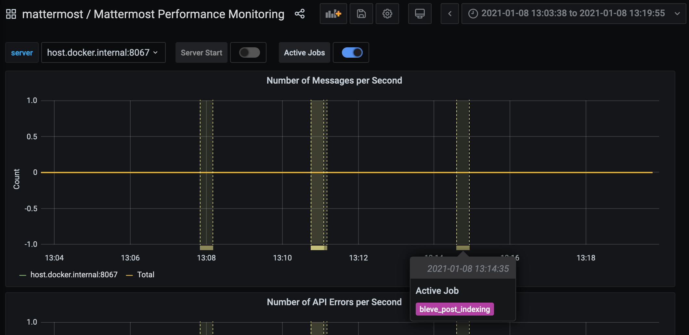
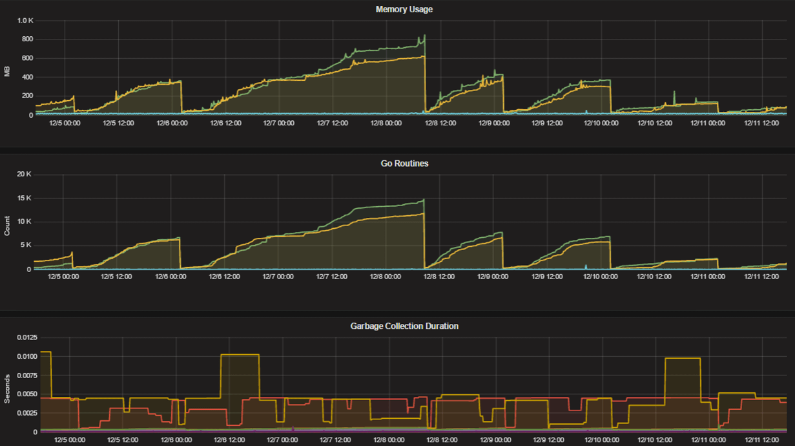

Performance monitoring metrics
==============================

.. include:: ../_static/badges/ent-cloud-selfhosted.rst
  :start-after: :nosearch:

Mattermost provides the following performance monitoring statistics to integrate with Prometheus and Grafana.

Custom Mattermost metrics
~~~~~~~~~~~~~~~~~~~~~~~~~

The following is a list of custom Mattermost metrics that can be used to monitor your system's performance:

API metrics
^^^^^^^^^^^

- ``mattermost_api_time``: The total time in seconds to execute a given API handler.

Caching metrics
^^^^^^^^^^^^^^^

- ``mattermost_cache_etag_hit_total``: The total number of ETag cache hits for a specific cache.
- ``mattermost_cache_etag_miss_total``: The total number of ETag cache misses for an API call.
- ``mattermost_cache_mem_hit_total``: The total number of memory cache hits for a specific cache.
- ``mattermost_cache_mem_invalidation_total``: The total number of memory cache invalidations for a specific cache.
- ``mattermost_cache_mem_miss_total``: The total number of cache misses for a specific cache.

The above metrics can be used to calculate ETag and memory cache hit rates over time.

.. image:: ../images/perf_monitoring_caching_metrics.png
   :alt: Example caching metrics, including Etag hit rate and mem cache hit rate, in a self-hosted Mattermost deployment.

Cluster metrics
^^^^^^^^^^^^^^^

- ``mattermost_cluster_cluster_request_duration_seconds``:  The total duration in seconds of the inter-node cluster requests.
- ``mattermost_cluster_cluster_requests_total``: The total number of inter-node requests.
- ``mattermost_cluster_event_type_totals``: The total number of cluster requests sent for any type.

Database metrics
^^^^^^^^^^^^^^^^

- ``mattermost_db_master_connections_total``: The total number of connections to the master database.
- ``mattermost_db_read_replica_connections_total``: The total number of connections to all the read replica databases.
- ``mattermost_db_search_replica_connections_total``: The total number of connections to all the search replica databases.
- ``mattermost_db_store_time``: The total time in seconds to execute a given database store method.
- ``mattermost_db_replica_lag_abs``: Absolute lag time based on binlog distance/transaction queue length.
- ``mattermost_db_replica_lag_time``: The time taken for the replica to catch up.

Database connection metrics
^^^^^^^^^^^^^^^^^^^^^^^^^^^

- ``max_open_connections``: The maximum number of open connections to the database.
- ``open_connections``: The number of established connections both in use and idle.
- ``in_use_connections``: The number of connections currently in use.
- ``idle_connections``: The number of idle connections.
- ``wait_count_total``: The total number of connections waited for.
- ``wait_duration_seconds_total``: The total time blocked waiting for a new connection.
- ``max_idle_closed_total``: The total number of connections closed due to the maximum idle connections being reached.
- ``max_idle_time_closed_total``: The total number of connections closed due to the connection maximum idle time configured.
- ``max_lifetime_closed_total``: The total number of connections closed due to the connection maximum lifetime configured.

HTTP metrics
^^^^^^^^^^^^

- ``mattermost_http_errors_total``: The total number of http API errors.
- ``mattermost_http_request_duration_seconds``: The total duration in seconds of the http API requests.
- ``mattermost_http_requests_total``: The total number of http API requests.

Login and session metrics
^^^^^^^^^^^^^^^^^^^^^^^^^

- ``mattermost_http_websockets_total`` The total number of WebSocket connections to the server.
- ``mattermost_login_logins_fail_total``: The total number of failed logins.
- ``mattermost_login_logins_total``: The total number of successful logins.

Mattermost channels metrics
^^^^^^^^^^^^^^^^^^^^^^^^^^^

- ``mattermost_post_broadcasts_total``: The total number of WebSocket broadcasts sent because a post was created.
- ``mattermost_post_emails_sent_total``: The total number of emails sent because a post was created.
- ``mattermost_post_file_attachments_total``: The total number of file attachments created because a post was created.
- ``mattermost_post_pushes_sent_total``: The total number of mobile push notifications sent because a post was created.
- ``mattermost_post_total``: The total number of posts created.
- ``mattermost_post_webhooks_totals``: The total number of webhook posts created.

.. image:: ../images/perf_monitoring_messaging_metrics.png
   :alt: Example Mattermost channels metrics, including messages per minute, broadcasts per minute, emails sent per minute, mobile push notifications per minute, and number of file attachments per minute, in a self-hosted Mattermost deployment.

Process metrics
^^^^^^^^^^^^^^^

- ``mattermost_process_cpu_seconds_total``: Total user and system CPU time spent in seconds.
- ``mattermost_process_max_fds``: Maximum number of open file descriptors.
- ``mattermost_process_open_fds``: Number of open file descriptors.
- ``mattermost_process_resident_memory_bytes``: Resident memory size in bytes.
- ``mattermost_process_start_time_seconds``: Start time of the process since unix epoch in seconds.
- ``mattermost_process_virtual_memory_bytes``: Virtual memory size in bytes.

Search metrics
^^^^^^^^^^^^^^

- ``mattermost_search_posts_searches_duration_seconds_sum``: The total duration, in seconds, of search query requests.
- ``mattermost_search_posts_searches_duration_seconds_count``: The total number of search query requests.

WebSocket metrics
^^^^^^^^^^^^^^^^^

- ``mattermost_websocket_broadcasts_total``: The total number of WebSocket broadcasts sent by type.
- ``mattermost_websocket_event_total``: The total number of WebSocket events sent by type.
    
Logging metrics
^^^^^^^^^^^^^^^

- ``logger_queue_used``: Current logging queue level(s).
- ``logger_logged_total``: The total number of logging records emitted.
- ``logger_error_total``: The total number of logging errors.
- ``logger_dropped_total``: The total number of logging records dropped.
- ``logger_blocked_total``: The total number of logging records blocked.
    
Debugging metrics
^^^^^^^^^^^^^^^^^

- ``mattermost_system_server_start_time``: Server start time. Set to the current time on server start. 
- ``mattermost_jobs_active``: Increment when a job starts and decrement when the job ends. 
    
Use ``mattermost_system_server_start_time`` to dynamically add an annotation corresponding to the event.

.. image:: ../images/mattermost_system_server_start_time.png
   :alt: Example debugging metrics, including number of messages per second, in a self-hosted Mattermost deployment.

Use ``mattermost_jobs_active`` to display an active jobs chart.

.. image:: ../images/mattermost_active_jobs_chart.png
   :alt: Example debugging metrics, including active jobs, in a self-hosted Mattermost deployment.

Or, use ``mattermost_jobs_active`` to dynamically add a range annotation corresponding to jobs being active.

Use annotations to streamline analysis when a job is long running, such as an LDAP synchronization job. 

.. note:: 
  Jobs where the runtime is less than the Prometheus polling interval are unlikely to be visible because Grafana is performing range queries over the raw Prometheus timeseries data, and rendering an event each time the value changes.

Standard Go metrics
~~~~~~~~~~~~~~~~~~~

.. include:: ../_static/badges/allplans-cloud-selfhosted.rst
  :start-after: :nosearch:

The performance monitoring feature provides standard Go metrics for HTTP server runtime profiling data and system monitoring, such as:

- ``go_memstats_alloc_bytes`` for memory usage
- ``go_goroutines`` for number of goroutines
- ``go_gc_duration_seconds`` for garbage collection duration
- ``go_memstats_heap_objects`` for object tracking on the heap

To learn how to set up runtime profiling, see the `pprof package Go documentation <https://pkg.go.dev/net/http/pprof>`__. You can also visit the ``ip:port`` page for a complete list of metrics with descriptions.

.. note::
   A Mattermost Enterprise license is required to connect to ``/metrics`` using HTTP.

If enabled, you can run the profiler by

``go tool pprof http://localhost:<port>/debug/pprof/profile?seconds=<duration>``

where you can replace ``localhost`` with the server name. The profiling reports are available at ``<ip>:<port>``, which include:

- ``/debug/pprof/profile?seconds=30`` for CPU profiling
- ``/debug/pprof/cmdline`` for command line profiling
- ``/debug/pprof/symbol`` for symbol profiling
- ``/debug/pprof/trace`` for trace profiling
- ``/debug/pprof/goroutine`` for Go routine profiling
- ``/debug/pprof/heap`` for heap profiling
- ``/debug/pprof/threadcreate`` for threads profiling
- ``/debug/pprof/block`` for block profiling

Frequently asked questions
--------------------------

Why are chart labels difficult to distinguish?
~~~~~~~~~~~~~~~~~~~~~~~~~~~~~~~~~~~~~~~~~~~~~~

The chart labels used in server filters and legends are based on the hostname of your machines. If the hostnames are similar, then it will be difficult to distinguish the labels.

You can either set more descriptive hostnames for your machines or change the display name with a ``relabel_config`` in  `Prometheus configuration <https://prometheus.io/docs/prometheus/latest/configuration/configuration/#relabel_config>`__.
