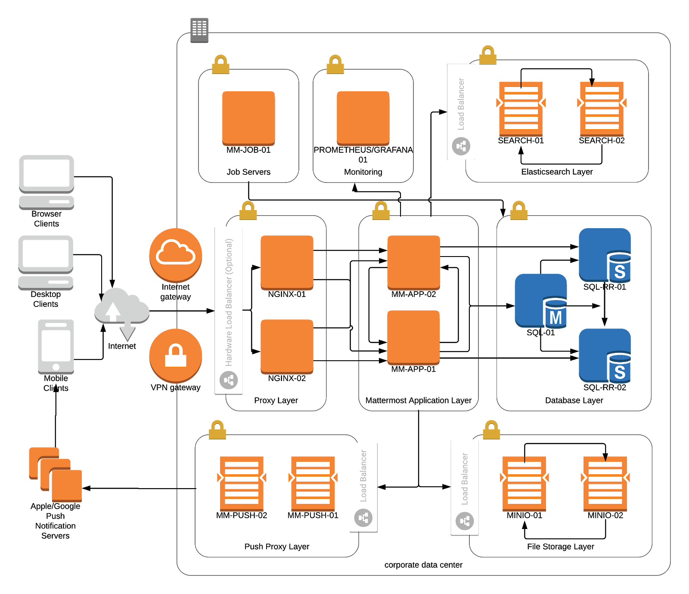
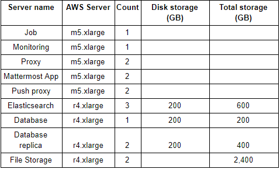

Scaling for Enterprise 
======================

Mattermost is designed to scale from small teams hosted on a single server to large enterprises running in cluster-based, highly available deployment configurations.

Server requirements vary based on usage and it is highly recommended that pilots are run before enterprise-wide deployments in order to estimate full scale usage based on your specific organizational needs.

Single Machine Deployment
-------------------------

Organizations can typically run Mattermost on a single server with up to 2,000 users, though more users have been observed based on different usage and server configurations.

- See `install guides for step-by-step configuration instructions for single machine setup <https://docs.mattermost.com/guides/deployment.html#install-mattermost>`__.
- See `hardware and software requirements for hardware sizing <https://docs.mattermost.com/install/software-hardware-requirements.html>`__.

Multi Machine Deployment
------------------------

Deployments between 2,000 and 10,000 registered users with moderate usage can run on a standard three-machine Mattermost deployment with a proxy, an application server and a database server. At this scale, demands of larger organizations can typically be met by using powerful hardware in a standard configuration.

- See `install guides for step-by-step configuration instructions for multi-machine setup <https://docs.mattermost.com/guides/deployment.html#install-mattermost>`__.
- See `hardware and software requirements for hardware sizing <https://docs.mattermost.com/install/software-hardware-requirements.html>`__.

Cluster-based Deployment
------------------------

*Available in Mattermost Enterprise Edition E20*

Deployments over 10,000 registered users with moderate usage can be supported by adding additional servers in cluster-based, High Availability configuration. To date, the largest simulation included `70,000 concurrent users on a single Mattermost instance <https://mattermost.com/blog/performance-scale-mattermost/>`__.

This configuration uses a load balancer to distribute requests from users across multiple Mattermost application servers, allowing the system to scale beyond the limits of any single server.

For more information, see `High Availability deployment guide for horizontal scaling setup <https://docs.mattermost.com/scale/high-availability-cluster.html>`__.

Sample Scaling Guide
--------------------

This guide demonstrates how to budget for, and build, large-scale Mattermost deployments.

Mattermost can be deployed on-premises or on the cloud platform of your choice, including AWS, Google Cloud, Microsoft Azure, and Oracle Cloud. This guide uses AWS as an example.

Based on the `hardware requirements <https://docs.mattermost.com/install/software-hardware-requirements.html#hardware-requirements>`__, here’s what Mattermost’s server architecture looks like for a 10,000-user deployment:

**Sizing Guide Using AWS**

On AWS, we recommend using the following EC2 server types as a baseline:

* App servers: m5.xlarge
* Database servers: r4.xlarge

For the purposes of this guide, we'll assume medium usage (10 MB/user/month with a 2x safety factor) for `storage estimates <https://docs.mattermost.com/install/software-hardware-requirements.html#alternate-storage-calculations>`__ and 200 MB/user/month for data transfer estimates. We will also assume on-demand pricing with no upfront payments, though more savings (typically 40% or more) can be achieved with reserved servers on 1–3 year commitments and upfront payments.

As deployments scale above 5,000 users, additional servers are added for performance load-balancing and for providing additional redundancy (see our `High Availability Cluster guide <https://docs.mattermost.com/scale/high-availability-cluster.html#mattermost-server-configuration>`__).

`This spreadsheet <https://docs.google.com/spreadsheets/u/1/d/e/2PACX-1vRkhRPFsf1_91AXFbqnmUT0UnpdZ1ZagbiTw9sfuBAL21ncnu7fynZ3yDrp22-LXCeXh0-xF_NFFPp3/pubhtml>`__ shows how much hardware you’ll need for different-sized Mattermost deployments and provides an estimate of how much each will cost. It includes links to AWS’s cost calculator for various deployment sizes. The smaller deployment examples (i.e., 1,000 users and 5,000 users) are on the conservative side, with separate servers per function that can easily be scaled out as Mattermost is rolled out.

Here’s an example of the hardware you’ll need for a 10,000-user deployment:

For more information, check out our `Administrator's Guide <https://docs.mattermost.com/getting-started/admin-onboarding-tasks.html#administrator-tasks>`__.

Hosting Recommendation for 100,000+ users
-----------------------------------------

The following matrix presents key features for a successful multi-region Mattermost implementation that scales to 100,000 users with support for high availability and geographically based traffic routing in on premises, AWS, and Azure deployments.

To scale to 100,000 users and above, we recommended using `the Mattermost open source load testing framework <https://github.com/mattermost/mattermost-load-test>`__ to simulate usage of your system at full scale.

.. csv-table::
    :header: "Feature", "On Premises", "Amazon AWS", "Azure"

    "Multi-region/data center support", "Yes", "Regions: 16", "Regions: 54"
    "Auto scaling for Mattermost nodes", "Yes - using a solution like Kubernetes", "`AWS Auto Scaling <https://aws.amazon.com/ec2/autoscaling/>`__", "`Azure Autoscale <https://azure.microsoft.com/en-us/features/autoscale/>`__"
    "Geographic based traffic routing", "Yes", "`Route 53 <https://aws.amazon.com/route53/>`__", "`Azure DNS <https://azure.microsoft.com/en-us/services/dns/>`__"
    "Load balancing", "Yes", "`Elastic Load Balancer <https://aws.amazon.com/elasticloadbalancing/>`__", "`Azure Load Balancer <https://azure.microsoft.com/en-us/services/load-balancer/>`__"
    "Multi-region, HA storage", "Yes", "`S3 <https://aws.amazon.com/s3/>`__", "?"
    "Multi-region, HA MySQL", "Yes - using a solution like Galera", "`Aurora <https://aws.amazon.com/rds/aurora/>`__ / `RDS for MySQL <https://aws.amazon.com/rds/mysql/>`__", "`Azure MySQL <https://azure.microsoft.com/en-us/services/mysql/>`__"
    "Multi-region, HA PostgreSQL", "Yes", "`Aurora <https://aws.amazon.com/rds/aurora/>`__ / `RDS for PostgreSQL <https://aws.amazon.com/rds/postgresql/>`__", "`Azure PostgreSQL <https://azure.microsoft.com/en-us/services/postgresql/>`__"
    "Multi-region, HA elasticsearch", "Yes", "`Amazon Elasticsearch Service <https://aws.amazon.com/elasticsearch-service/>`__", "No"
