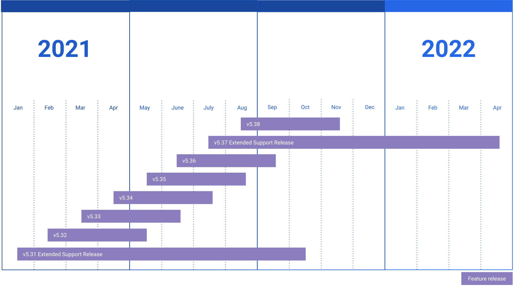

Extended Support Release
========================

What is an Extended Support Release?
------------------------------------

During each monthly release, Mattermost backports high severity or high impact security fixes to the previous three monthly releases. Extended Support Releases (ESRs) are releases that will receive backports for security fixes and major bug fixes for the length of their life cycle.

.. important::
  Support for Mattermost Server v5.31 `Extended Support Release <https://docs.mattermost.com/administration/extended-support-release.html>`_ will come to the end of its life cycle on October 15, 2021. Upgrading to Mattermost Server v5.37 `Extended Support Release <https://docs.mattermost.com/administration/extended-support-release.html>`_ or later is required.

What is the life cycle of an Extended Support Release?
------------------------------------------------------

Mattermost provides an ESR when a significant number of new features and improvements have been added to the product, and those new features have had sufficient time to stabilize. A new ESR is released twice a year every January and July release. An ESR is supported for 9 months to provide customers enough time to test and upgrade to the next ESR.

When an ESR is at the end of its life cycle, there will be announcements ahead of time to provide time for people to test, certify, and deploy a newer ESR version before support ends. There will be a clear upgrade path provided between ESR versions. 

After a release reaches its end-of-life, no further updates will be provided for that version.

Please see `Release Lifecycle documentation <https://docs.mattermost.com/administration/release-lifecycle.html>`_ for full list of lifecycles for each Mattermost release.

To receive updates about Extended Support Releases, sign up for our mailing list `here <https://eepurl.com/dCKn2P>`__.

What is included in an Extended Support Release dot release? 
------------------------------------------------------------

Dot releases for ESR versions will contain high severity or high impact security fixes and bug fixes. They will not include changes to product functionality or new features. 

Who should use an Extended Support Release? 
-------------------------------------------

ESRs are intended for organizations who value stability over having the newest features and improvements, or who have a long internal testing and certification process to undergo when upgrading.

If your organization prefers to have the newest features and improvements, Extended Support Releases may not be the best fit for you.

How do I install the Extended Support Release?
----------------------------------------------

Follow our normal `install <https://docs.mattermost.com/guides/administrator.html#installing-mattermost>`__ or `upgrade <https://docs.mattermost.com/administration/upgrade.html>`__ guides. Please follow the `important upgrade notes <https://docs.mattermost.com/administration/important-upgrade-notes.html>`_ for all the versions since the current ESR version you have currently installed. Please also see `the changelog <https://docs.mattermost.com/administration/changelog.html>`_ for list of database, API and config.json updates for each release.

When downloading the Mattermost version, choose an Extended Support Release from the list below.

What are the current supported Extended Support Release versions? 
-----------------------------------------------------------------

+-------------+----------------+------------------+------------------+--------------------------------------------------------------------------------------------+-----------------------------------------------------+
| Version     | Type           | Release Date     | End of Support   | Latest Dot Release Download link                                                           | Upgrade Notes                                       |
+=============+================+==================+==================+============================================================================================+=====================================================+
| 5.37        | Feature        | July 16, 2021    | April 15, 2022   | `5.37.0 <https://releases.mattermost.com/5.37.0/mattermost-5.37.0-linux-amd64.tar.gz>`_    |                                                     |
+-------------+----------------+------------------+------------------+--------------------------------------------------------------------------------------------+-----------------------------------------------------+
| 5.31        | Feature        | January 16, 2021 | October 15, 2021 | `5.31.7 <https://releases.mattermost.com/5.31.7/mattermost-5.31.7-linux-amd64.tar.gz>`_    |                                                     |
+-------------+----------------+------------------+------------------+--------------------------------------------------------------------------------------------+-----------------------------------------------------+
| 5.25        | Quality        | July 16, 2020    | April 15, 2021   | `5.25.7 <https://releases.mattermost.com/5.25.7/mattermost-5.25.7-linux-amd64.tar.gz>`_    | The xmlsec1-based SAML library was disabled in      |
|             |                |                  |                  |                                                                                            | favor of the re-enabled and improved SAML library   |
+-------------+----------------+------------------+------------------+--------------------------------------------------------------------------------------------+-----------------------------------------------------+
| 5.19        | Quality        | January 16, 2020 | October 15, 2020 | `5.19.3 <https://releases.mattermost.com/5.19.3/mattermost-5.19.3-linux-amd64.tar.gz>`_    |                                                     |
+-------------+----------------+------------------+------------------+--------------------------------------------------------------------------------------------+-----------------------------------------------------+
| 5.9         | Quality        | April 16, 2019   | April 15, 2020   | `5.9.8 <https://releases.mattermost.com/5.9.8/mattermost-5.9.8-linux-amd64.tar.gz>`_       | Please upgrade to 5.0 prior to upgrading to 5.9     |
+-------------+----------------+------------------+------------------+--------------------------------------------------------------------------------------------+-----------------------------------------------------+
| 4.10        | Quality        | May 16, 2018     | July 15, 2019    | `4.10.10 <https://releases.mattermost.com/4.10.10/mattermost-4.10.10-linux-amd64.tar.gz>`_ |                                                     |
+-------------+----------------+------------------+------------------+--------------------------------------------------------------------------------------------+-----------------------------------------------------+

How do I restore a previous Extended Support Release?
-----------------------------------------------------

Before you perform an upgrade, please ensure you have done a full back up of your current version.  You can restore the database and previous version if you need to revert an upgrade.  Please note that previous ESR versions are subject to an end of support date.

Why is an Extended Support Release supported for 9 months and not longer?
-------------------------------------------------------------------------

We chose 9 months because the overhead for maintaining an ESR is high (and becomes higher the longer the support window is).
If we increase the support window, it decreases how much we can develop the product. We specifically chose "ESR" instead of "LTS", since it is not intended to be a multi-year long term support release. The 9 months support timeframe will not be extended in any case.

Can customers pay for extended support?
---------------------------------------

At this point, we are not planning on letting customers pay for extended support, but we are open to discuss options for this. Please speak to your Customer Success Manager if you have additional requirements for extended support.

How do we notify customers about new and deprecated Extended Support Releases?
------------------------------------------------------------------------------

For a new upcoming ESR, we send out an email announcement on or close to release day. We also add a reminder on our release announcement, changelog, and via a Forum post (`see example <https://forum.mattermost.org/t/upcoming-extended-support-release-updates/8526>`_).

For a deprecated ESR, we send out an email announcement 3 months in advance. We also add reminders on our release announcements, changelogs, `important upgrade notes <https://docs.mattermost.com/administration/important-upgrade-notes.html>`_, and our `Forum site <https://forum.mattermost.org/>`_.

To receive updates about Extended Support Releases, sign up for our mailing list `here <https://eepurl.com/dCKn2P>`_.
