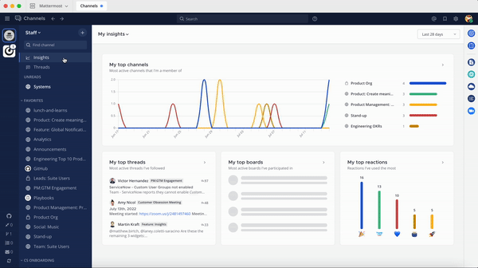

Insights
========

.. include:: ../_static/badges/allplans-cloud-selfhosted.rst
  :start-after: :nosearch:

Insights offer you visibility into top activities by surfacing the most important events happening within each team within your Mattermost workspace. 

From Mattermost v7.1, insights are available for all users using Mattermost in a web browser or the desktop app, except guests. Mobile support for insights is coming in a future release.

Access insights
---------------

To access insights, go to Channels, then select **Insights** at the top of the channel sidebar. On the Insights page, you'll see your own insights over the last seven days by default. You can also:

- Switch between your insights and insights for the team.
- Show insights for the current day or the last 28 days.
- Select insights to go directly to that channel, thread, or board.

.. note::
  From Mattermost v7.5, Insights for top channels and thread counts don't include messages posted by plugins and OAuth apps.

My insights
-----------

+---------------------------------+-----------------------------------------------------+
| **Insight category**            | **Description**                                     |
+---------------------------------+-----------------------------------------------------+
| My top channels                 | Most active channels you're a member of.            |
+---------------------------------+-----------------------------------------------------+
| My top threads                  | Most active threads you follow.                     |
+---------------------------------+-----------------------------------------------------+
| My top boards                   | Most active boards you've participated in.          |
+---------------------------------+-----------------------------------------------------+
| My top reactions                | Emoji reactions you've used the most.               |
+---------------------------------+-----------------------------------------------------+
| My most active direct messages  | Most active direct messages you've participated in. |
+---------------------------------+-----------------------------------------------------+
| My least active channels        | Channels you're a member of with the fewest posts.  |
+---------------------------------+-----------------------------------------------------+
| My top playbooks                | Playbooks you've used with the most runs.           |
+---------------------------------+-----------------------------------------------------+

Team insights
-------------

.. include:: ../_static/badges/ent-pro-only.rst
  :start-after: :nosearch:

+-----------------------+-----------------------------------------------+
| **Insight category**  | **Description**                               |
+-----------------------+-----------------------------------------------+
| Top channels          | Most active channels across the team.         |
+-----------------------+-----------------------------------------------+
| Top threads           | Most active threads across the team.          |
+-----------------------+-----------------------------------------------+
| Top boards            | Most active boards across the team.           |
+-----------------------+-----------------------------------------------+
| Top reactions         | The team's most used emoji reactions.         |
+-----------------------+-----------------------------------------------+
| New team members      | Latest members to join the team.              |                                     
+-----------------------+-----------------------------------------------+
| Least active channels | Least active channels across the team.        |
+-----------------------+-----------------------------------------------+
| Top playbooks         | Playbooks with the most runs across the team. |
+-----------------------+-----------------------------------------------+

.. note:: 

  - Team insights are based on all public channels available as well as private channel membership. System Admins must be a member of private channels to see threads from those channels.
  - System Admins who can't see public threads without joining them first indicates that compliance export is enabled for the Mattermost deployment. When enabled, compliance export requires a record of every user having joined a channel so that a compliance system knows who has access to messages.
