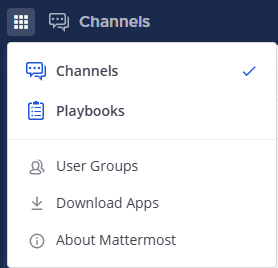

Manage custom groups
====================

|enterprise| |professional| |cloud| |self-hosted|

.. |enterprise| image:: ../images/enterprise-badge.png
  :scale: 30
  :target: https://mattermost.com/pricing
  :alt: Available in the Mattermost Enterprise subscription plan.

.. |professional| image:: ../images/professional-badge.png
  :scale: 30
  :target: https://mattermost.com/pricing
  :alt: Available in the Mattermost Enterprise subscription plan.

.. |cloud| image:: ../images/cloud-badge.png
  :scale: 30
  :target: https://mattermost.com/sign-up
  :alt: Available for Mattermost Cloud deployments.

.. |self-hosted| image:: ../images/self-hosted-badge.png
  :scale: 30
  :target: https://mattermost.com/deploy
  :alt: Available for Mattermost Self-Hosted deployments.

Custom Groups (Beta) enables Mattermost users to create and manage custom user groups in Mattermost Channels. A custom group is a group of up to 30 members in a team or a workspace who often need to be notified together as a group. 

When you mention a custom group, you’ll notify everyone in the group without having to mention members individually. You can mention a group's unique name the same way you @mention another Mattermost member. See the `Mention People in Messages <https://docs.mattermost.com/channels/mention-people.html>`__ documentation for details.

Custom groups reduce noise and improve focus by notifying the right people in a channel at the right time, while maintaining transparency for all members in that channel. For example, perhaps you want to @mention a cross-functional team about a bug fixes needed for an upcoming feature release, without notifying everyone else in the channel. Using a custom group notifies the cross-functional team immediately, while keeping important stakeholders in the loop on the status of the feature release.

.. note:: 
  
  - Custom Groups functionality is available with Mattermost Professional or Mattermost Enterprise. Legacy Mattermost E10/E20 licenses aren't supported.
  - The ability to create custom user groups on mobile will be available in a future release. @mentions for custom user groups work the same as `LDAP-synced groups <https://docs.mattermost.com/channels/mention-people.html#groupname>`__ on mobile.
  - System Admins need to enable this feature. See our `Mattermost Configuration Settings <https://docs.mattermost.com/configure/configuration-settings.html#custom-user-groups>`__ documentation for details. 

Create a custom group
---------------------

1. Select **+** from the top of the channel sidebar, then select **Create New User Group**.

2. Specify a name and mention. The mention is the handle you use to @mention a notification to the group. Group names must be unique across the Mattermost workspace. If a name is in use as a channel name, display name, or another custom group's name, it won't be available.

3. Search for and select members to add to the custom user group, then select **Create Group**.

Manage custom user groups
-------------------------

You can review and filter the list of custom groups, add people to an existing group, edit the group name or mention, leave the group, or archive the group. 

To manage a custom user group, select **User Groups** from the Products menu, then select the group you want to modify.

Review available groups
~~~~~~~~~~~~~~~~~~~~~~~

Review a list of all available custom user groups, search for specific groups by name, or filter the list of groups to display only groups you're a member of.

Change name or mention
~~~~~~~~~~~~~~~~~~~~~~

1. From the **More Actions** icon to the right of any custom group, select **View Group**. 

  .. image:: ../images/manage-user-groups.png
    :alt: Access tools to manage your custom user groups.

2. From the **More Actions** icon, select **Edit Details**.

  .. image:: ../images/edit-custom-group.png
    :alt: Edit details of a custom user group.

3. Update the **Name** or **Mention**, then select **Save Details**.

Add people
~~~~~~~~~~

1. Select **Add People**.
2. Search for and select people to add to the group, then select **Add People**.

Remove people
~~~~~~~~~~~~~

Hover over a member, then select the **Trash** icon to remove them from the group.

Leave a group
~~~~~~~~~~~~~

From the **More Actions** icon, select **Leave Group**.

Archive group
~~~~~~~~~~~~~

From the **More Actions** icon, select **Archive Group**. When you archive a custom user group, you won’t be able to mention the group’s handle or view its members. However, the group isn't deleted from the list, and all members remain in the group unless manually removed.
