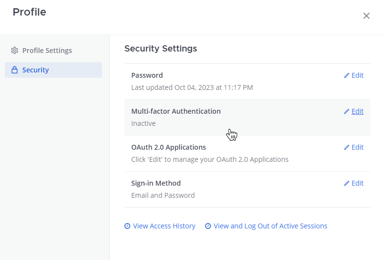
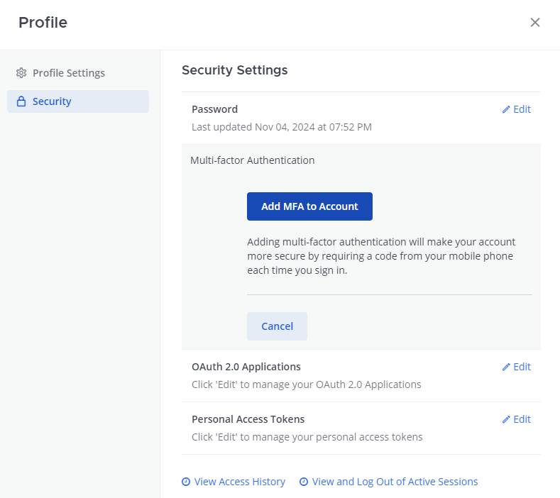

Manage your Mattermost profile
==============================

.. include:: ../_static/badges/allplans-cloud-selfhosted.rst
  :start-after: :nosearch:

You can configure your profile and security preferences by selecting **Profile** from your avatar in the global header.

.. tabs::

  .. tab:: Mattermost v6.0 onwards

      In Mattermost v6.0, **Account Settings** have moved.

      - Access **Profile** and **Security** settings from your Avatar in the Global Header.
      - Access **Notifications**, **Display**, **Sidebar**, and **Advanced Settings** by selecting the Gear |gear-icon| icon in the Global Header.

      .. |gear-icon| image:: ../images/settings-outline_F08BB.svg
        :alt: Select the Gear icon to open the Settings dialog.

  .. tab:: Mattermost v5.39 and earlier

      In Mattermost versions up to v5.39, access all of your profile and security settings in **Account Settings** from the **Main Menu** by selecting the three horizontal lines (also known as a hamburger menu) at the top of the channel sidebar.

Profile
-------

Settings to configure name, username, nickname, email, and profile picture.

Full name
~~~~~~~~~

Full names appear in the direct messages member list and team management modal. By default, you will receive mention notifications when someone types your first name. Entering a full name is optional. 

Username
~~~~~~~~

Usernames are unique identifiers appearing next to all posts. Pick something easy for teammates to recognize and recall. By default, you will receive mention notifications when someone types your username. In order to maintain message integrity, changing your username does not update @mentions in messages already posted. Username must begin with a letter, and contain between 3 to 22 lowercase characters made up of numbers, letters, and the symbols '.', '-', and '_'. 

Nickname
~~~~~~~~

Nicknames appear in the direct messages member list and team management modal. You will not receive mention notifications when someone types your nickname unless you add it to the *Words That Trigger Mentions* notifications list in **Notifications**.

Position
~~~~~~~~~

Position can be used to describe your role or job title. It appears in the profile popup that shows up when you select a user's name in the center channel or right-hand sidebar.

Email
~~~~~

Email is used for signing in, notifications, and password reset. Email requires verification if changed. If you are signing in using a single sign-on service, the email field is not editable and you will receive email notifications to the email you used to sign up to your SSO service.

Profile picture
~~~~~~~~~~~~~~~

Profile pictures appear next to all posts and at the top of the channel sidebar next to your name. To change your profile picture, choose **Select**, then choose an image. For best results, choose an image that's at least 128 x 128 pixels in size. Supported image formats include: BMP, JPG, JPEG, and PNG. The GIF file format is not supported.

Security
--------

Settings to configure your password, view access history, and view or logout of active sessions.

Password
~~~~~~~~

You may change your password if you've logged in by email. If you are signing in using a single sign-on service, the password field is not editable, and you must access your SSO service's account settings to update your password.

Multi-factor authentication
~~~~~~~~~~~~~~~~~~~~~~~~~~~

When your System Admin enables `multi-factor authentication </configure/configuration-settings.html#enable-multi-factor-authentication>`__ in Mattermost, you can choose to set up your Mattermost account to require a phone-based passcode generated by Google Authenticator, in addition to your password, when signing in.

Download Google Authenticator from `iTunes <https://itunes.apple.com/us/app/google-authenticator/id388497605?mt=8>`__ or `Google Play <https://play.google.com/store/apps/details?id=com.google.android.apps.authenticator2&hl=en>`__ for your device, then:

1. In Mattermost, select your avatar, then select **Profile > Security**.
2. Under **Multi-factor Authentication**, select **Edit**.

3. Select **Add MFA to Account**.

4. On your device, use the Google Authenticator app to scan the QR code that displays in Mattermost.
5. Enter the **MFA Code** generated by the authentication app, then select **Save**.

Once you've set up multi-factor authentication for your Mattermost account, when you log in to Mattermost you'll be asked to enter a code generated by Google Authenticator as well as your password.

.. tip::
  If scanning the QR code using your device doesn't work, you can manually enter the **Secret** provided on the Mattermost screen into the Google Authenticator app as a **Manual Entry** instead.

Sign-in method
~~~~~~~~~~~~~~

This option allows you to switch your `login method </welcome/log-in.html>`__ from `email/username and password </welcome/log-in.html#email-address-or-username>`__ to a `single sign-on option </welcome/log-in.html#single-sign-on-sso>`__, and back again. While you can choose to log in with either set of credentials, you can enable one login method at a time.

For example, if AD/LDAP single sign-on is enabled, you can select **Switch to using AD/LDAP** and enter your AD/LDAP credentials to switch login over to AD/LDAP. You'll need to enter the password for your email account to verify your existing credentials. Following the change, you'll receive an email to confirm the action.

View access history
~~~~~~~~~~~~~~~~~~~

Access history displays a chronological list of the last 20 login and logout attempts, channel creations and deletions, account settings changes, or channel setting modifications made on your account. The details of the Session ID (unique identifier for each Mattermost browser session) and IP Address of the action is recorded for audit log purposes.

View and logout of active sessions
~~~~~~~~~~~~~~~~~~~~~~~~~~~~~~~~~~

Sessions are created when you log in with your email and password to a new browser on a device. Sessions let you use Mattermost for up to 30 days without having to log in again. Select **Logout** on an active session if you want to revoke automatic login privileges for a specific browser or device. Select **More Info** to view details on browser and operating system.
