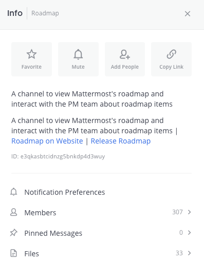
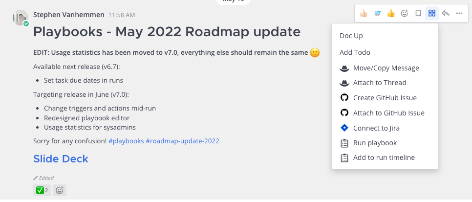
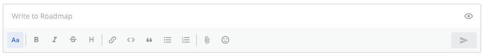

What changed in Mattermost v7.0?
================================

.. include:: ../_static/badges/allplans-cloud-selfhosted.rst
  :start-after: :nosearch:

.. |view-info-icon| image:: ../images/information-outline_F02FD.svg
  :height: 24px
  :width: 24px
  :alt: Access channel information in the right pane using the View Info icon.

.. |more-actions-icon| image:: ../images/dots-horizontal_F01D8.svg
  :height: 24px
  :width: 24px
  :alt: Access additional message actions using the More actions icon.

In Mattermost v7.0 self-hosted deployments, we've changed where you can find channel information, where you can access your Mattermost integrations and their related actions, and we've made it easier to format your messages. Whether you're new to Mattermost, or a long-time user, this document will help you start using these new features and introduce you to new ways of navigating the product.

Channel information
-------------------

When creating channels, you're prompted to provide context that helps other users understand the focus of the channel. From Mattermost v7.0, these channel details appear in both the center pane under the channel name and in a new channel information pane on the right. 

You can show or hide channel information in the right pane by selecting the **View Info** |view-info-icon| icon located in the top right corner of the center pane, or by pressing :kbd:`Ctrl` :kbd:`Alt` :kbd:`I` on Windows or Linux, or by pressing :kbd:`⌘` :kbd:`⌥` :kbd:`I`. on Mac.

Apps bar (beta)
---------------

We've moving access to your enabled Mattermost integrations, including the icons for Playbooks and Boards, from the channel header in the center pane. Their new home is a vertical pane located to the far right of the Mattermost screen called the Apps Bar.

In self-hosted Mattermost v7.0 deployments, the Apps Bar is hidden and integrations continue to display in the channel header by default. Your System Admin can `enable the Apps Bar in the System Console </configure/configuration-settings.html#enable-app-bar>`__. When enabled, access to all Mattermost integrations, with the exception of calls beta functionality, moves to the far right pane.

.. note:: 
    
    In Mattermost Cloud workspaces, enabled integrations automatically display in the Apps Bar on the far right. Cloud System Admins can't disable this feature or move the integration icons back to the channel header.

    Integrations currently registered to the channel header will move to the Apps Bar automatically; however, we strongly encourage Mattermost integrators to update their integrations to provide the best user experience. See the developer documentation for details on registering integrations to the Apps Bar.

Message actions have moved
--------------------------

You use message actions to take action on a message by pushing information to an external system, such as when creating a Jira ticket using the `Jira integration <https://mattermost.com/marketplace/jira-plugin/>`__, creating a GitHub issue using the `GitHub integration <https://mattermost.com/marketplace/github-plugin/>`__, or creating a Zendesk support ticket using the `Zendesk integration <https://mattermost.com/marketplace/zendesk-app/>`__. 

We’ve moved message actions for Mattermost integrations to their own dedicated location under a **Message actions** |message-actions-icon| icon to reduce clutter. Select this icon to see what messages you can take based on the integrations enabled for your Mattermost instance.

Message formatting toolbar
~~~~~~~~~~~~~~~~~~~~~~~~~~

Formatting your messages is easier with the introduction of an message formatting toolbar that includes shortcuts to preview messages, react with emojis, strike out text, add headings, format numbered steps, add bullets, format content as code, and hide the formatting options. See the `format messages </channels/format-messages.html>`__ documentation to learn more about the many ways you can format your messages in Mattermost using both Markdown and using the new message formatting toolbar.

